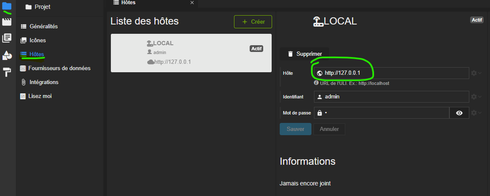
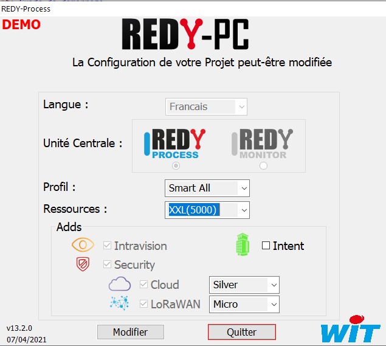
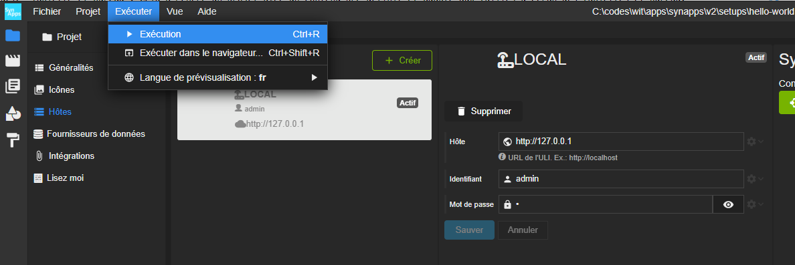
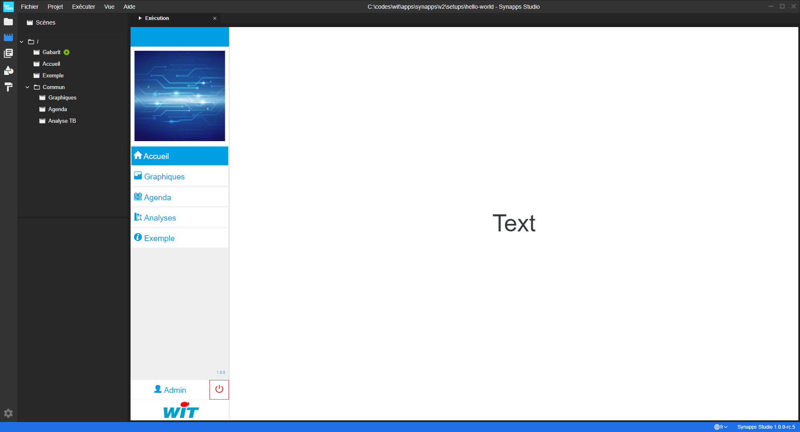

# Exécution de la synapp

Dans l'étape précédente, nous avons créé un projet avec le modèle "Tablette et Bureau". Cela a généré un projet avec un contenu pré-défini et adapté aux tailles des tablettes et bureau.
Le contenu est pret à être exécuté.

## Hôte

Lorsqu'une **synapp** s'exécute dans Studio, elle doit se connecter à une ULI.

Dans la section de gestion des **hôtes** du projet, il est possible d'enregistrer les moyens de se connecter à une ULI.

Tout nouveau projet démarre avec un hôte pré-défini. Il pointe vers `http://127.0.0.1`. Ainsi, le projet s'attend à la présence d'un **REDY-PC** et qu'il puisse se connecter avec l'utilisateur administrateur par défaut `admin`.

Tout ceci est paramétrable (voir la section consacrée à la gestion des hôtes et des synapps - *todo*).

Lancez une instance de **REDY-PC** (une version `13.2.0` ou ultérieur).

> N'oubliez pas d'activer l'adds **Intravision**. C'est ce qui vous permettra plus tard de publier la synapp dans le paramétrage.

## Exécution

Passons maintenant à l'exécution de la synapp :
 - Rendez-vous dans le menu d'application et choisissez l'option "Exécution".  Raccourci clavier **Ctrl+R**

L'onglet d'exécution s'est ouvert :

Vous pouvez tester la synapp en utilisant le menu.

> Un autre manière de visualiser la synapp est de l'ouvrir dans votre navigateur.
Dans ce cas choisissez l'option "Exécuter dans le navigateur...".  Raccourci clavier **Ctrl+Shift+R**

# Prochaine étape :
Maintenant, vous allez effectuer [vos premiers pas avec le designer de scène](./designer-first-steps).
