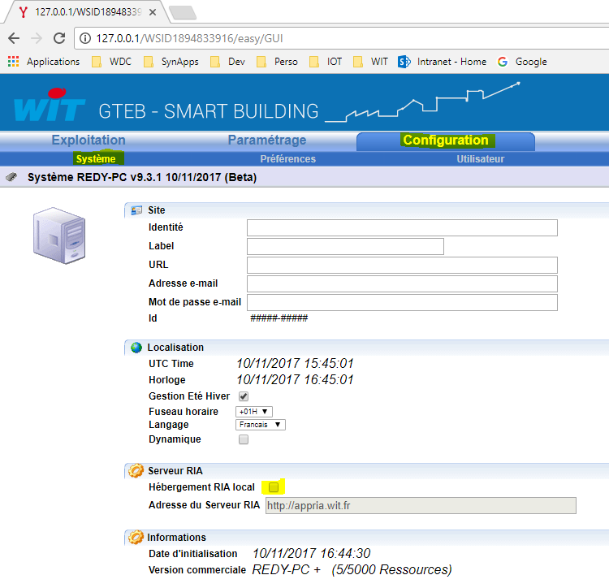

[Home](../sitemap.md) > [Redy](index.md)

# Configurer un Redy

## Désactiver le mode Hébergement RIA local

Le runtime de SynApps est embarqué dans le Redy mais prour profiter des dernières versions, il est recommander de travailler en mode **Cloud RIA** dans la mesure du possible

1. Ouvrir *Configuration* > *Système*

2. Dans la section *Serveur RIA*, **déselectionner** *Hébergement RIA local*

3. Valider

## Configuration du cross-origin

*TODO*