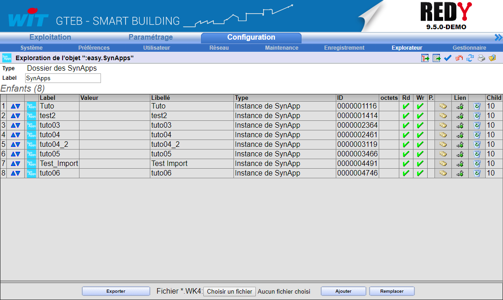

# Exploration des objets SynApps dans le REDY

[Home](../sitemap.md) > [REDY](index.md)

## Chemin de la SynApp

Les paramétrages des SynApps sont déployés sur le REDY dans le chemin:

```TEXT
:easy.SynApps
```

