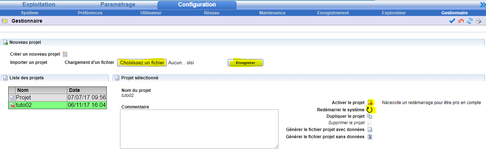

[Home](../sitemap.md) > [Redy](index.md)

# Installation projet PK4

1. Sélectionner le fichier _[YOUR].PK4_ avec le bouton **Choisissez un fichier**

2. Cliquer sur **Enregistrer**

3. Lorsque le projet est visible dans la *Liste des projets*, cliquer sur **Activer**

4. Cliquer sur **Redémarrer le système**

5. Après redemarrage, le projet est chargé et actif

Se reporter à la documentation du [gestionnaire de projets](http://www.wit.fr/?page_id=14117&download-info=gestion-de-projets-redy-faq-71) pour les instructions détaillées