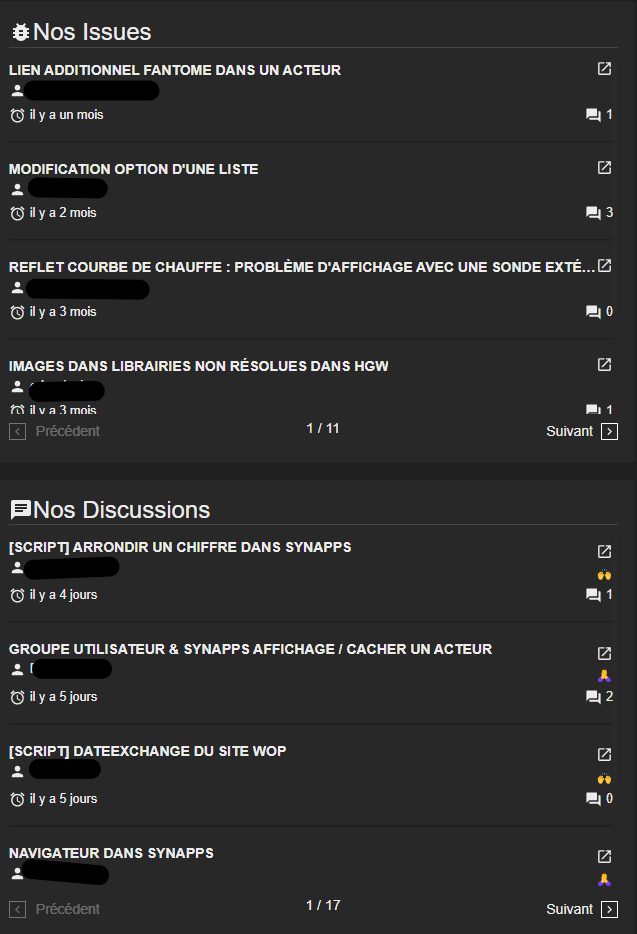

# Notes de version `1.2.0`

## Révisions

> 2023-11-20T18:00:00

- Correction d'un problème qui empéchait de publier une synapp plus d'une fois uniquement pour les utilisateurs n'ayant jamais eu d'agrément.
- Correction d'un problème qui empéchait de voir les acteurs changer lorsqu'on modifiait des valeurs glissantes.
- Ajout d'options de suppression pour pouvoir supprimer un acteur ou une additionnelle en gardant les relations qui l'utilisent.
- Ajout d'un filtre de recherche d'acteur qu'il est possible d'ajouter dans une scène/composite.

> 2023-11-13T19:00:00

- Délai pour un affichage plus gracieux de la demande du type d'utilisateur.
- Correction de message d'erreur intempestif lors du passage en mode JSON sur les éditeurs de scènes/composites/fournisseurs de données.
- Correction de message d'erreur intempestif lors de la suppression d'un acteur dans l'éditeur de fournisseurs de données.
- Correction de l'absence d'une relation avec les liaisons de type fournisseur de variable

> 2023-11-13T08:00:00

- version 1.2.0



## Synapps Runtime version 2.5.0

> Présent dans le REDY version `14.5.0`.

- **Langue** Support de l'allemand
- **Liste des synapps** Dans la page qui liste les synapps disponibles dans le REDY un message invite à utiliser Synapps Studio.
- **Acteur Modale** Correction d'une boucle de rendu : Un écran dans une modale, les deux sans tailles produisaient un
- **Acteur Détail de reflet** :
  - **Bruleur** Amélioration de l'affichage en faute
  - **Chaudière** Amélioration de l'état de la chaudière en faute et forcé
  - **Courbe de chauffe** Les ordonnées négatives et le 0 ne sont plus affichés.
  - **Digital** Amélioration de l'affichage de l'état
  - **PID** Amélioration de l'affichage en forcé
  - **Pompe** Amélioration de l'affichage en faute
  - **Vanne** Amélioration de l'affichage en faute
- **Acteur Requêteur de Reflet** Nouvel acteur qui permet de regrouper les intérrogations de reflet paramétrées par les *acteurs Fournisseurs de Reflet*.
- **Acteur Fournisseur de Reflet** Nouvel acteur qui permet d'aller chercher un reflet dans le REDY et de le mettre à disposition des autres acteurs.
- **Liaison Fournisseur de Reflet** Nouvelle liaison qui permet d'utiliser un requêteur de reflet pour aller chercher un champ d'un reflet.
- **Liaison Donnée d'un fournisseur** Nouvelle liaison qui permet de consommer un champ d'une donnée exposée par un fournisseur de ressource, de variable ou de reflet.

## Affichage des Issues et Discussions de Github
Dans la page d'accueil de Synapps Studio, les issues et discussions de Github sont affichées. Cela permet de suivre l'avancement des développements et de participer aux discussions.

<!--  -->

## Inspecteur d'acteur : Indication d'héritage
Les propriétés qui peuvent hériter d'un acteur ascendant proposent dans le menu d'option d'afficher une indication. Le parent éventuel ainsi que la valeur sont affichés.

## Support des nouveaux acteurs et liaisons

### Acteur Requêteur de Reflet
Nouvel acteur qui permet de regrouper les intérrogations de reflet paramétrées par les *acteurs Fournisseurs de Reflet*.

### Acteur Fournisseur de Reflet
Nouvel acteur qui permet d'aller chercher un reflet dans le REDY et de le mettre à disposition des autres acteurs. Associé aux liaison *Donnée d'un fournisseur* ou *Fournisseur de reflet* vous pouvez maintenant librement exploiter les reflets dans vos scènes.

### Liaison Fournisseur de Reflet
Nouvelle liaison qui permet d'utiliser un requêteur de reflet pour aller chercher un champ d'un reflet.

### Liaison Donnée d'un fournisseur

Nouvelle liaison qui permet de consommer un champ d'une donnée exposée par un fournisseur de ressource, de variable ou de reflet.

> ℹ️ **Note** 
> Très pratique pour les reflets. Une fois le reflet sélectionné, les champs disponibles sont affichés. Si aucun reflet ne correspond, seuls les champs communs à tous les relfets sont affichés.

### Variante Bouton d'écriture de fournisseur

Une variante de l'acteur bouton permet de déclencher l'écriture de valeur avec un fournisseur de ressource/variable ou une commande avec les reflets. Il suffit simplement de renseigner quel fournisseur on veut utiliser.

## Copie de chemin de propriété/additionnelle

Dans l'inspecteur, il est possible de copier le chemin d'une propriété ou d'une additionnelle. Cela se fait depuis le menu d'options de la propriété ou de l'additionnelle. Cela facilite l'écriture  dans les scripts.

## Filtre de recherche de scène/composite et d'acteur

Un filtre de recherche est disponible au dessus de l'arborescence des scènes/composites et des acteurs. Il permet de filtrer par leur nom afin de les retrouver plus facilement.

 

## Filtre de recherche de type d'acteur à ajouter

Il est maintenant possible de trouver un type d'acteur à ajouter dans une scène/composite en tapant son nom dans le filtre de recherche.

## Paramètres de Synapps Studio

Un onglet permet de changer les paramètres de Synapps Studio. Il est possible de changer la langue, d'activer/désactiver la recherche automatique de mise à jour, etc.

Dans cet onglet, il est possible également de gérer la liste des projets récents : supprimer, enlever les projets absents.

## Accélération de la publication de synapp

La publication d'une synapp est maintenant plus rapide avec les REDY de version 14.5.0. Cela est d'autant plus marquant que la synapp contient des objets volumineux (2 fois plus rapide!).

## Librairie d'images : Suppression par sélection multiple

Il est possible de supprimer plusieurs images en même temps depuis la librairie d'images. Il suffit de sélectionner les images à supprimer puis de cliquer sur le bouton de suppression. La sélection multiple se fait en cliquant sur les images avec la touche `Ctrl` enfoncée ou bien en cochant les images à supprimer.

## Relations

Une section dans l'inspecteur est dédiée à afficher les relations d'un acteur ou d'une scène/composite. Elle affiche la liste des acteurs qui l'utilisent dans une liaison, une propriété ou une additionnelle.

## Suivi de modification de clé d'acteur, de scène/composite et d'additionnelle

Lorsque la clé d'un acteur ou d'une scène/composite est modifiée, les liaisons, les propriétés et additionnelles qui utilisent cette clé sont automatiquement mis à jour.

## Suivi de suppression d'acteur et d'additionnelle

Lorsqu'une additionnelle ou un acteur est supprimé, les liaisons qui l'utilise sont supprimées et les propriétés et additionnelles sont mises à zéro.

Des options de suppression sont disponibles pour supprimer un acteur ou une additionnelle sans supprimer les relations qui l'utilisent.

> ℹ️ **Note** 
> Il est possible aussi de désactiver ce suivi au moment de la suppression en maintenant la touche `Alt` enfoncée pendant le clic.

## Amélioration des icones de liaison

Maintenant, les icones des liaisons sont plus explicites : chaque liaison a sa propre icone et elles apparaissent dans l'inspecteur et dans l'arborescence des acteurs.

## Aide à l'édition de propriétés

Il est maintenant plus facile de configurer les propriétés suivantes, grace à une *popup* d'accompagnement :

### Curseur de souris

### Taille de bordure

### Courbure des coins

### Ombre portée

### Position de l'image de fond

### Taille de l'image de fond

## Amélioration des modèles

1view a été mis à jour en 1.0.6.

## Rechargement de l'application
Un dialogue de confirmation est affiché lorsqu'on tente de recharger l'application. Cela permet d'éviter de perdre des modifications non sauvegardées.

## Divers

- Améliorations visuelles (onglet, page d'accueil, boutons, icônes, etc.)
- Liste des librairies open source utilisées dans Synapps Studio dans le menu `A propos`.

## Correction

### Famille de police générale non prise en compte
La famille de police générale n'était pas prise en compte dans la publication d'une synapp. Ce problème est corrigé.

> ℹ️ **Indication** 
> Dans le cas où cela c'était produit, il faut republier la synapp.

### Amélioration de l'édition des propriétés de type options

Un scroll automatique empéchait de gérer correctement les propriétés de type options. Ce problème est corrigé.

### Amélioration message d'erreur de publication : PreconditionFailed

Il est encore possible, rarement, que la publication d'une synapp échoue avec le message d'erreur `PreconditionFailed`, ceci à cause de doublon de clé de scène ou composite. Le message d'erreur est maintenant plus explicite.

### Sécurisation de la sauvegarde de scène et composite
Il pouvait se produire rarement, sur des PC très lent, une confusion entre deux fichiers de scènes ou de composites au moment de la sauvegarde. Cela pouvait conduire à la perte de la scène ou du composite. Ce problème est corrigé.

### Confusion d'arborescence des scènes/composites avec projets dupliqués
Sur des projets dupliqués, lorsqu'on passait d'un projet à l'autre, l'arborescence des scènes et composites pouvait être mélangée. Ce problème est corrigé.
> ⚠️ **Attention** : Il est toujours recommandé de ne pas dupliquer les projets. Il est préférable d'exporter un modèle du projet pour l'utiliser dans la création d'une autre.
