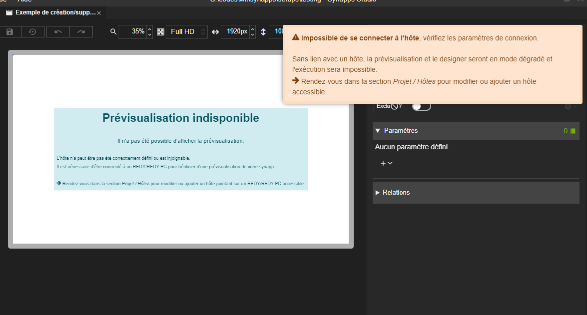
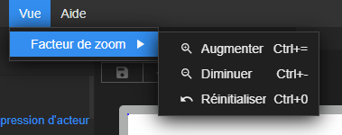
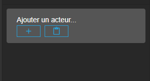
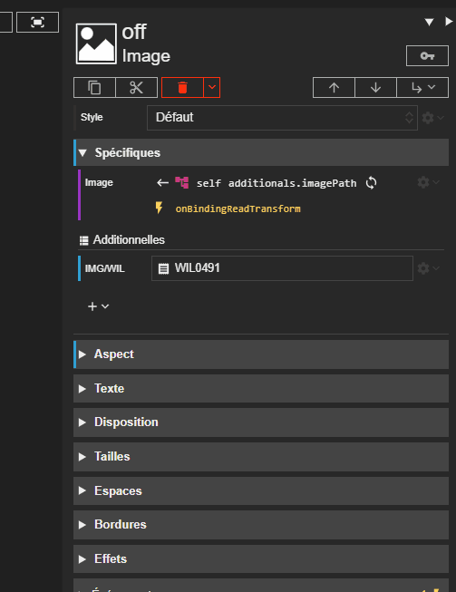
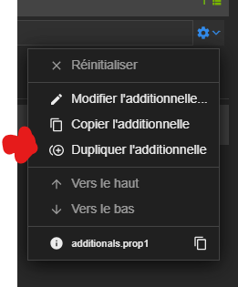
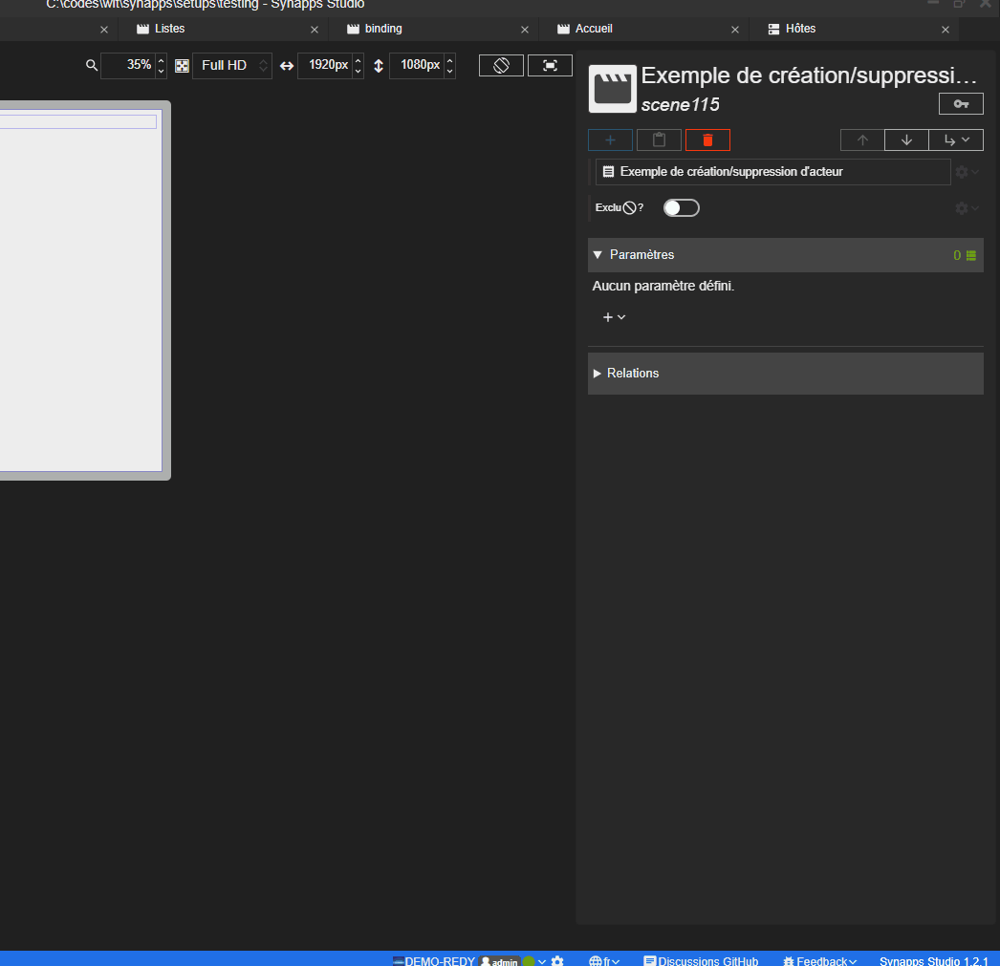
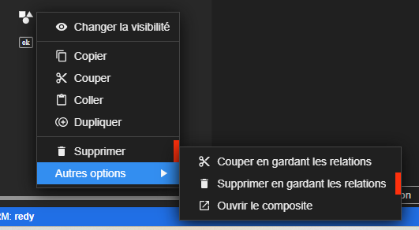
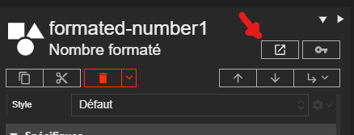
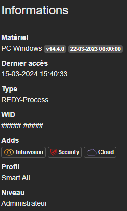
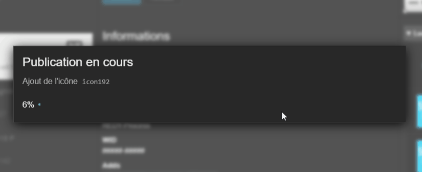

# Notes de version `1.2.1`

## Révisions

> 2024-03-15T14:00:00



## Synapps Runtime version 2.5.1

> Présent dans le REDY la future version `16.0.0`.

- **Reflets** :
  - Corrections des données pour les champs de listes de valeurs.
  - Ajout de la description et de la note de version sur les reflets.
  - **Reflet Agenda et Agendapp** Ajout du forçage de consigne.
- **Script** :
  - **Requêteur de reflet** Correction des options d'écriture.

## Améliorations et ajouts

### Barre de défilement

Les barres de défilement sont maintenant plus visibles dans studio. Son contraste a été augmenté.

### Champs de type *option* : Suppression du défilement automatique

Le défilement automatique des champs de type *option* lorsqu'on les ajoutait a été supprimé.

### Amélioration du message d'absence d'hôte

Amélioration du message qui indique un problème de connexion à l'hôte et qui rend impossible l'affichage de la prévisualisation de l'application.

### Raccourcis clavier

Ajout de raccourcis clavier pour changer la taille d'affichage de l'interface de Studio.

### Traductions

L'interface de Studio est intégralement traduite en **anglais** et en **italien**.

### Modèles de projet

Le modèle 1view a été amélioré.

### Bouton coller acteur principal

Le bouton pour coller l'acteur principal a été ajouté.

## Liaisons

### Copier/coller avec les scripts

Les scripts `onReadTransform` et `onWriteTransform` sont maintenant copiés/collés en même temps que les liaisons.

### Liaisons vers un reflet

Les options de liaison sur un reflet sont maintenant disponibles :
- Description
- Note

## Additionnelles

### Duplication d'additionnelle

II est maintenant possible de dupliquer une additionnelle depuis son menu d'options.

### Additionnelle de type *Code*

L'additionnelle de type *Code* a été ajoutée. Elle permet d'ajouter du code dans votre synapp. Vous choississez le type de code (Texte, HTML, CSS, Javascript, JSON et Markdown) et vous pouvez éditer le code directement avec l'éditeur intégré.

## Composites

### Liens vers édition de composite

Un bouton et une option dans le menu contextuel permettent maintenant d'accéder directement à l'édition d'un composite.

### Amélioration de la gestion des longue clé de composite

Dans le designer de composite, les clés de composite trop longues ne dépasse plus de la fenêtre.

## Gestion des hôtes et publication

### Amélioration des informations sur les hôtes

Les informations sur les hôtes sont maintenant plus complètes et plus claires, notamment sur le niveau utilisateur et les Adds activés.

### Etapes de publication

Les étapes de publication sont maintenant visible pendant le processus.
image07

Aussi, lorsqu'un problème survient pendant la publication, le message d'erreur indique maintenant à quelle étape le problème est survenu.

## Corrections

### Suivi de modification de clé d'un requêteur de reflet

Le suivi sur les fournisseur de reflet et liaison de type fournisseur de reflet lors de la modification de la clé d'un requêteur de reflet ne fonctionnait pas correctement. Cela est maintenant corrigé.

### Redo sur suppression d'acteur

La prévisualisation de l'application parfois ne suivait pas correctement après avoir annulé une suppression d'acteur. Cela est maintenant corrigé.

### Prévisualisation de l'acteur modale

Le bouton qui permet de prévisualiser l'acteur modale ne fonctionnait plus. Cela est maintenant corrigé.
