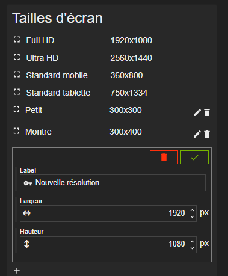

# Notes de version `1.3.0`

## Révisions

> 2024-07-12T11:00:00
- correction de la perte de taille personnalisée de composite lors d'une création/modification/suppression de liaison ou additiionnelle ou évènement.

> 2024-07-11T11:00:00

- correction affichage du designer de fournisseurs de données globales
- correction raccourcis clavlier absents dans le designer de fournisseurs de données globales

> 2024-07-10T14:00:00



## Synapps Runtime version 2.6.0

> Présent dans la future version REDY `16.0.2`.

- **Reflets** :
  - **Acteur détails de reflet** Il est maintenant possible de réunir les requêtes sur un acteur *Requêteur de reflet*.
  - **Acteur Requêteur de reflet** Prend en charge les acteurs *détails de reflets*.
- **Correction** :
  - **Iframe** Correction de la gestion des authorisations.

## Améliorations et ajouts

### Raccourcis clavier

De nombreux raccourcis clavier ont été ajoutés pour faciliter l'utilisation de Studio.

#### Gestion des scènes/Composites

- **Copier/Coller** : `Ctrl + C` / `Ctrl + V`

#### Gestion des acteurs

- **Dupliquer** : `Ctrl + D`
- **Supprimer** : `Suppr`
- **Copier/Coller/Couper** : `Ctrl + C` / `Ctrl + V` / `Ctrl + X`

#### Dans une toile

- **Deplacer vers haut/bas/gauche/droite** : `flèche haut` / `flèche bas` / `flèche gauche` / `flèche droite`

- **Déplacements rapides** : `Ctrl + flèche haut` / `Ctrl + flèche bas` / `Ctrl + flèche gauche` / `Ctrl + flèche droite`

#### Gestion des onglets

- **Fermer l'onglet actif** : `Ctrl + W`
- **Fermer tous les onglets** : `Ctrl + Shift + W`
- **Passer à l'onglet suivant/précédent** : `Alt + D` / `Alt + Q`

#### Gesion des hôtes

- **Afficher la gestion des hôtes** : `Ctrl + H`

### Liste des racourcis clavier
Vous pouvez retrouver tous les raccourcis clavier dans le menu `Aide` > `Raccourcis clavier`.

Une zone de recherche est disponible pour trouver rapidement le raccourci.

### Tailles personnalisées pour les prévisualisation des designers de scène et de composite.

Dans les paramètres de Studio, vous pouvez maintenant ajouter des tailles personnalisées pour les prévisualisations des designers de scène et de composite.

Elles apparaitrons dans la liste des tailles disponibles dans les designers de scène et de composite.

### Mémorisation de la taille de prévisualisation des designers de scène et de composite

La taille de prévisualisation des designers de scène et de composite est maintenant mémorisée dans le projet. Ainsi, lorsque vous ouvrez la scène ou le composite, la taille de prévisualisation que vous avez définie est conservée.

### Taille personnalisée pour le contenant dans le designer de composite

Jusqu'à maintenant, dans le designer de composite, celui ci était visualisé dans un contenant de taille fixe. Il est maintenant possible de définir une taille personnalisée pour le contenant du designer de composite.

Vous pouvez ainsi visualiser votre composite de grande taille par exemple.

### Taille par défaut du contenant dans le designer de composite

Dans les paramètres de Studio, vous pouvez maintenant définir une taille par défaut pour le contenant du designer de composite.

### Gestion des hôtes : Duplication

Il est maintenant possible de dupliquer un hôte.

## Corrections

### Fermeture du menu d'ajout image ou de fichier d'inclusion

Le menu qui permet d'ajouter des images dans la librairie Images et des fichiers dans les Inclusions se fermait automatiquement alors que l'utilisateur n'avait pas terminé ses actions. Cela est maintenant corrigé.

### Acteur **Modale au clic** et évènement `onClick`

L'évènement `onClick` sur l'acteur qui déclenche l'ouverture ou la fermerture d'une modale n'était pas pris en compte. Cela est maintenant corrigé.

### Acteur **Iframe** : prévisualisation de PDF dans Studio

La prévisualisation de PDF dans un acteur *Iframe* ne fonctionnait pas correctement. Cela est maintenant corrigé.
