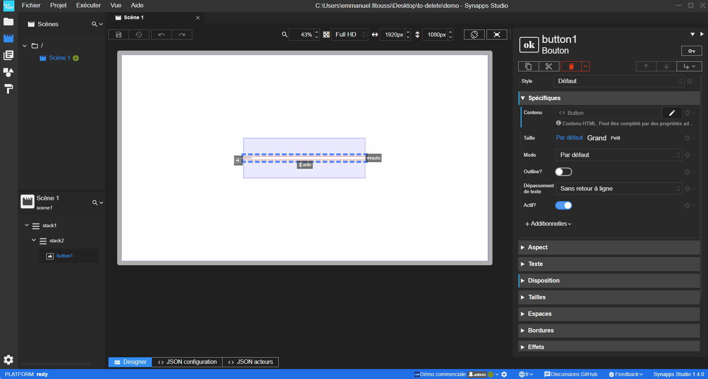
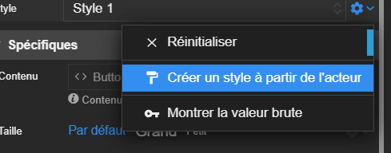

# Notes de version `1.4.0`

## Révisions

> 2024-11-27T16:00:00


  

  <strong>⚠️ Attention</strong> 
  Un projet ouvert avec cette version de Studio ne pourra plus être ouvert avec une version antérieure. 
  C'est le cas aussi pour un export de modèle : un modèle exporté avec cette version ne pourra pas être importé dans une version antérieure.

## Synapps Runtime version 2.7.0

Support de la version `2.7.0` de Synapps Runtime qui est présente dès la version `16.2.0` du REDY.

- Support de la nouvelle stucture des styles d'acteur
- Ajout de traductions manquantes
- Correction d'un problème qui empechait la valorisation des liaisons relatives lors de l'ajout dynamique d'acteurs.

## Nouveautés

### Designer de styles

Ca y est, le designer de styles est enfin disponible ! Vous pouvez maintenant créer et modifier vos styles directement dans Studio comme vous le faites pour une scène ou un composite !

Vous pouvez maintenant :
  - créer un style à partir de zéro ou à partir d'un acteur existant
  - modifier un existant
  - supprimer
  - dupliquer
  - copier/coller

Vous pouvez créer des styles pour tous les acteurs même les acteurs fournisseurs de données et les composites.

**Créer un style à partir d'un acteur :**

Vous pouvez utiliser des éléments de librairies pour définir les propriétés d'un style.

#### Compatibilité des projets

La fonctionnalité a demandé un remaniement des fichiers projet. Par conséquent, une fois un projet ouvert avec cette version, il ne pourra plus être ouvert avec une version antérieure.

### Filtre texte sur la liste des projets récents

Il est maintenant possible de filtrer par texte la liste des projets récents sur l'accueil de Studio.

## Corrections

### Projet sur OneDrive

Le problème rapporté dans l'[issue #790](https://github.com/witsa/synapps/issues/790) avec les projets sur OneDrive a été corrigé.

### Projet sur Lecteur réseau

Le problème qui empéchait d'avoir un projet sur un lecteur réseau a été corrigé.

### Editeur de code

Le problème qui empechait l'undo/redo dans l'éditeur de code a été corrigé.

Le problème qui produisait parfois une disparition de la dernière saisie ou action dans l'éditeur de code a été corrigé.

### Prévisualisation et Undo/Redo

Il était possible de perdre la synchronisation entre ce qui était affiché dans la prévisualisation et l'arborescence d'acteurs définie. C'est maintenant corrigé.

### Acteur Détails de reflet - Explorateur de reflets

Correction [issue #788](https://github.com/witsa/synapps/issues/788) : Explorateur non fonctionnel avec Acteur détail de Reflet en mode NON AUTONOME.

### Acteur écran, Vue de composite, additionelles scène et composite

Pour ces éléments, la possibiilité ou l'impossibilité de choisir la scène ou le composite en cours a été rétablie.

### Absence d'aide sur les additionnelles

Certaines additionnelles n'affichaient pas l'aide qu'il était possible de définir. C'est maintenant corrigé.

### Modification non détectée sur paramètre de scène

Lors de la modification d'un paramètre de scène qui contenait une modale, la modification n'était pas détectée. C'est maintenant corrigé.

### Erreur lors du changement rapide dans la liste des hôtes

Lorsque l'on changeait rapidement d'hôte dans la liste des hôtes, une erreur pouvait survenir. C'est maintenant corrigé.
