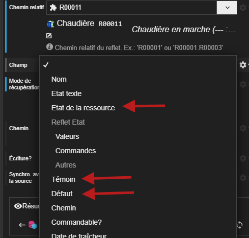
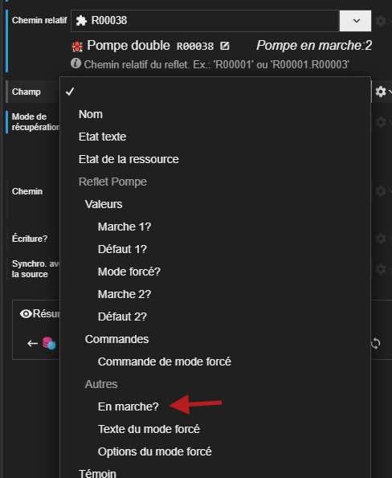

# Notes de version `1.4.1`

## Révisions

> 2025-05-14T12:00:00



## Synapps Runtime version 2.7.1

Support de la version `2.7.1` de Synapps Runtime qui est présente dès la version `16.3.0` du REDY.

- Reflet :
  - Tous les reflets ont les éléments du reflet état, présisemment l'état texte de la ressource, sont état de witness et de défaut.
  - Le reflet Pompe / Pompe double possède maintenant le champ calculé `En Marche ?`.
  - L'acteur **Détails de reflet* pour un reflet inconnu tentera d'afficher l'état texte de la ressource à la place de la liste des valeurs.
  - Support du nouveau type de liste.

Corrections :
- Acteur **Liste de boutons** : style et variant de texte n'étaient pas pris en compte.
- Acteur **Intérupteur image** : Le tooltip ne se mettait pas à jour lors du changement de valeur.
- Script : removeBinding() ne fonctionnait pas sur les acteurs.

## Nouveautés

### Laision vers les champs états de reflet

Les champs propres à l'état de la ressource derrière un reflet sont maintenant accessibles dans les champs à choisir dans la liaison vers un reflet :

- Etat texte de la ressource
- Etat de witness
- Etat de défaut

### Liaison vers `En marche ?` pour les reflets Pompe simple / Pompe double

L'acteur **Détails de reflet** pour un reflet de type Pompe simple ou Pompe double possède maintenant le champ `En Marche ?` accessible dans la liaison. Il est un résumé de l'état en marche de la pompe : dans le cas d'une pompe double, il est à `true` si au moins une des deux pompes est en marche.

### Publication de synapp

La taille des fichiers est affichée pendant chaque étape de la publication d'un synapp. Cela permet de savoir si le fichier de comprendre mieux le temps que prendra cette étape.

## Corrections

### Sous-menu qui se ferme au clic

Le problème qui faisait que le sous-menu se fermait au clic sur l'élément parent a été corrigé.

### Double quote dans la description d'un champ de composite

Le problème rapporté [ici](https://github.com/witsa/synapps/issues/853) qui faisait que la description d'un champ de composite contenant une double quote était mal interprété a été corrigé.
