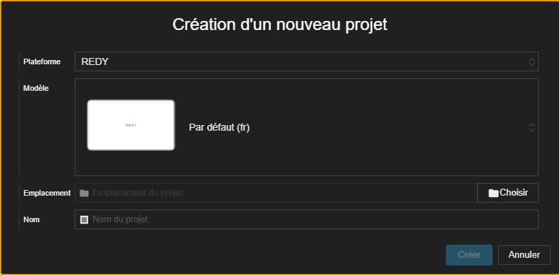
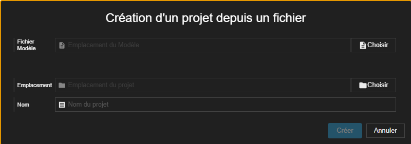
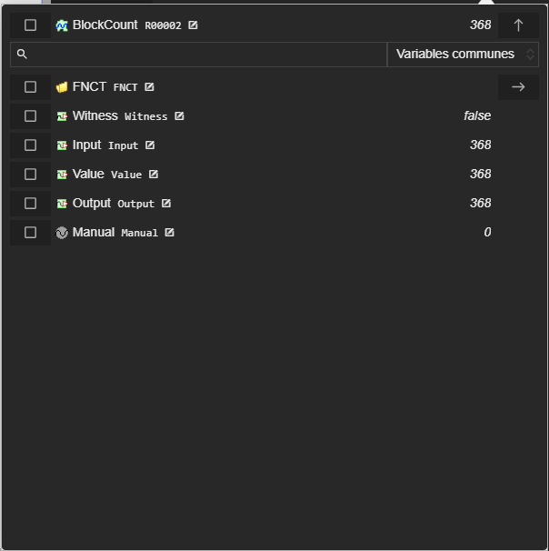
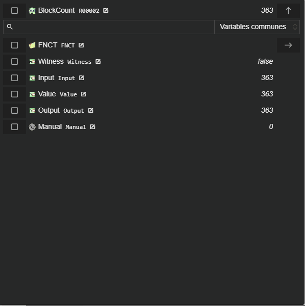
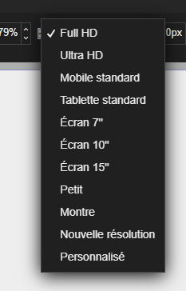

# Notes de version `1.5.0`

## Révisions

> 2025-10-15T14:00:00

- ajouts de champs communs au filtre dans l'explorateur de variables
- ajouts des resources dans l'explorateur de variable lorsqu'on filtre sur les champs communs

> 2025-10-10T12:00:00



## Synapps Runtime version 2.8.0

Support de la version `2.8.0` de Synapps Runtime, disponible dans la prochaine version de REDY.

Nouveautés
- Acteur tableau de données
- Optimisation des requêtes.

## Nouveautés

### Suppression de dossiers

Il est maintenant possible de supprimer un dossier de scène/composite et tout son contenu.

### Création de projet

La création d'un nouveau projet et la création depuis un fichier modèle ont été séparées en deux interfaces distinctes.

### Simplification de l'explorateur de variables

L'explorateur de variables a été simplifié pour une meilleure lisibilité : par défaut, seules les variables des champs les plus communs des ressources sont affichées.

Il est aussi possible d'afficher comme avant toutes les variables en changeant le filtre.

Dans les paramètres de Studio, il est possible de :
- choisir le mode d'affichage par défaut,
- d'ajouter vos propres labels de champs de ressources qui s'ajouteront à ceux existants.

### Affichage de la taille de l'élément ouvert

La taille de l'élément actuellement ouvert est affichée dans la barre d'état en bas à gauche. Elle se colorera en orange si la taille dépasse la limite recommandée pour l'élément visualisé. En effet, une taille trop importante pourrait ralentir l'affichage et la publication, notamment sur un réseau lent.

> Vous trouverez très prochainement dans la documentation les recommandations de taille pour chaque type d'élément ansi que les conseils pour réduire cette taille.
>
> Vous trouverez aussi bientôt des conseils pour éviter de surcharger vos scènes et composites.

### Tailles des écrans WIT dans le designer de scènes/composites

Les tailles des écrans WIT ont été ajoutées dans les designers de scènes et composites. Elles sont disponibles dans le menu déroulant des tailles d'écran.

### Amélioration de la page d'accueil

La page d'accueil de Synapps Studio a été améliorée pour offrir une meilleure lisibilité des projets récents.

### La page des paramètres

La page des paramètres a été revue pour une meilleure organisation et lisibilité.

### Amélioration globale des performances

Le moteur de Synapps Studio ainsi que plusieurs de ces composants ont été mis à jour. Cela a pour effet notamment d'améliorer les performances globales de l'application.

### Acteur Tableau de données

> **⚠️ Attention :** disponible que dans la prochaine version de REDY

Pour les utilisateurs avancés, un nouvel acteur qui permet de créer des tableaux de données dynamiques a été ajouté. L'entrée se fait sous la forme de tableau d'objets `JSON`. Il est possible de définir des colonnes typées et personnalisées.
De nombreux évènements sont disponibles pour interagir avec le tableau ou chaque cellule et avec des boutons de pagination.
Les types de colonnes disponibles sont :
 - texte : pour afficher simplement la donnée d'une cellule,
 - nombre : pour afficher directement un nombre,
 - booléen : pour afficher une valeur vraie ou fausse et définir les textes associés,
 - booléen images : pour afficher une image en fonction de la valeur booléenne et définir les textes associés,
 - date/heure : pour afficher une date ou une heure avec un format personnalisable,
 - personnalisé : pour utiliser un composite comme contenu de la cellule.

> La documentation complète est à venir.

## Corrections

### Editeur de code

L'éditeur de code ne bloque plus la sélection à la souris lorsqu'elle sort de la zone de l'éditeur.

### Librairie Images : image avec un nom qui contient que des nombres

Lors de l'ajout d'une image dont le nom ne contient que des nombres, l'image est maintenant correctement ajoutée à la librairie.
