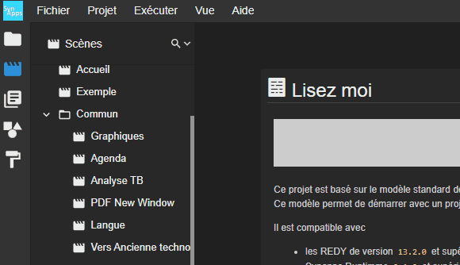
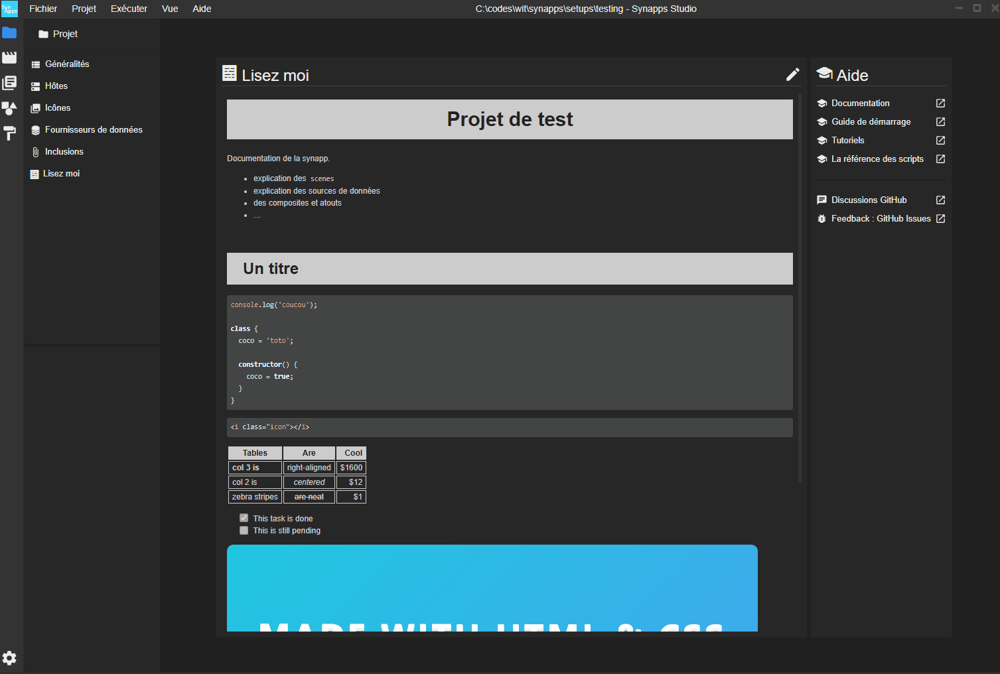
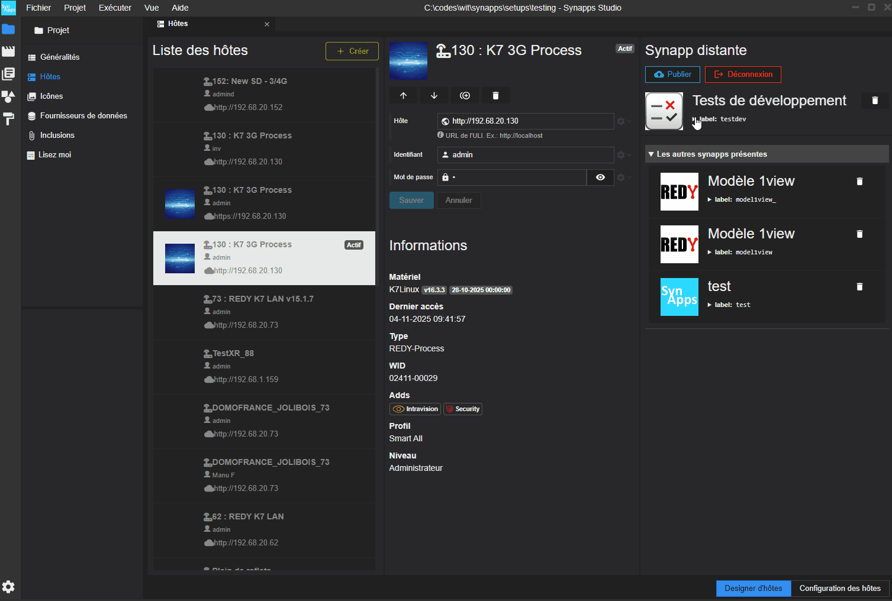
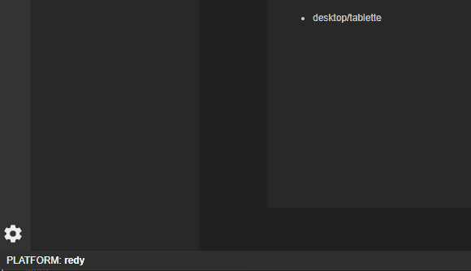
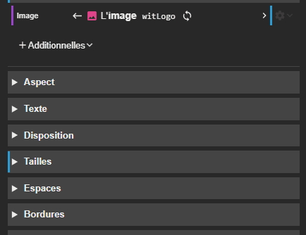
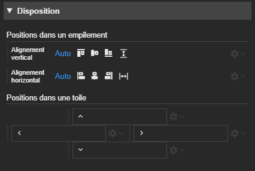
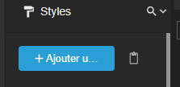

# Notes de version `1.6.0-beta`

> **🚧 En cours de construction 🚧**
>
> Cette version est en cours de construction. Certaines fonctionnalités peuvent apparaître ou bien certaines peuvent être modifiées.

## Révisions

> 2025-11-03T14:00:00



## Synapps Runtime version 2.8.0

Support de la version `2.8.0` de Synapps Runtime, disponible dans la prochaine version de REDY.

## Nouveautés

### Navigation dans un onglet temporaire

Jusqu'à présent, lorsqu'un onglet était ouvert en cliquant sur un rubrique, il restait ouvert et disponible dans les onglets, jusqu'à ce que l'utilisateur le ferme explicitement. Désormais, lorsqu'un onglet est ouvert en cliquant sur une rubrique, il est automatiquement remplacé dès que l'utilisateur navigue vers une autre rubrique.

Si l'utilisateur commence à modifier le contenu de l'onglet ou s'il double-clique sur l'onglet, il devient permanent et n'est donc plus remplacé automatiquement.

> 💡 En maintenant la touche `Alt` enfoncée tout en cliquant sur une rubrique pour l'ouvrir, il est possible de forcer son ouverture dans un nouvel onglet permanent.

### Evaluation de la taille de la synapp

Un nouvel élément de menu de Synapps Studio ``Projet > Rapport de taille`` permet d'obtenir une estimation de la taille de tous les éléments de la synapp avant publication. Cela permet d'anticiper la taille finale de la synapp publiée et d'identifier les éléments qui pèsent le plus dans la synapp.

Vous pouvez ordonner les éléments par taille, filtrer mot clé pour étudier les éléments de la liste.

### Etapes de publication en journal

Lors de la publication d'une synapp, la modale qui montrait la progression de la publication affiche désormais les différentes étapes de la publication sous forme de journal. En cas d'erreur, cela permet de mieux comprendre à quelle étape la publication a échoué par rapport au reste.

Si l'utilisateur souhaite conserver la modale ouverte après la publication, meme en cas de succès, il suffit de cliquer dedans.

### Indicateurs d'utilisation des acteurs

Dans la partie basse à gauche de Synapps Studio, de nouveaux indicateurs viennent rejoindre l'indicateur de taille dans les designers de scène/composite/style. Ils ont pour but d'évaluer l'impact de l'élément courant sur la vitesse d'exécution et son chargement de données.

 Les indicateurs suivants sont affichés  :

- le nombre d'acteurs définis dans l'élément courant
- le nombre réel d'acteurs instanciés dans l'élément courant. C'est à dire le nombre d'acteurs qui sont réellement présents à l'exécution, en tenant compte des acteurs :
    - à l'intérieur des composites,
    - dans les scènes des acteurs écrans
    - et ceux instanciés dynamiquement ou par script.
- le nombre d'acteurs qui contiennent une iframe comme par exemple l'acteur iframe, l'agenda ou bien l'acteur synoptique.
- le nombre d'acteurs qui est succeptible de requêter des données de manière autonome, comme par exemple les fournisseurs de ressources, les listes de reflets, les journaux, les détails de reflets en mode autonome, etc.
- le nombre de requêtes de données simultanées en cours et le maximum de requêtes simultanées depuis le chargement de l'élément courant.

> 💡 En cliquant sur cet indicateur, on peut réinitialiser le maximum.

Comme pour l'indicateur de taille, certains indicateurs seront colorés en orange si leur valeur dépasse un certain seuil. Cela informe qu'il peut être pertinent d'optimiser l'élément courant pour améliorer ses performances.

> ℹ️ La documentation sur les moyens d'optimiser est toujours en cours. Elle arrive bientôt.

### Bouton pour montrer/cacher la valeur initiale d'une propriété liée

Dans l'inspecteur d'un acteur, lorsqu'une propriété est liée, un bouton est directement accessible pour montrer ou cacher la valeur initiale de cette propriété.

Aussi, un liseré bleu apparait pour savoir, même sans l'ouvrir, que la valeur initiale est renseignée.

> 💡Ceci permet par exemple de savoir si une image restée inutiliement définie sur une propriété liée.

### Designer de style

#### Gestion du positionnement dans une toile

L'inspecteur de style permet maintenant de choisir un positionnement pour un élément lorsqu'il sera éventuellement placé dans un acteur Toile.

#### Coller un style

Un bouton permet maintenant de coller un style d'acteur pour un type d'acteur qui n'a pas encore reçu de définition.

### Paramétres Studio : activer/désactiver le log d'utilisation

Les logs d'utilisations permettent de diagnostiquer des problèmes rencontrés dans Synapps Studio. Ils sont stockés localement sur la machine de l'utilisateur.

Jusqu'à présent, ils étaient activés par défaut. Désormais, ils sont désactivés par défaut.

Une option dans les paramètres de Synapps Studio permet de réactiver cette fonctionnalité.

### REDY PILOT <code>beta</code>

> ℹ️ Cette partie est en cours de développement et sera améliorée dans les prochaines versions. Elle concerne le support des futurs REDY PILOT.

#### Acteur Fournisseur de curseur requête

Un nouvel acteur fournisseur de données permet d'exécuter une requête SQL et de fournir son résultat. Il est possible de définir des paramètres dynamiques pour la requête qui sont détectés automatiquement lors du choix du curseur.
La donnée fournie est récupérable par liaison ou utilisable dans les évènements.

#### Acteur Fournisseur de curseur instruction

Comme le précédent, un nouvel acteur permet d'exécuter une instruction SQL et de fournir son résultat. Il est possible de définir des paramètres dynamiques pour l'instruction qui sont détectés automatiquement lors du choix du curseur.

#### Acteur Tableau de curseur

C'est un acteur tableau de données alimenté directement par un curseur requête.

Il permet d'afficher des données paginées issues d'une base de données SQL via le curseur requête choisi. Les colonnes peuvent être automatiquement créées en fonction des données reçues ou définies manuellement.

Comme pour le tableau de données classique, de nombreux évènements sont disponibles pour interagir avec le tableau ou chaque cellule et le personnaliser.

## Corrections

### Changement de nom d'une scène ou d'un composite intempestif

Lorsqu'on passait d'une scène ouverte ou d'un composite ouvert en mode édition du JSON à une autre scène ou composite, le nom de la scène/composite courante était changé de façon inattendue. Ce problème est corrigé.
