# Notes de version `1.6.0-beta`

{: .pin-title }
> 🚧 En construction 🚧
>
> Cette version est en cours de construction. Certaines fonctionnalités peuvent apparaître ou bien certaines peuvent être modifiées.

## Révisions

> 2026-01-27T16:00:00

- Acteur Tableau de données : correction de l'affichage des valeurs 0, null, indéfinie.

> 2026-01-23T15:00:00

 - Correction d'une régression sur le champ liste à choix multiples : les options n'étaient plus affichées.
 - mise à jour de sécurité.
 - Correction sur la gestion du rafraîchissement des curseurs lorsque la propriété _Auto rafraîchissement_ est désactivée et qu'un paramètre de requête est modifié.
 - Ajout de l'affichage en mode liste/grille pour la fenêtre d'ajout d'acteur.



## Synapps Runtime version 2.8.0

Support de la version `2.8.0` de Synapps Runtime, disponible dans la prochaine version de REDY `16.4.0`.

- Acteurs techniques :
  - Acteur _LED_,
  - Acteur _Ternaire_,
  - Acteur _Multi-position_,
  - Acteur _Tuyau_,
  - Acteur _Bruleur_,
  - Acteur _Chaudière_,
  - Acteur _Pompe simple_,
  - Acteur _Pompe double_,
  - Acteur _Vanne 2 voies_,
  - Acteur _Vanne 3 voies_,
  - Acteur _Echangeur_,
  - Acteur _Ballon_.
- Acteurs techniques avec reflet :
  - Reflet _Ternaire_,
  - Reflet _Bruleur_,
  - Reflet _Chaudière_,
  - Reflet _Pompe simple_,
  - Reflet _Pompe double_,
  - Reflet _Vanne 2 voies_,
  - Reflet _Vanne 3 voies_.
- Acteur _Tableau de données_.
- Optimisation des requêtes.
- Support des traductions de texte dans le champ _Options_ des acteurs _Liste de boutons_, _Liste déroulante_, _Boutons radio_ et _Cases à cocher_.
- Corrections :
  - plus de dédoublement de session utilisateur au démarrage.
  - mises à jour de sécurité.
- Login chiffré.
- **REDY PILOT** `beta` :
  - Acteurs _Fournisseurs de curseur requête_ et _instruction_,
  - Acteur _Tableau de curseur_.

## Nouveautés

### Dialogue d'ajout d'acteur en liste

Le dialogue d'ajout d'acteur est maintenant affichée sous la forme d'une liste à deux colonnes. Le filtre texte permet de filtrer directement dans le même affichage et conserve les groupes d'acteurs.

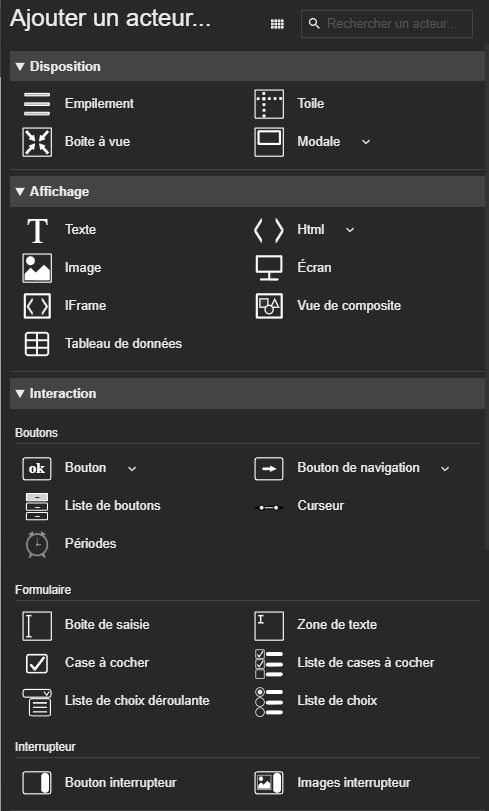

Il est possible de rebasculer dans l'ancien mode de représentation par grille d'icônes en cliquant sur l'icône en haut de la liste, à coté de la zone de filtre. Ce reglage est aussi disponible dans les paramètres de Synapps Studio.

### Nouveaux acteurs techniques

De nouveaux acteurs font leur apparition dans une nouvelle catégorie _Technique_.

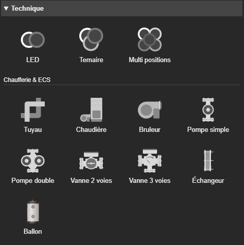

#### Acteur _LED_

Un nouvel acteur _LED_ permet d'afficher une LED de couleur personnalisée et dans différents états (allumée, éteinte ou clignotante).

#### Acteur _Ternaire_

L'acteur _Ternaire_ permet d'afficher une **image** et un **texte** selon trois états : _Vrai_, _Faux_ et _Défaut_. L'état est déterminé par une propriété booléenne et une propriété _En Défaut?_.

Si aucune image n'est définie, une _LED_ est affichée par défaut (verte allumée pour _Vrai_, verte éteinte pour _Faux_ et clignotante rouge pour _Défaut_). L'apparence de chaque état reste personnalisable.

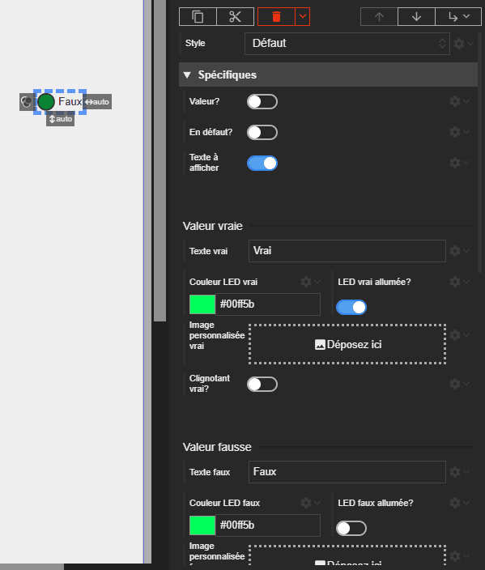

#### Acteur _Multi-position_

L'acteur _Multi-position_ permet d'afficher une **image** et un **texte** selon plusieurs états (jusqu'à 8). L'état est piloté par une propriété _Position_. Chaque état est défini par une clé, un texte, une image et une option de clignotement.

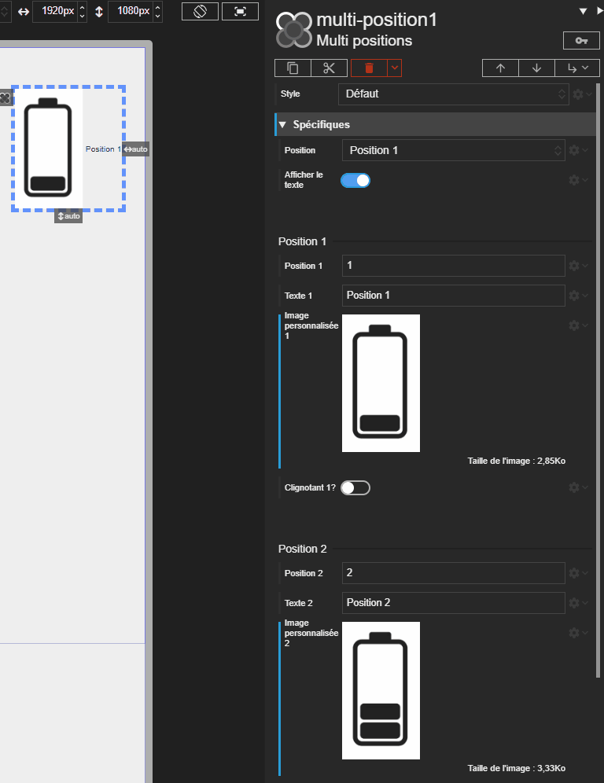

### Nouveaux acteurs techniques pour la chaufferie et ECS

Encore des acteurs techniques mais dédiés à la représentation de la chaufferie et de l'eau chaude sanitaire (ECS).

L'idée principale de ces acteurs est de permettre de représenter des équipements de chaufferie avec illustrations personnalisées et dynamiques. Les tailles sont normalisées par briques de 100x100 pixels pour faciliter la création de synoptiques de chaufferie.

#### Acteur _Tuyau_

L'acteur _Tuyau_ permet d'afficher un segment de tuyau ou une flèche de circulation. La couleur du tuyau et son orientation sont personnalisables.

Voici les différentes variantes disponibles :

- Tuyau droit
- Tuyau coudé
- Tuyau en T
- Tuyau en croix
- Terminaison
- Flèche

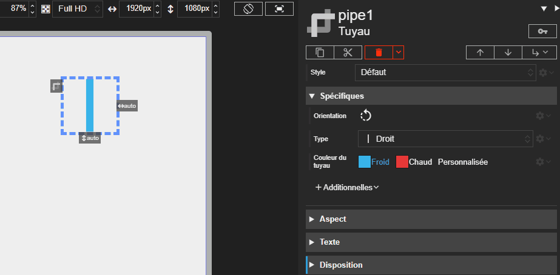

Deux couleurs sont prédéfinies pour représenter le fluide chaud (rouge) et le fluide froid (bleu). Il est possible de définir une couleur personnalisée.

L'acteur peut être tourné dans 4 directions (0°, 90°, 180° et 270°) par un bouton dans l'inspecteur.

Voici une démonstration de l'utilisation de l'acteur _Tuyau_ pour créer un réseau :

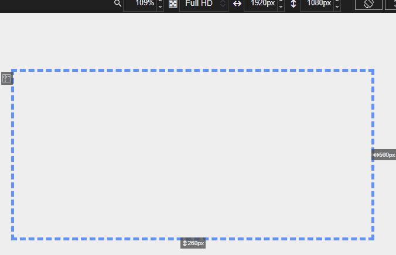

#### Acteur _Bruleur_

L'acteur _Bruleur_ permet d'afficher les différents états d'un bruleur de chaufferie. L'acteur est orientable vers la gauche ou la droite par un bouton dans l'inspecteur.

> version pilotée par un reflet disponible

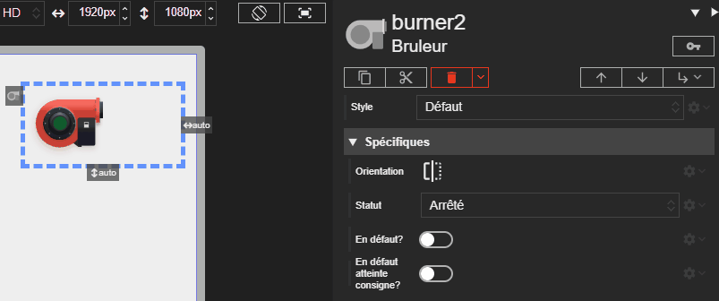

#### Acteur _Chaudière_

L'acteur _Chaudière_ permet d'afficher les différents états d'une chaudière de chaufferie. L'acteur est orientable vers la gauche ou la droite par un bouton dans l'inspecteur.

> version pilotée par un reflet disponible

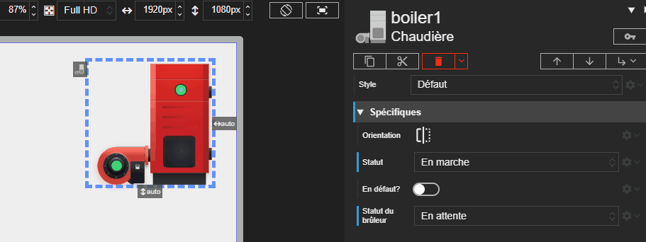

#### Acteur _Pompe simple_

L'acteur _Pompe simple_ permet d'afficher les différents états d'une pompe simple de chaufferie. L'acteur est orientable dans 4 directions (0°, 90°, 180° et 270°) par un bouton dans l'inspecteur.

> version pilotée par un reflet disponible

#### Acteur _Pompe double_

L'acteur _Pompe double_ permet d'afficher les différents états d'une pompe double de chaufferie. L'acteur est orientable dans 4 directions (0°, 90°, 180° et 270°) par un bouton dans l'inspecteur.

> version pilotée par un reflet disponible

#### Acteur _Vanne 2 voies_

L'acteur _Vanne 2 voies_ permet d'afficher les différents états d'une vanne 2 voies de chaufferie. L'acteur est orientable dans 4 directions (0°, 90°, 180° et 270°) par un bouton dans l'inspecteur.

> version pilotée par un reflet disponible

#### Acteur _Vanne 3 voies_

L'acteur _Vanne 3 voies_ permet d'afficher les différents états d'une vanne 3 voies de chaufferie. L'acteur est orientable dans 4 directions (0°, 90°, 180° et 270°) par un bouton dans l'inspecteur.

> version pilotée par un reflet disponible

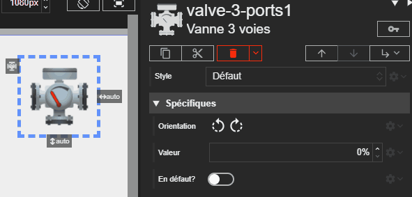

#### Acteur _Echangeur_

L'acteur permet d'afficher un échangeur thermique.

#### Acteur _Ballon_

L'acteur permet d'afficher un ballon d'eau chaude sanitaire (ECS).

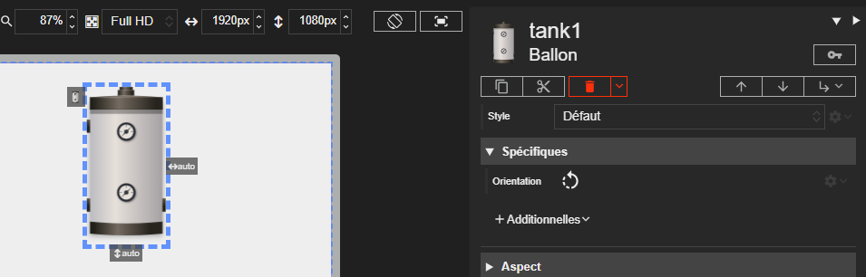

### Acteurs Techniques avec Reflet

Pour faciliter l'utilisation des nouveaux acteurs techniques, des versions avec reflet sont également disponibles. Ils permettent de piloter directement un acteur technique depuis un reflet de type correspondant.

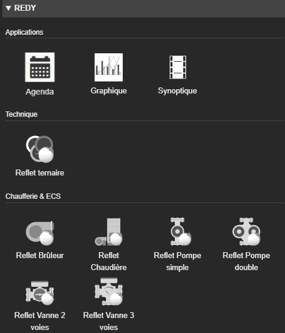

| Acteur               | Reflets compatibles                                                      |                                                                                                                                                          |
| -------------------- | ------------------------------------------------------------------------ | -------------------------------------------------------------------------------------------------------------------------------------------------------- |
| Reflet Ternaire      | <ul><li>Tous</li></ul>                                                   | Le reflet _Digital_ est bien entendu le plus adapté. Mais tous les reflets peuvent être utilisés.                                                        |
| Reflet Bruleur       | <ul><li>_Bruleur_</li><li>_Digital_</li></ul>                            |                                                                                                                                                          |
| Reflet Chaudière     | <ul><li>_Chaudière_</li></ul>                                            | Pour afficher la représentation de son bruleur, il faut que la sous-ressource correspondante existe et que le reflet _bruleur_ ou _digital_ soit activé. |
| Reflet Pompe simple  | <ul><li>_Pompe simple_</li><li>_Digital_</li></ul>                       |                                                                                                                                                          |
| Reflet Pompe double  | <ul><li>_Pompe double_</li></ul>                                         |                                                                                                                                                          |
| Reflet Vanne 2 voies | <ul><li>_Vanne 2 voies_</li><li>_Analogique_</li><li>_Digital_</li></ul> |                                                                                                                                                          |
| Reflet Vanne 3 voies | <ul><li>_PID_</li><li>_Analogique_</li><li>_Digital_</li></ul>           |                                                                                                                                                          |

Sur chacun d'eux, on peut choisir un reflet compatible pour le piloter. Il pourra fonctionner en mode autonome ou en suivant un requeêteur de reflet.

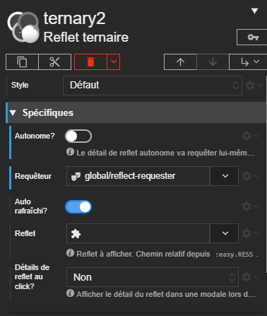

Il est également possible d'activer l'affichage d'un détail de reflet en cliquant sur l'acteur. Il s'afficera dans une modale sur un coté de l'acteur à choisir.

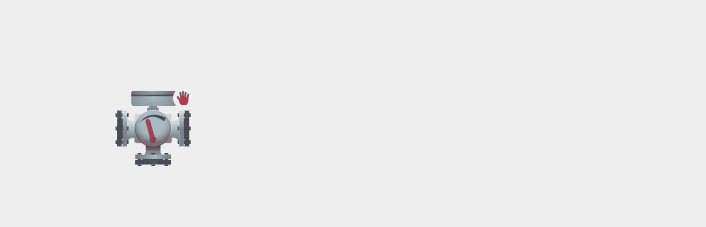

### Reflets

#### Optimisation des acteurs de reflet

Désormais, les acteurs nécessitant un reflet pour fonctionner sont créés par défaut en mode non autonome et utilisent le requêteur de reflet global `global/reflect-requester`. Cette approche optimise les performances de la scène en limitant le nombre de requêteurs actifs.

#### Indicateur de reflet forcé

L'affichage de l'indicateur a été uniformisé : il apparaît désormais en rouge sur fond blanc pour une lisibilité accrue.

### Navigation dans un onglet temporaire

Jusqu'à présent, lorsqu'un onglet était ouvert depuis une rubrique, il restait affiché jusqu'à sa fermeture explicite. Désormais, l'onglet est ouvert en mode temporaire et se voit automatiquement remplacé lors de la navigation vers une nouvelle rubrique.

Pour rendre un onglet permanent et éviter son remplacement, l'utilisateur peut soit commencer à en modifier le contenu, soit double-cliquer sur l'onglet lui-même.

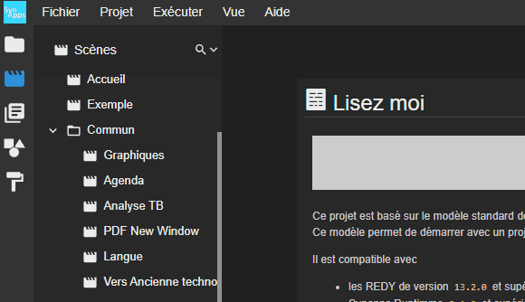

{: .tip }
> Maintenez la touche `Alt` enfoncée lors du clic sur une rubrique pour forcer son ouverture dans un nouvel onglet permanent.

### Evaluation de la taille de la synapp

Un nouvel outil accessible via le menu `Projet > Rapport de taille` permet d'estimer la taille de chaque élément de la synapp avant sa publication. Cette fonctionnalité aide à anticiper le poids final du projet et à identifier précisément les ressources les plus volumineuses.

Le rapport permet de trier les éléments par taille et d'utiliser des filtres par mots-clés pour faciliter l'analyse.

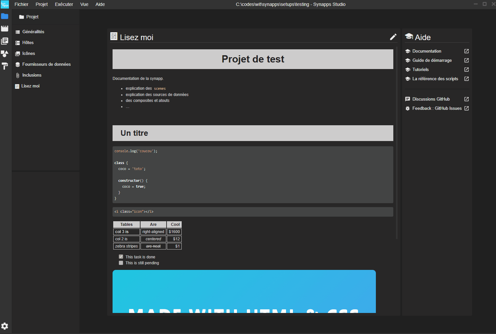

### Etapes de publication en journal

Lors de la publication d'une synapp, la fenêtre de progression affiche désormais le détail des étapes sous forme de journal. En cas d'échec, ce journal permet d'identifier précisément l'étape ayant posé problème.

Pour conserver la fenêtre ouverte après la fin de la publication (même en cas de succès), il suffit de cliquer à l'intérieur de celle-ci.

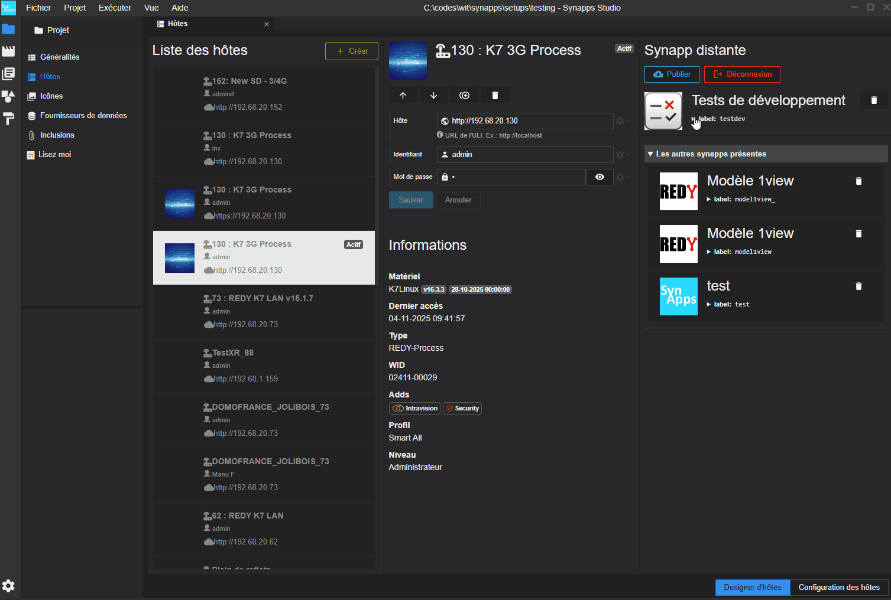

### Indicateurs d'utilisation des acteurs

En bas à gauche de Synapps Studio, de nouveaux indicateurs complètent l'indicateur de taille dans les éditeurs de scène, de composite et de style. Ils permettent d'évaluer l'impact de l'élément sur les performances d'exécution et la consommation de données.

Les indicateurs suivants sont affichés :

- **Nombre d'acteurs définis** : le nombre d'acteurs présents dans l'élément courant.
- **Nombre total d'acteurs instanciés** : le nombre réel d'acteurs présents à l'exécution, en tenant compte des contenus des composites, des scènes des acteurs _Écran_ et des instanciations dynamiques.
- **Nombre d'iframes** : le nombre d'acteurs intégrant une iframe (ex: _Iframe_, _Agenda_ ou _Synoptique_).
- **Nombre de requêteurs autonomes** : le nombre d'acteurs effectuant des requêtes de données de manière indépendante (fournisseurs de ressources, listes de reflets, journaux, etc.).
- **Requêtes simultanées** : le nombre de requêtes en cours et le maximum atteint depuis le chargement.

{: .tip }
> Cliquez sur l'indicateur de requêtes pour réinitialiser la valeur maximale.

Comme pour l'indicateur de taille, ces compteurs s'affichent en orange si un seuil de performance est dépassé, indiquant qu'une optimisation peut être nécessaire.

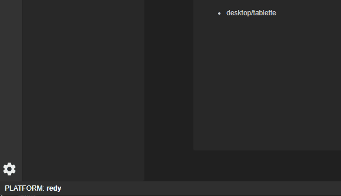

{: .note }
> Une première version des recommandations est disponible dans la section [conseils de performance](../../concepts/tips.md).

### Bouton pour montrer/cacher la valeur initiale d'une propriété liée

Dans l'inspecteur d'un acteur, lorsqu'une propriété est liée, un nouveau bouton permet d'afficher ou de masquer sa valeur initiale.

Un liseré bleu indique visuellement que cette valeur est renseignée, sans qu'il soit nécessaire d'ouvrir le volet.

{: .tip }
> Cela permet, par exemple, d'identifier rapidement une image restée inutilement définie sur une propriété liée.

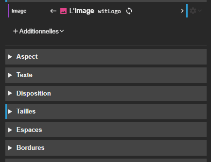

### Traduction des champs Options

Il est désormais possible d'utiliser la librairie de textes pour traduire les options des acteurs de sélection. En saisissant une clé de traduction dans le champ _Texte_ d'une option, celle-ci sera automatiquement traduite selon la langue active.

Cette fonctionnalité est disponible pour les acteurs : _Liste de boutons_, _Liste déroulante_, _Boutons radio_ et _Cases à cocher_.

### Designer de style

#### Gestion du positionnement dans une toile

L'inspecteur de style permet désormais de définir le positionnement par défaut d'un acteur lorsqu'il est placé dans un acteur _Toile_.

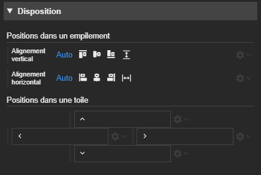

#### Coller un style

Il est désormais possible de coller un style copié sur un type d'acteur qui ne possède pas encore de définition de style personnalisée.

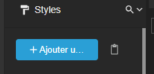

### Paramétres Studio : activer/désactiver les logs d'utilisation

Les logs d'utilisation facilitent le diagnostic des problèmes rencontrés dans Synapps Studio. Stockés localement, ils sont désormais **désactivés par défaut**.

Une option a été ajoutée dans les paramètres de Synapps Studio pour permettre de réactiver cette fonctionnalité.

### REDY PILOT <code>beta</code>

{: .warning }
> Cette section introduit le support des futurs REDY PILOT. Cette fonctionnalité est en cours de développement et sera enrichie dans les prochaines versions.

#### Acteur Fournisseur de curseur requête

Un nouvel acteur fournisseur de données permet d'exécuter une requête SQL et de fournir son résultat. Il est possible de définir des paramètres dynamiques pour la requête, qui sont détectés automatiquement lors du choix du curseur.
La donnée fournie est récupérable par liaison ou utilisable dans les évènements.

#### Acteur Fournisseur de curseur instruction

Similaire au fournisseur de requête, ce nouvel acteur permet d'exécuter une instruction SQL (modification de données) et de fournir son résultat. Il permet également de définir des paramètres dynamiques détectés automatiquement.

#### Acteur Tableau de curseur

Alimenté directement par un curseur de requête, cet acteur permet d'afficher des données paginées issues de la base de données SQL.

Les colonnes peuvent être générées automatiquement selon les données reçues ou configurées manuellement. Comme pour le tableau de données classique, de nombreux évènements sont disponibles pour interagir avec les cellules et personnaliser le rendu.

## Corrections

### Renommage intempestif des scènes et composites

Correction d'un problème où le basculement entre l'éditeur JSON d'une scène ou d'un composite et un autre élément entraînait un renommage accidentel de l'élément source.

### Restauration des réglages d'alignement

Les options d'alignement dans l'inspecteur d'acteur, absentes dans la version précédente pour les scènes, les composites et les acteurs principaux, sont de nouveau disponibles.

### Première connexion au REDY

Résolution d'un bug empêchant la première connexion au serveur REDY au sein d'un nouveau projet.

### Clé de scène ou composite en doublon

Il était possible de créer une scène ou un composite avec une clé identique à un élément existant. Ce problème survenait notamment lorsqu'un élément collé conservait sa clé d'origine (ex: `scene12`), entrant en conflit avec un nouvel élément créé ultérieurement. Ce dysfonctionnement est désormais corrigé.
