# Notes de version `1.7.0-beta`

{: .pin-title }

> 🚧 En construction 🚧
>
> Cette version est en cours de construction. Certaines fonctionnalités peuvent apparaître ou bien certaines peuvent être modifiées.

## Révisions

> 2026-XX-XXTXX:00:00

- XXXXXXXXXXXXXXXXXXXXX



## Synapps Runtime version 2.9.0

Support de la version `2.9.0` de Synapps Runtime, disponible dans la prochaine version de REDY `16.5.0`.

- Acteurs techniques pour la CTA:

  - Acteur _Flèche_,
  - Acteur _Conduit_,
  - Acteur _Registre_,
  - Acteur _Bypass_,
  - Acteur _Filtre_,
  - Acteur _Échangeur adiabatique_,
  - Acteur _Batterie_,
  - Acteur _Humidificateur_,
  - Acteur _Moteur_,
  - Acteur _Moteur axial_,
  - Acteur _Capteur antigel_,
  - Acteur _Capteur_,
  - Acteur _Roue_,

- Acteurs menus :
  - Acteur _Menu de navigation_,
  - Acteur _Groupe de navigation_,
  - Acteur _Bouton Menu_,

- Corrections :
  - Acteur _Modal_ : La couleur de fond du modal suit maintenant la couleur de fond définie sur la synapp.
  - Acteur _Reflet de chaudière_ : La couleur du bruleur suit maintenant celle de la chaudière.

## Nouveautés

<!-- ### Archivage du projet dans le REDY

A partir des REDY version 16.6.0, il est possible d'archiver le projet Synapps Studio dans la synapp publiée. Ainsi, il est possible de télécharger le projet Synapps Studio ainsi archivé depuis le REDY.

Depuis la section *Projet/Hôtes*, dans le détail de la synapp publiée, il y a maintenant des boutons qui permettent de gérer l'archivage du projet.

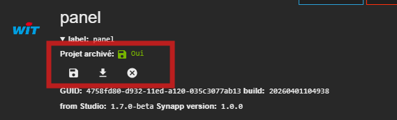

Dans le menu *Fichier/Récupérer un projet archivé*, un outil permet de se connecter à un REDY compatible et de récupérer un projet archivé avec la synapp.

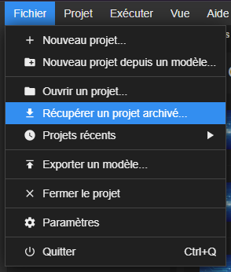
 -->

### Exécuter une scène

Il est maintenant possible d'exécuter une scène directement depuis Synapps Studio en cliquant sur l'icône en forme de triangle dans la barre d'outils.

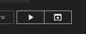

Il est également possible de l'exécuter depuis le menu contextuel de l'explorateur de scènes.

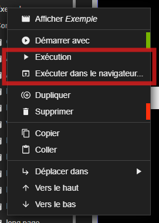

### Acteurs Menu de navigation

3 nouveaux acteurs font leur apparition pour faciliter la création de menus de navigation.

- Acteur _Menu de navigation_
- Acteur _Groupe de navigation_
- Acteur _Bouton Menu_

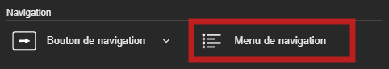

L'acteur _Menu de navigation_ permet de renseigner quelle scène est séléctionnée. Il permet d'ajouter des acteurs _Groupe de navigation_ et _Bouton Menu_.

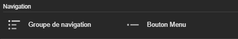

L'acteur _Bouton Menu_ permet de définir quelle scène sera sélectionnée sur l'acteur _Menu de navigation_.

L'acteur _Groupe de navigation_ permet de regrouper des acteurs _Bouton Menu_ dans une boite enroulable.

Aussi, l'acteur _Menu de navigation_ permet de définir les styles des acteurs _Groupe de navigation_ et _Bouton Menu_ lorsqu'il sont actifs ou inactifs ou survolés.

Il suffit maitenant de lier un acteur _Ecran_ pour qu'il navigue vers la scène définie dans l'acteur _Bouton Menu_.

Un [tutoriel](../../tutorials/navigation-menu-actors.md) est disponible dans la section dédiée.

### Nouveaux acteurs techniques pour la CTA

De nouveaux acteurs techniques font leur apparition pour faciliter la création de synoptiques de centrale de traitement d'air (CTA). Ces acteurs sont en cohérence avec les acteurs issues de la `chaufferie`, il est donc possible de connecter les éléments d'une chaufferie à ceux d'une CTA (tuyaux, pompes ...).

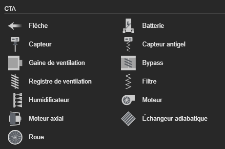

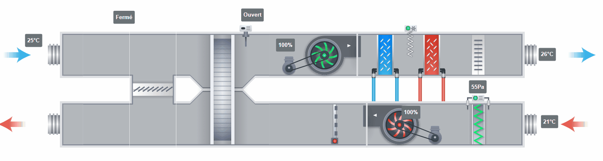

### Acteur _Flèche_

L'acteur _Flèche_ permet de représenter le sens de circulation de l'air.

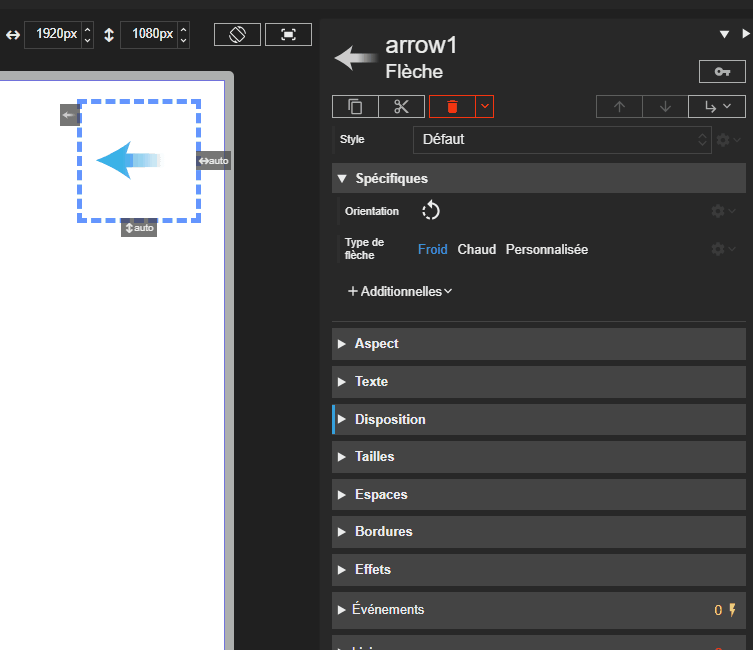

#### Acteur _Conduit_

L'acteur _Conduit_ permet d'afficher une gaine de ventilation et d'en définir la taille.

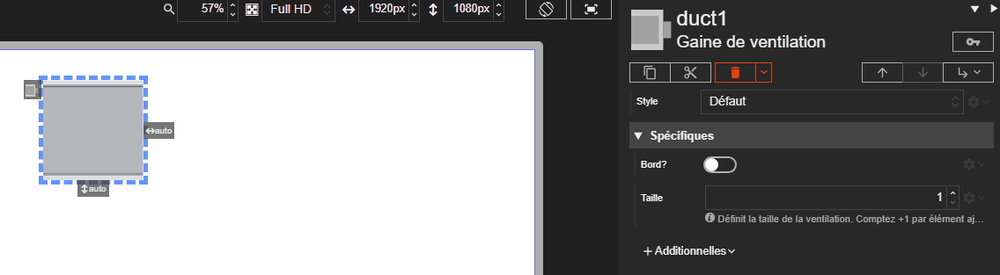

#### Acteur _Registre_

L'acteur _Registre_ permet de représenter un registre d'air.  Il prend en charge un mode digital et un mode analogique.

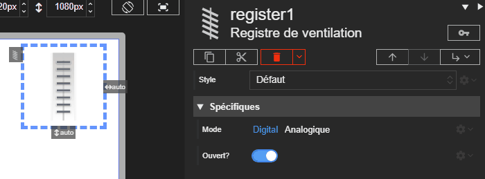

#### Acteur _Bypass_

L'acteur _Bypass_ permet d'afficher un organe de dérivation d'air.  Il prend en charge un mode digital et un mode analogique.

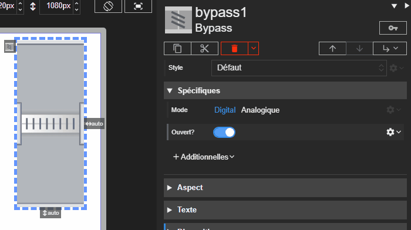

#### Acteur _Filtre_

L'acteur _Filtre_ permet de visualiser un filtre CTA. Cet acteur est toujours muni d'une caption affichant l'état du filtre (propre / sale).

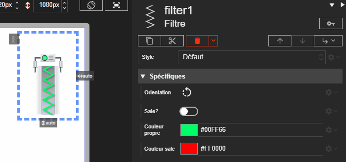

#### Acteur _Batterie_

L'acteur _Batterie_ permet de représenter une batterie à air ou électrique. Il gère la couleur de batterie d'air et l'état LED de la version électrique.

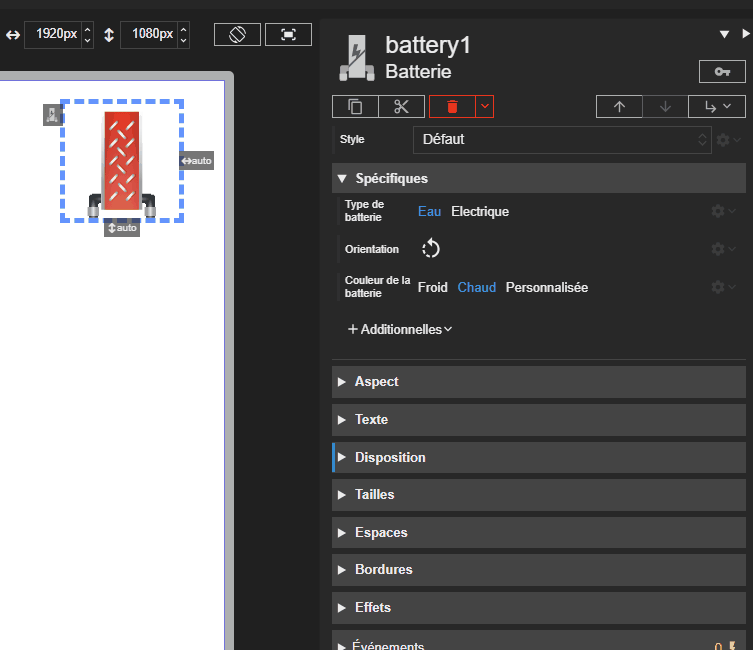

#### Acteur _Humidificateur_

L'acteur _Humidificateur_ permet de représenter un humidificateur de CTA.

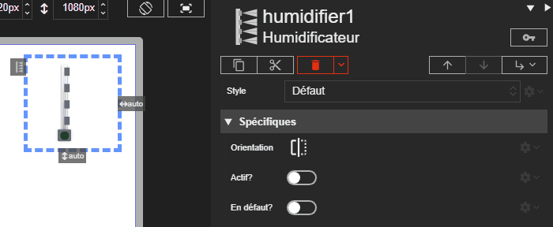

#### Acteur _Moteur_

L'acteur _Moteur_ permet d'afficher un moteur de CTA avec état visuel. Il prend en charge un pilotage numérique ou analogique.

#### Acteur _Moteur axial_

L'acteur _Moteur axial_ propose une variante axial du moteur CTA. Son comportement reste identique.

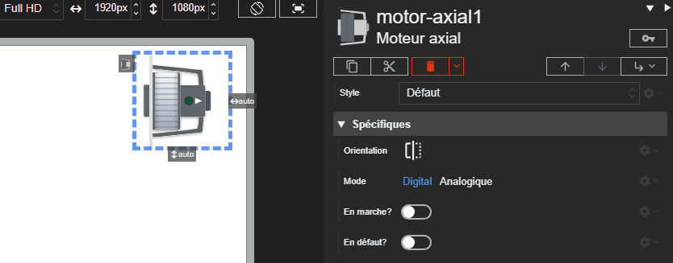

#### Acteur _Capteur_

L'acteur _Capteur_ permet d'afficher un capteur que l'on peut acoller aux conduits de la CTA.

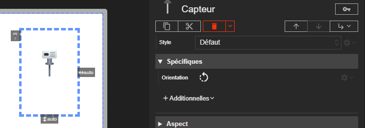

#### Acteur _Capteur antigel_

L'acteur _Capteur antigel_ permet de signaler visuellement le risque de gel. Il met en avant l'état d'alarme via un indicateur dédié.

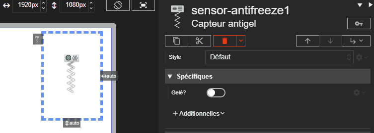

#### Acteur _Roue_

L'acteur _Roue_ permet de représenter une roue de brassage d'air. Il prend en charge un mode digital et un mode analogique.

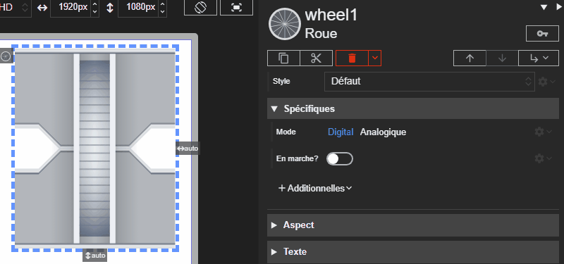

#### Acteur _Échangeur adiabatique_

L'acteur _Échangeur adiabatique_ permet de représenter un échangeur avec personnalisation des flux et des couleurs.

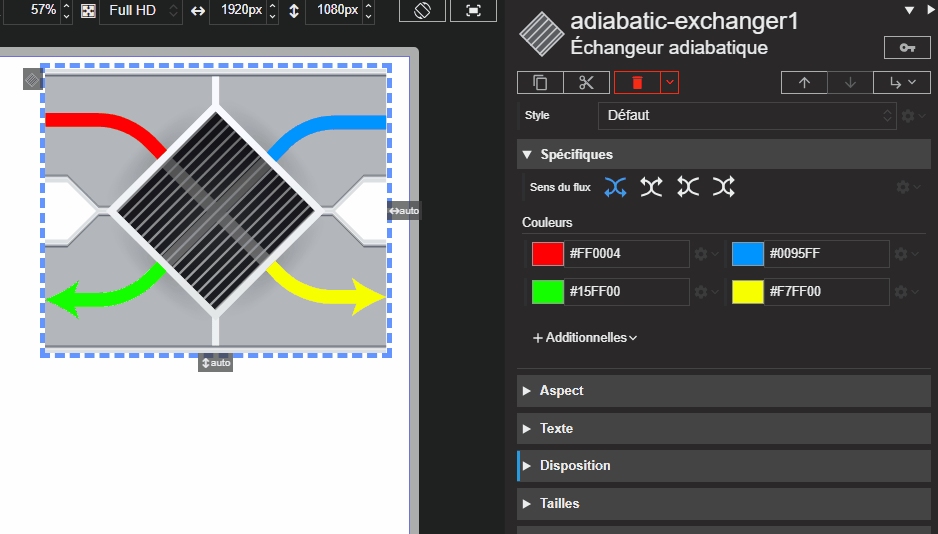

### Gestion des Hôtes

L'aspect de la page de gestion des hôtes a été revu :

- L'aspect de l'indicateur de l'hôte actif a été revu pour être plus visible.
- Les boutons de connexion/déconnexion et suppression de synapp ont été redisposés.
- Les boutons de suppression des autres synapps n'apparaissent qu'à leur survol.

## Corrections

- Acteur _Pompe double_ : Ajout du mode `bridé` / `débridé`.
  Lorsque l'acteur est en mode `bridé`, il affiche une pompe double avec une seule pompe active à la fois, c'est un statut qui contrôle le fonctionnement. En mode `débridé`, les deux pompes peuvent être actives simultanément ce sont plusieurs propriétés qui contrôlent le fonctionnement.

-
