# Notes de version `1.7.1`

## Révisions

> 1.7.1 - 2026-05-28T14:00:00

- Correction de la rotation de l'acteur _Conduit_
- Correction de la prise en compte de la taille de la police générale dans les synapps publiées.
- Retour de tous les évènements sur l'acteur _Bouton Menu_
- Support du Runtime version 2.9.2 et des changements sur les acteurs menus et CTA.

> 1.7.0 - 2026-05-07T11:00:00

- Correction de l'acteur _Échangeur_ qui s'appelait auparavant _Échangeur adiabatique_.

> 1.7.0 - 2026-05-05T18:00:00

- Sortie de la version 1.7.0



## Synapps Runtime version 2.9.2

- Support de la version `2.9.2` de Synapps Runtime, disponible dans la version de REDY `16.5.1`:
  - Les acteurs _Conduit_, _Capteur_, _Capteur antigel_,  _Batterie_, _Filtre_ et _Registre_ peuvent être orientés dans les 4 directions.
  - Acteur _Conduit_ :
    - Type de conduit en _T_,
    - Type de conduit en _Coude_

  - Acteur _Moteur axial_ : Ajout d'un indicateur visuel lors d'un défaut.
  - Acteur _Tuyaux_ : Ajout de la taille pour le type _Droit_
  - Corrections :
    - Acteur _Roue_ : La version digitale ne prend plus en compte la propriété _Vitesse_ pour faire tourner la roue.
    - Acteur _Batterie_ : Suivi correct de la position de la LED lors du changement de l'orientation.
    - Acteur _Groupe de navigation_ :
      - Ajustement de la position de l'icone d'enroulement.
      - Prise en compte dynamique du changement de la propriété _Image_.
    - Acteur _Bouton de Menu_ :
      - Prise en compte dynamique du changement de la propriété _Image_.

### Depuis la version `2.9.0` :

- Acteurs techniques pour la CTA :

  - Acteur _Flèche_,
  - Acteur _Conduit_,
  - Acteur _Registre_,
  - Acteur _Bypass_,
  - Acteur _Filtre_,
  - Acteur _Échangeur_,
  - Acteur _Batterie_,
  - Acteur _Humidificateur_,
  - Acteur _Moteur_,
  - Acteur _Moteur axial_,
  - Acteur _Capteur antigel_,
  - Acteur _Capteur_,
  - Acteur _Roue_,

- Acteurs menus :
  - Acteur _Menu de navigation_,
  - Acteur _Groupe de navigation_,
  - Acteur _Bouton Menu_,

- Corrections :
  - Acteur _Modal_ : La couleur de fond du modal suit maintenant la couleur de fond définie sur la synapp.
  - Acteur _Reflet de chaudière_ : La couleur du bruleur suit maintenant celle de la chaudière.

## Nouveautés

### Exécuter une scène

Il est maintenant possible d'exécuter une scène directement depuis Synapps Studio en cliquant sur l'icône en forme de triangle dans la barre d'outils.

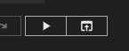

Il est également possible de l'exécuter depuis le menu contextuel de l'explorateur de scènes.

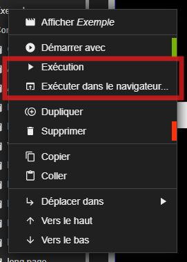

### Acteurs Menu de navigation

3 nouveaux acteurs font leur apparition pour faciliter la création de menus de navigation.

- Acteur _Menu de navigation_
- Acteur _Groupe de navigation_
- Acteur _Bouton Menu_

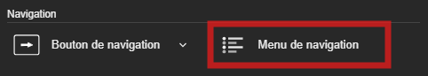

L'acteur _Menu de navigation_ permet de renseigner quelle scène est séléctionnée. Il permet d'ajouter des acteurs _Groupe de navigation_ et _Bouton Menu_.

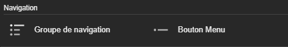

L'acteur _Bouton Menu_ permet de définir quelle scène sera sélectionnée sur l'acteur _Menu de navigation_.

L'acteur _Groupe de navigation_ permet de regrouper des acteurs _Bouton Menu_ dans une boite enroulable.

Aussi, l'acteur _Menu de navigation_ permet de définir les styles des acteurs _Groupe de navigation_ et _Bouton Menu_ lorsqu'il sont actifs ou inactifs ou survolés.

Il suffit maitenant de lier un acteur _Ecran_ pour qu'il navigue vers la scène définie dans l'acteur _Bouton Menu_.

Un [tutoriel](../../tutorials/navigation-menu-actors.md) est disponible dans la section dédiée.

### Nouveaux acteurs techniques pour la CTA

De nouveaux acteurs techniques font leur apparition pour faciliter la création de synoptiques de centrale de traitement d'air (CTA). Ces acteurs sont en cohérence avec les acteurs issues de la `chaufferie`, il est donc possible de connecter les éléments d'une chaufferie à ceux d'une CTA (tuyaux, pompes ...).

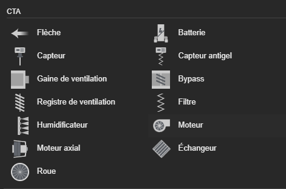

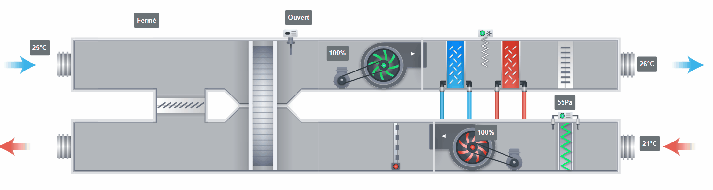

Un exemple de scène :



### Acteur _Flèche_

L'acteur _Flèche_ permet de représenter le sens de circulation de l'air.

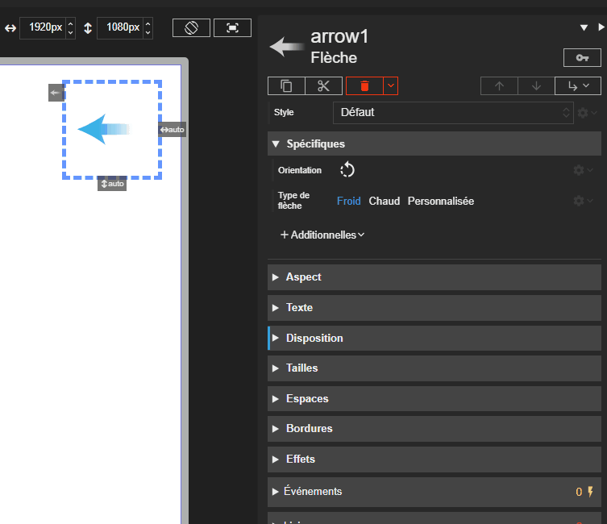

#### Acteur _Conduit_

L'acteur _Conduit_ permet d'afficher une gaine de ventilation et d'en définir la taille.

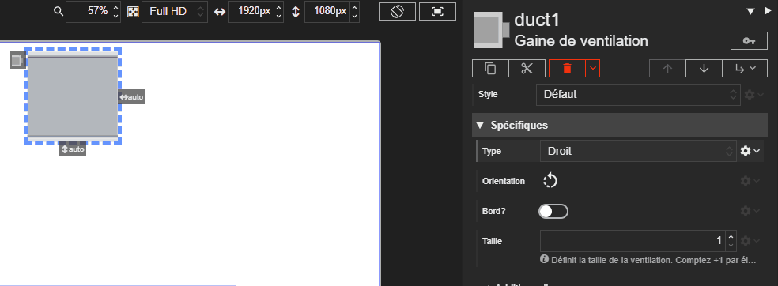

#### Acteur _Registre_

L'acteur _Registre_ permet de représenter un registre d'air.  Il prend en charge un mode digital et un mode analogique.

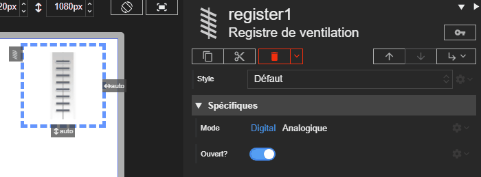

#### Acteur _Bypass_

L'acteur _Bypass_ permet d'afficher un organe de dérivation d'air.  Il prend en charge un mode digital et un mode analogique.

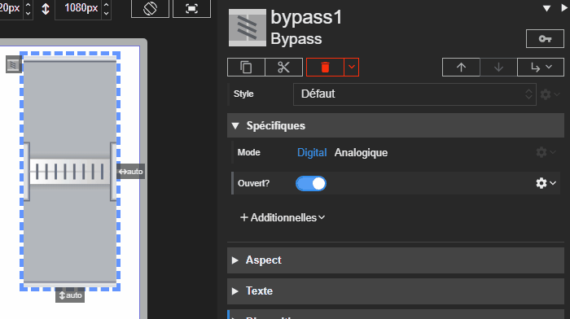

#### Acteur _Filtre_

L'acteur _Filtre_ permet de visualiser un filtre CTA. Cet acteur est toujours muni d'une caption affichant l'état du filtre (propre / sale).

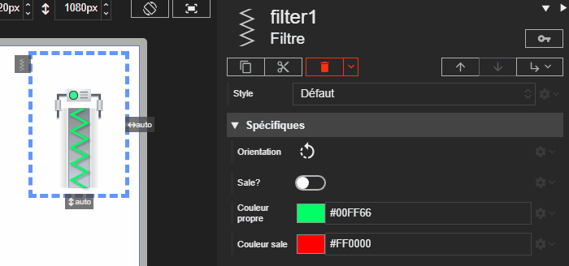

#### Acteur _Batterie_

L'acteur _Batterie_ permet de représenter une batterie à air ou électrique. Il gère la couleur de batterie d'air et l'état LED de la version électrique.

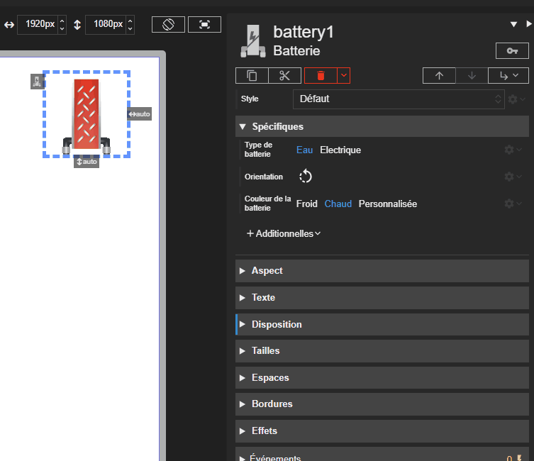

#### Acteur _Humidificateur_

L'acteur _Humidificateur_ permet de représenter un humidificateur de CTA.

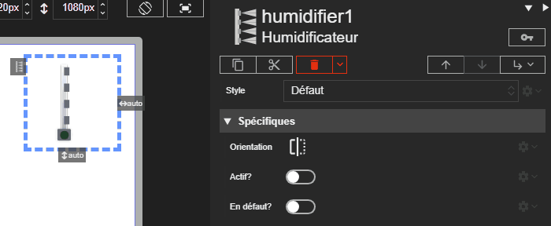

#### Acteur _Moteur_

L'acteur _Moteur_ permet d'afficher un moteur de CTA avec état visuel. Il prend en charge un pilotage numérique ou analogique.

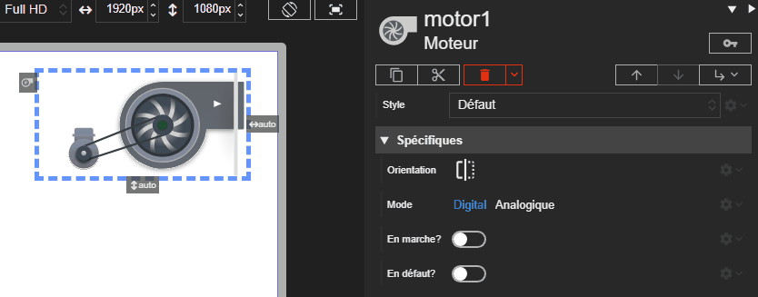

#### Acteur _Moteur axial_

L'acteur _Moteur axial_ propose une variante axial du moteur CTA. Son comportement reste identique.

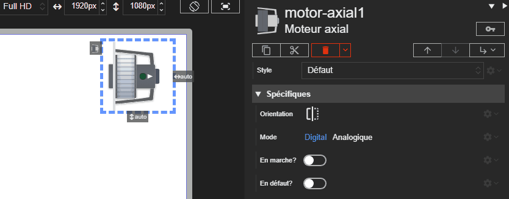

#### Acteur _Capteur_

L'acteur _Capteur_ permet d'afficher un capteur que l'on peut acoller aux conduits de la CTA.

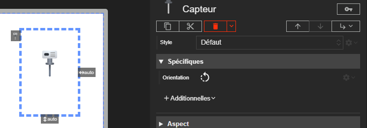

#### Acteur _Capteur antigel_

L'acteur _Capteur antigel_ permet de signaler visuellement le risque de gel. Il met en avant l'état d'alarme via un indicateur dédié.

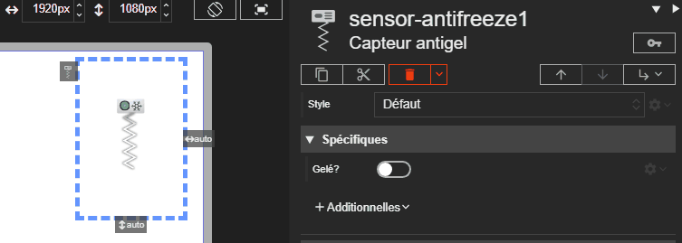

#### Acteur _Roue_

L'acteur _Roue_ permet de représenter une roue de brassage d'air. Il prend en charge un mode digital et un mode analogique.

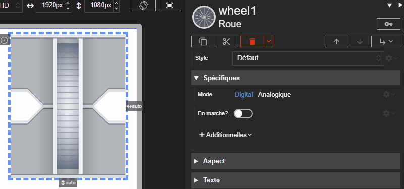

#### Acteur _Échangeur_

L'acteur _Échangeur_ permet de représenter un échangeur avec personnalisation des flux et des couleurs.

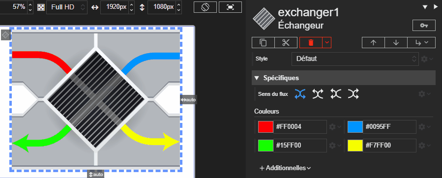

### Acteurs Chaufferie

#### Acteur _Tuyau_

L'acteur _Tuyau_ en mode droit propose maintenant de choisir la taille du tuyau.

#### Acteur _Pompe double_

Ajout du mode `bridé` / `débridé`.
Lorsque l'acteur est en mode `bridé`, il affiche une pompe double avec une seule pompe active à la fois, c'est un statut qui contrôle le fonctionnement. En mode `débridé`, les deux pompes peuvent être actives simultanément ce sont plusieurs propriétés qui contrôlent le fonctionnement.

### Gestion des Hôtes

L'aspect de la page de gestion des hôtes a été revu :

- L'aspect de l'indicateur de l'hôte actif a été revu pour être plus visible.
- Les boutons de connexion/déconnexion et suppression de synapp ont été redisposés.
- Les boutons de suppression des autres synapps n'apparaissent qu'à leur survol.

## REDY PILOT

De nouveaux acteurs font leur apparition pour faciliter la création de vue dédié à REDY PILOT, notamment pour l'affichage de données issues de la base SQL.

### Acteur Fournisseur de curseur requête

Un nouvel acteur fournisseur de données permet d'exécuter une requête SQL et de fournir son résultat. Il est possible de définir des paramètres dynamiques pour la requête, qui sont détectés automatiquement lors du choix du curseur.

La donnée fournie est récupérable par liaison ou utilisable dans les évènements.

### Acteur Fournisseur de curseur instruction

Similaire au fournisseur de requête, ce nouvel acteur permet d'exécuter une instruction SQL (modification de données) et de fournir son résultat. Il permet également de définir des paramètres dynamiques détectés automatiquement.

### Acteur Tableau de curseur

Alimenté directement par un curseur de requête, cet acteur permet d'afficher des données paginées issues de la base de données SQL.

Les colonnes peuvent être générées automatiquement selon les données reçues ou configurées manuellement. Comme pour le tableau de données classique, de nombreux évènements sont disponibles pour interagir avec les cellules et personnaliser le rendu.

## Corrections

### Taille de la police

- La taille de la police dans les généralités ne s'appliquait pas dans les synapps publiées.

### Acteur _Bouton Menu_

- Retour de tous les évènements sur l'acteur _Bouton Menu_. Les évènements de souris, de clavier, etc n'étaient pas proposés dans la liste des évènements.
