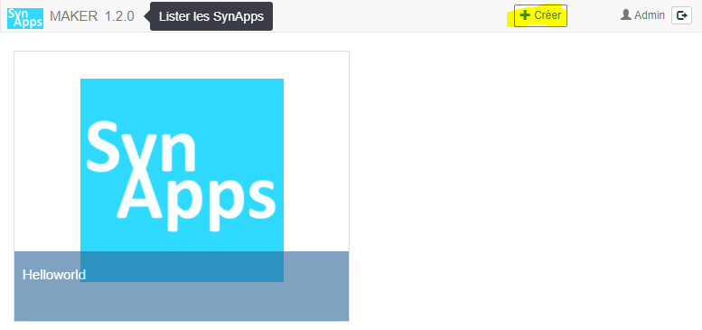

[< 2. Les liaisons](./index.md)

# Tutoriel 2: les liaisons **1/6** *[6 nov 17]*

## Prérequis

* [Tutoriel 1: première SynApp "Helloworld"](../tuto01/index.md)

* Le paramétrage [SynApps_Tutorials.BRY](../config/SynApps_Tutorials.BRY) installé sur le REDY. Il contient deux ressources pré-configurées nécessaires dans le dossier ```Tutorial2```:
    1. Une **variable analogique** ```VariableAnalogiqueTuto``` sinusoïdale variant de 0 à 100
    2. Une **consigne digitale** ```ConsigneLogiqueTuto```

## Création de la SynApp

Créer la SynApp **tuto02** avec le MAKER depuis le bouton *créer* de la *barre de commande*



Suite du [tutoriel](part2.md)
