[< 3. Les acteurs dispositions](./index.md)



# Tutoriel 3: l'acteur de disposition **toile**


La deuxième partie de ce tutoriel est consacrée à l'acteur **_toile_** qui permet de **superposer** des acteurs enfants et repondre au besoin de **construction de synoptiques** notamment !

La scène sera constituée d'un fond de plan et permettra de gérer deux zones de lumières dans une salle de réunion

## Prerequis

Le paramétrage [SynApps_Tutorials.BRY](../config/SynApps_Tutorials.BRY) installé sur le REDY. Il contient deux **consignes analogiques** préconfigurées ```LightZone1``` et ```LightZone2``` dans le dossier ```Tutorial3```. Elles représentent deux zones de lumières à commander avec des valeurs pouvant varier de ```0``` à ```100%```

Créer une **nouvelle scène** dans la SynApp **tuto03** créée précédemment. Modifier le _label_ de la scène en ```sceneCanvas``` et le _nom_ avec ```Toile``` puis déployer.


## Construction de la scène de la zone 1

1. Dans la scène courante _sceneCanvas_ définissez l'acteur principal avec un acteur **toile**

    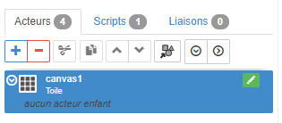

    Modifier la taille de la grille de la toile

    * propriété _Spécifiques > Grille horizontale_ avec la valeur ```50px```
    * propriété _Spécifiques > Grille verticale_ avec la valeur ```50px```

    _Remarque:_ la grille permet d'**aligner** les acteurs enfants selon la **taille de la maille**. Ici: _50px*50px_
    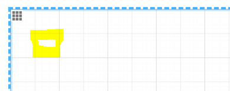

2. **Ajouter** un acteur enfant de type **image** et définir le fond de plan avec l'image ci-dessous.
    * Click droit sur l'image ci-dessous et _Enregistrer sous_ dans un dossier local
    

    * Ouvrir le dossier local contenant l'image
    * Glisser/déplacer l'image dans la zone **hachurée** de la propriété  _Spécifiques > Image_
   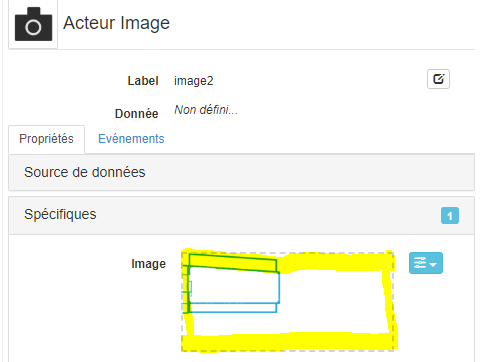
    * Modifier la propriété _Gabarit > Hauteur_ à la valeur par défaut
    
    * Modifier également la propriété _Gabarit > Largeur_ à la valeur par défaut

3. La _zone de prévisualisation_ doit ressembler à ceci
    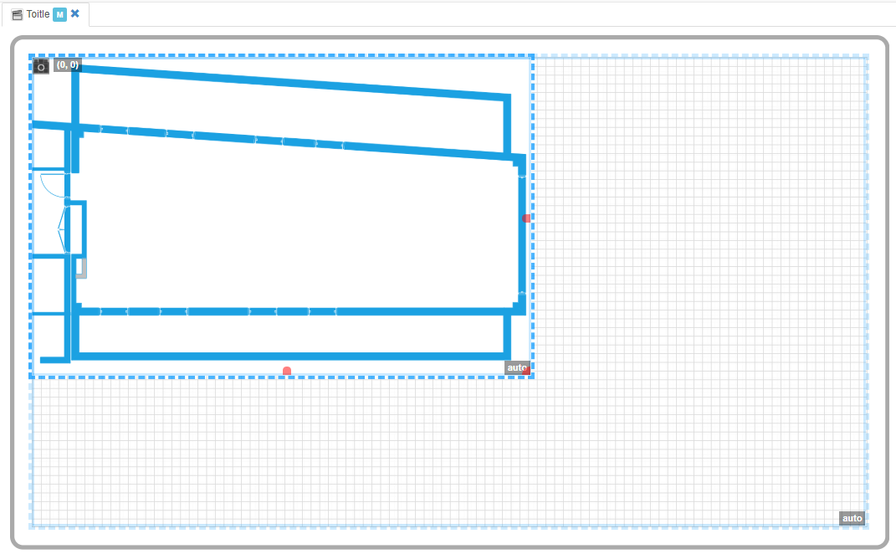

    _Remarque:_ pour adapter la taille de la _zone de prévisualisation_ au contenu:
    * positionner le curseur souris sur la zone de prévisualisation et utiliser le **scroll haut**/**bas** de la souris pour **zoomer**/**dezoomer** ou
    * modifier manuellement le facteur de zoom
    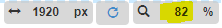

4. **Sélectionner** l'acteur _toile_ **canvas1** et **ajouter** un acteur enfant de type _Empilement_ **stack3** qui représentera le contour du point lumineux et le configurer:

    * définir la propriété _Aspect > Couleur de fond_ avec une couleur gris clair ```#e7e7e7```
    * la propriété _Aspect > Bordure > Style bordure_ à ```Solide```
    * la propriété _Aspect > Bordure > Epaisseur bordure_ à ```10px```
    * la propriété _Aspect > Bordure > Rayon bordure_ à ```50px```
    * la propriété _Aspect > Bordure > Couleur bordure_  avec une couleur gris foncé ```#555555```

5. **Sélectionner** l'acteur _Empilement_ **stack3** et **ajouter** un acteur enfant de type _Empilement_ **stack4** qui représentera la couleur dont l'opacité variera en fonction de l'intensité lumineuse:

    * définir la propriété _Aspect > Couleur de fond avec une couleur jaune ```#ffe583```
    * ajouter cette couleur dans la librairie avec le nom ```colorLight```, pour une utilisation ultérieure, et lier la propriété ci-dessus (voir [tutoriel 2 sur les liaisons aux librairies](../tuto02/part6/index.md))
    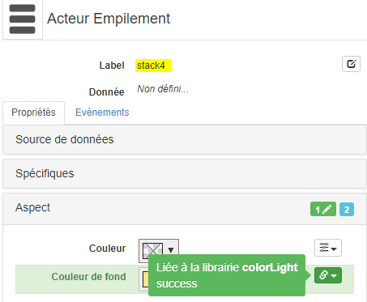
    * la propriété _Aspect > Bordure > Rayon bordure_ à ```50px```
    * la propriété _Position > Align. vertical_ à ```Etendre```
    * la propriété _Position > Align. horizontal_ à ```Etendre```
    * la propriété _Gabarit > Hauteur_ à la valeur par défaut ```[vide]```
    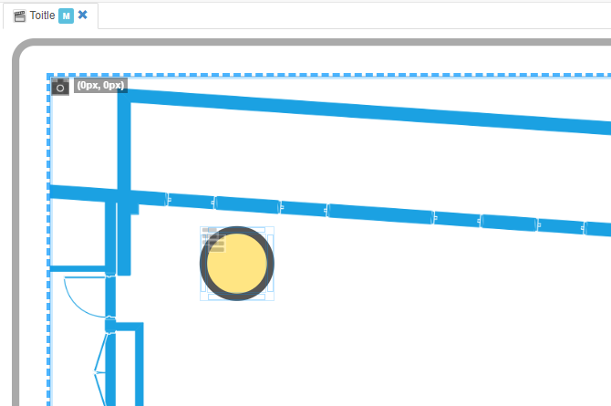

6. **Positionner** l'acteur _Empilement_ **stack3** sur la toile directement en déplaçant l'acteur avec le clique souris

    * ouvrir l'onglet _Position_ dans l'inspecteur de l'acteur
    * déplacer l'acteur avec la souris maintenue cliquée
    * observer ques les propriétés _Position > Position gauche_ et _Position > Position haut_ changent en même temps avec un pas de ```50px``` correspondant à la taille de la grille de la toile
    * modifier la propriété _Position > Alignement_ à ```200px```
    * modifier la propriété _Position > Position haut_ à ```200px```

    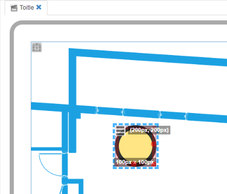
    _Remarque:_ dans la zone de prévisualisation, les tailles ```100px * 100px``` ainsi que positions sont indiquées ```200px, 200px```

    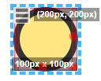

7. **Sélectionner** l'acteur _toile_ **canvas1** et **ajouter** un acteur enfant de type _curseur_ **slider5** qui permettra de commander la consigne analogique de la première zone lumineuse:

    * modifier la propriété _Spécifiques > Valeur_ avec la valeur ```75```
    * modifier la propriété _Spécifiques > Bar_ avec ```Après curseur```
    * lier la propriété _Spécifiques > Couleur fond bar_ à la librairie ```colorLight```
    * modifier la propriété _Position > Position gauche_ à ```150px```
    * modifier la propriété _Position > Position haut_ à ```620px```
    * modifier la propriété _Gabarit > Largeur_ à ```400px```
    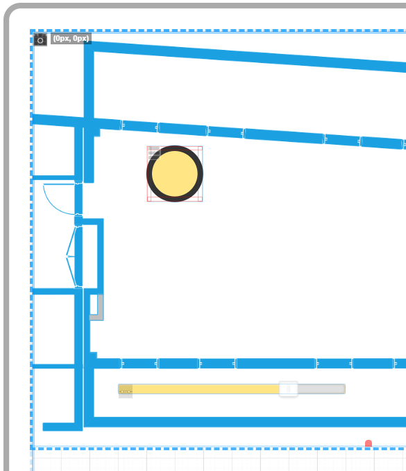
    * definir la source de donnée propriété _Source de données > Source_
    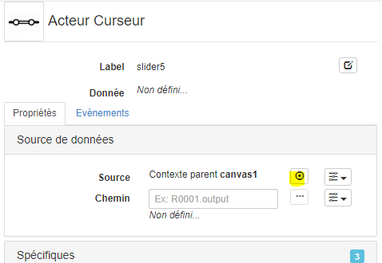
    * créer une nouvelle source de donnée
    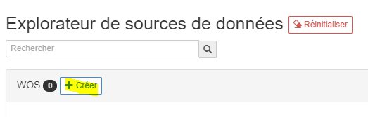
    * sélectionner la consigne analogique ```LightZone1``` dans le dossier des ressources ```Tutorial2```
    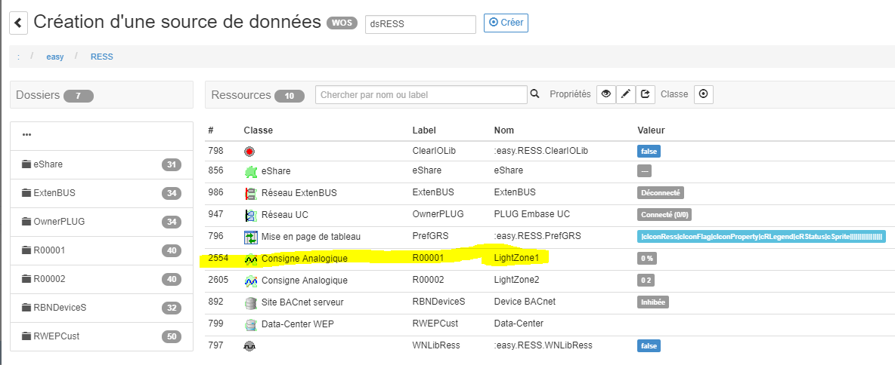
    * renommer la source de donnée ```dsLightZone1``` puis **créer**
    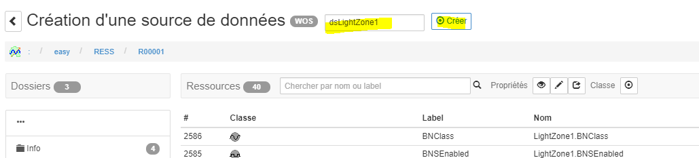
    * lier la propriété _Spécifiques > Valeur_ à une source de donnée
    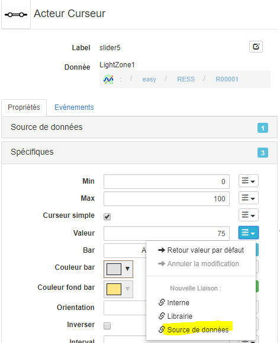
    * Dans l'explorateur de liaison, modifier le _Chemin_ avec la valeur ```setpoint```, sélectionner _Ecriture_ puis **Lier**
    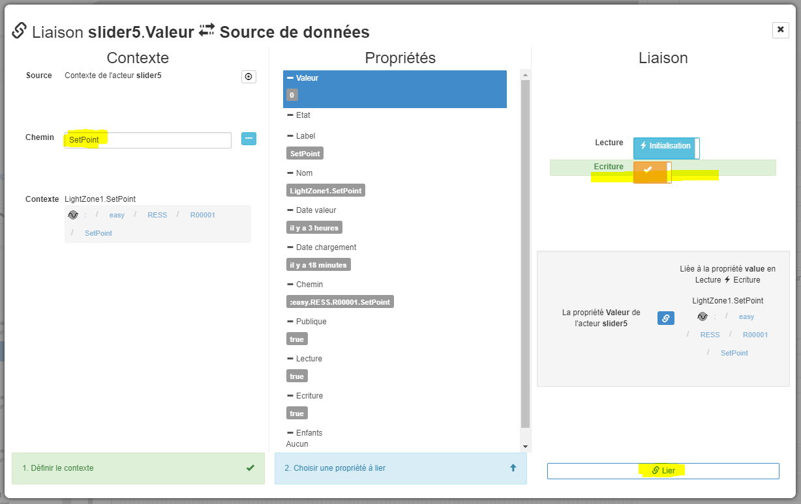
    * La _valeur_ du curseur **slider5** est désormais lié en _lecture_/_écriture_ sur la ressource consigne analogique **LightZone1**
    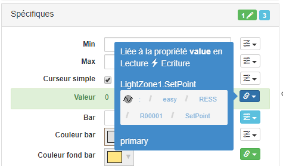

8. **Sélectionner** l'acteur _Empilement_ **stack4** et lier son _opacité_ à la valeur de l'acteur _curseur_ **slider5** qui permettra de commander la consigne analogique de la première zone lumineuse:

    * lier en _interne_ la propriété _Aspect > Opacité_ avec la propriété _Spécifiques > Valeur_ de l'acteur **slider5**
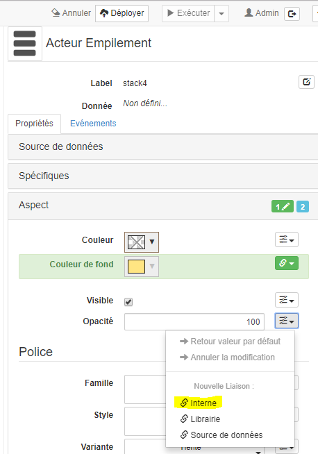
    (voir [Tutoriel 2 sur les liaisons internes](../tuto02/part5/index.md))
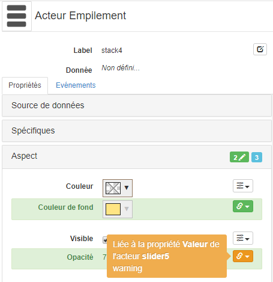

9. **Exécuter** la SynApp et vérifier que:
    * la couleur de la lumière change en fonction de la position du curseur
    * la valeur _SetPoint_ de la ressource **LightZone1** dans le paramétrage du REDY reflète bien la position du curseur
    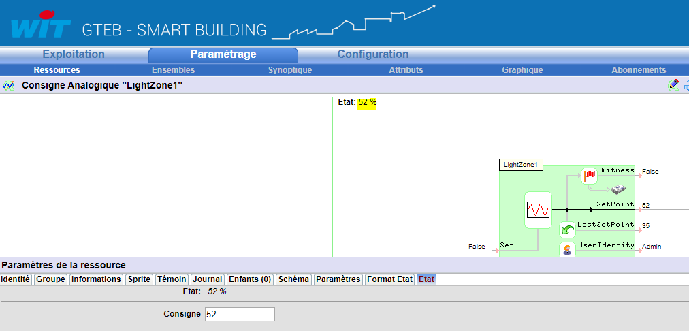

10. **Cloner** l'acteur _Empilement_ **stack3** en un nouvel acteur **stack6** et **positionner** ce dernier en _position gauche_ ```350px``` et _position haut_ ```200px```

11. **Cloner** l'acteur _Empilement_ **stack3** en un nouvel acteur **stack8** et **positionner** ce dernier en _position gauche_ ```200px``` et _position haut_ ```450px```

12. **Cloner** l'acteur _Empilement_ **stack3** en un nouvel acteur **stack10** et **positionner** ce dernier en _position gauche_ ```350px``` et _position haut_ ```450px```
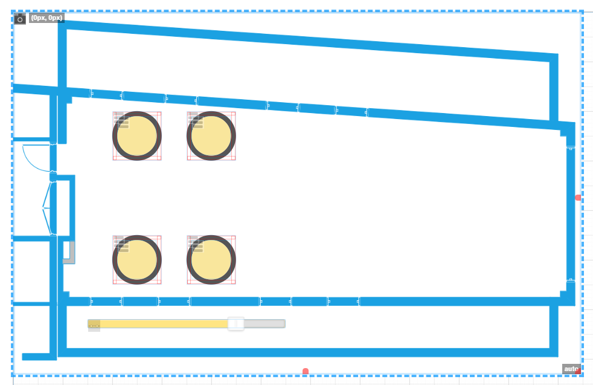

13. **Exécuter** la SynApp et vérifier que les couleurs des quatre lumières changent en fonction de la position du curseur

14. **Sélectionner** l'acteur _toile_ **canvas1** et **ajouter** un acteur enfant de type _jauge_ **gauge12** qui permettra de visualiser la valeur de l'intensité lumineuse:

    * positionner ce dernier en _position gauche_ ```175px``` et _position haut_ ```300px```
    * lier en _interne_ la propriété _Spécifiques > Min_ avec la propriété _Spécifiques > Min_ de l'acteur **slider5**
    * lier en _interne_ la propriété _Spécifiques > Max_ avec la propriété _Spécifiques > Max_ de l'acteur **slider5**
    * lier en _interne_ la propriété _Spécifiques > Valeur_ avec la propriété _Spécifiques > Valeur_ de l'acteur **slider5**

    **Important:**
    Nous aurions également pu lier en _interne_ la propriété _Spécifiques > Valeur_ de la jauge avec la propriété _Spécifiques > Valeur_ de l'acteur **slider5** mais ce que nous voulons visualiser ici n'est pas la valeur de la commande effectuée via le curseur mais la valeur de la ressource _consigne analogique_ **LightZone5**. Celle-ci n'est pas forcemment identique car la ressource REDY peut corriger la valeur commandée.
    _Par exemple:_ commande de la consigne avec la valeur décimale ```50,85``` arrondi par la ressource à ```50``` car pas de décimales.

    * definir la source de donnée propriété _Source de données > Source_
    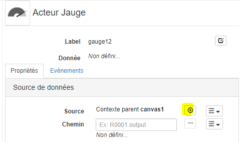
    * sélectionner la source de donnée existante **dsLightZone1**
    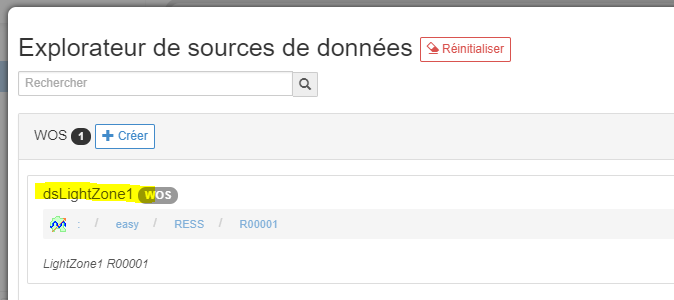
    * lier en _Source de données_  la propriété _Spécifiques > Valeur_
    * Dans la modale de _définition de la liaison_, définir le _Chemin_ avec la valeur ```setpoint```, la _Lecture_ en mode ```Rafraichie``` et **Lier**
    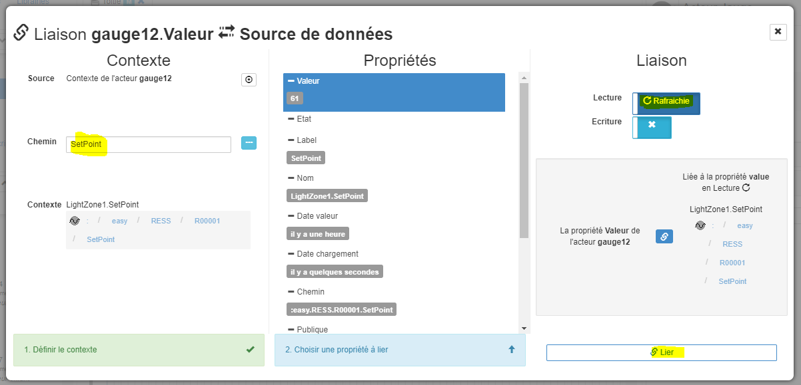

    * La zone de prévisualisation doit alors ressembler à ceci:
    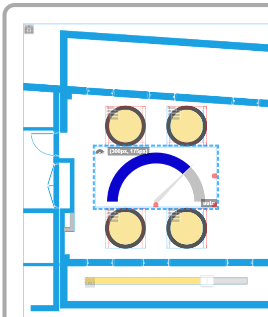

15. **Sélectionner** l'acteur _toile_ **canvas1** et **ajouter** un acteur enfant de type _text_ **text13** qui permettra de connaitre la valeur de l'intensité lumineuse ainsi que son unité:

    * positionner ce dernier en _position gauche_ ```260px``` et _position haut_ ```380px```
    * définir la propriété _Aspect > Police > Taille_ à ```50px```
    * definir la source de donnée propriété _Source de données > Source_
    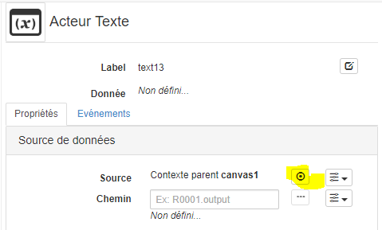
    * sélectionner la source de donnée existante **dsLightZone1**
    
    * définir la propriété _Spécifiques > Contenu_ avec la valeur ```{{variation}} {{unit}}```
    * créer les deux propriétés _spécifiques_ proposées **variation** de type _Nombre_ et **unit** de type _Text_
    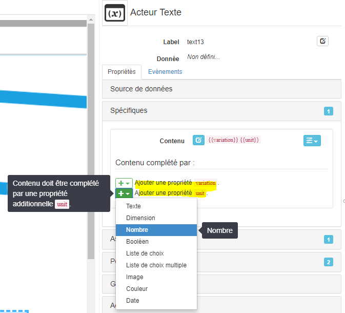
    * lier en _Source de données_  la propriété _Spécifiques > unit_
    * Dans la modale de _définition de la liaison_, **ouvrir** l'_explorateur de chemin relatif_
    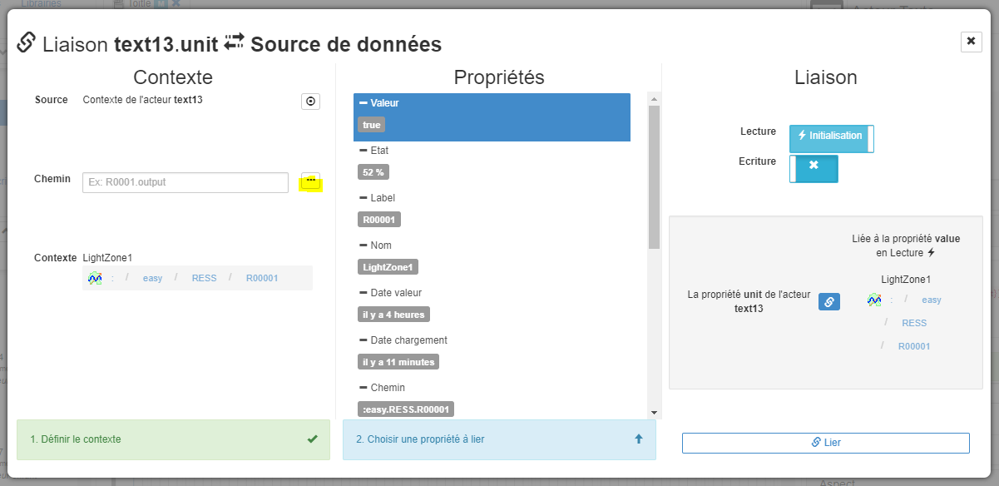
    * Dans la zone de recherche de ressource dans l'_explorateur de chemin relatif_, commencez à taper ```un``` (début de _unit_) puis sélectionner le _Label_ **Unit** et cliquer sur **Sélectionner**
    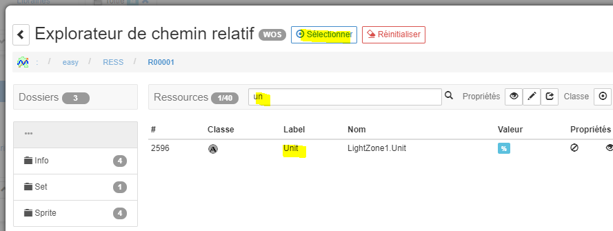
    * Dans la modale de _définition de la liaison_ **Lier**
    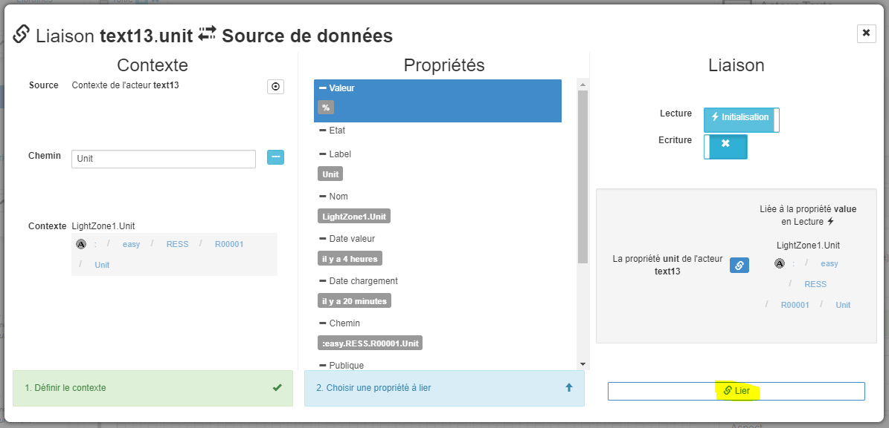
    * La zone de prévisualisation doit alors ressembler à ceci:
    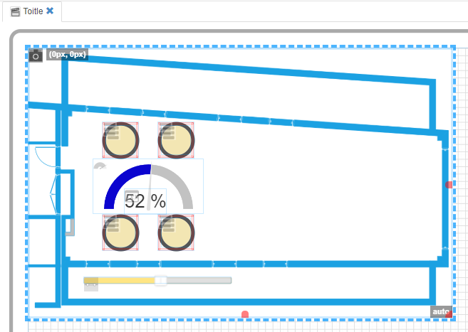

16. **Modifier** la fréquence de rafraichissement de la ressource
    * Sélectionner la source de données ```dsLightZone1```
    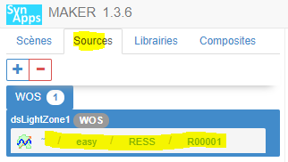
    * Modifier la _Période_ à ```5``` secondes
    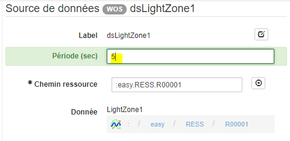

17. Ajouter un moyen visuel de distinguer les éléments de la zone 1

18. **Sélectionner** l'acteur _toile_ **canvas1** et **ajouter** un acteur enfant de type _text_ **text14** qui permetttra de définir un moyen visuel de distinguer les éléments de la **zone 1**

    * modifier la propriété _Spécifiques > Contenu_ avec la valeur ```Zone 1```
    * modifier la propriété _Aspect > Couleur de fond_ avec un gris clair ```#e7e7e7```
    * modifier la propriété _Aspect > Opacité_ à ```20```
    * modifier la propriété _Aspect > Police > Alignement texte_ à ```Centre```
    * modifier la propriété _Aspect > Police > Taille_ à ```80px```
    * modifier la propriété _Aspect > Bordure > Style bordure_ à ```Hachuré```
    * modifier la propriété _Aspect > Bordure > Epaisseur bordure_ à ```5px```
    * modifier la propriété _Aspect > Bordure > Rayon bordure_ à ```50px```
    * modifier la propriété _Position > Position gauche_ à ```130px```
    * modifier la propriété _Position > Position haut_ à ```70px```
    * modifier la propriété _Gabarit > Hauteur_ à ```550px```
    * modifier la propriété _Gabarit > Largeur_ à ```440px```
    * déplacer l'ordre (z-index) de l'acteur afin qu'il ne recouvre que l'acteur image **image2**. Il doit être placé entre **image2** et **stack3**
      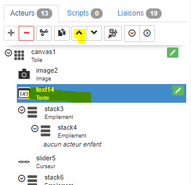
    * La zone de prévisualisation doit alors ressembler à ceci:
    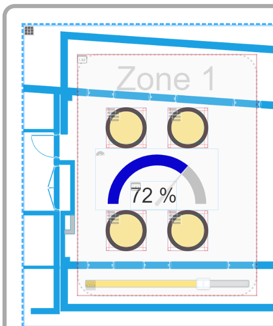

19. **Déployer** et **Exécuter** la SynApp:

    * Modifier la **position du curseur**:
        * vérifier que la **couleur des 4 lumières** changent de concert en fonction de la position du curseur

        * la valeur _SetPoint_ de la ressource **LightZone1** dans le paramétrage du REDY reflète bien la position du curseur

        * la **jauge** ainsi que le **texte** correspondent bien à la valeur et à l'unité de la ressource **LightZone1**

    * Modifier directement, dans le **paramétrage du REDY**, la consigne de la ressource **LightZone1** et vérifier que, dans les **5 secondes**, les 3 éléments ci-dessus reflètent bien la nouvelle consigne

## Construction de la scène de la zone 2

 Tout fonctionne correctement ? **à vous de jouer**, recommencez toutes les opérations pour la **zone 2** qui sera associée à la ressource consigne analogique **LightZone2**

Quelques suggestions ...

* **Ne pas vous aider de ce tutoriel !**
* Utiliser la  **Dupplication** des acteurs de la _zone 1_ et les déplacer vers la _zone 2_

* Modifier la **source de donnée principale** des 2 acteurs _jauge_ et _curseur_. Tous les liaisons des propriétés des acteurs de type _source de données_ seront automatiquement configurées car **relatives à leurs sources de donnée principale**

* Modifier les **les liaisons internes** entre acteurs de la _zone 2_

Et le résultat !
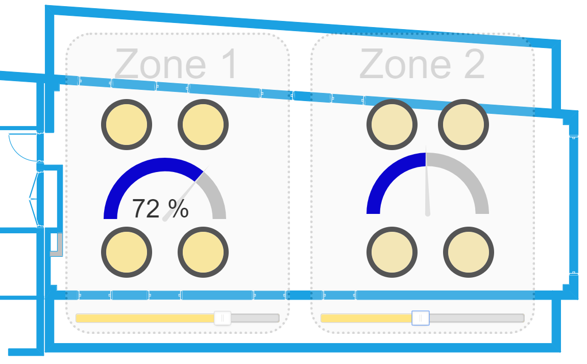

## Que retenir ?

Vous avez composé une scène de type _toile_ et représenté un synoptique simple:

* Cet acteur est un de ceux les **plus utilisés** avec l'acteur _Empilement_ pour construire des scènes de type synoptique composés d'acteurs superposés et **bien comprendre son mode de fonctionnement** constitue une des clés de SynApps.

* Beaucoup d'acteurs sont dupliqués dans ce tutoriel au moins 2x et même 8x pour les lumières. Même si le mécanisme est plutot simple, cela ne favorise pas:
    * **réutisabilité**: cloner est seulement un raccourci pour refaire rapidement mais les acteurs vivent ensuite indépendemment

    * **maintenabilité**: si l'on souhaite modifier des propriétés d'un acteur, il faut répéter l'opération sur tous les acteurs. Par exemple, modifier la représentation des lumières avec une image nécessiterais de faire la modification 8x ...

    Les acteurs **composites** permettent de résoudre ce problème et seront exploités dans un prochain tutoriel

* Nous aurions pu également utiliser 2 acteurs _toiles_ enfants de **canvas1** pour les _zones 1 & 2_. Les 2 _toiles_ auraient disposés les acteurs enfants dans leurs zones respectives. Les 2 sources de données ```dsLightZone1``` et ```dsLightZone2``` auraient également été définies sur les 2 toiles et ainsi héritées directement sur leurs enfants !
Cela aurait également permis une dupplication simplifiée de la _zone 1_ vers la _zone 2_

* La scène est relativement statique et ne s'adapte pas en l'état a toutes les tailles d'écrans. Même si il est toujours possible d'utiliser des tailles relatives, on arrive rapidement à des limites pour ce type de restitution. Le tutoriel suivant adresse cette problématique ...

Le tutoriel suivant est complémentaire à celui-ci puisque nous allons utiliser l'acteur **_boite à vue_** qui permet d'**adapter** des acteurs à une taille d'écran !

[Tutoriel acteur disposition **_boite à vue_**](part3.md)
