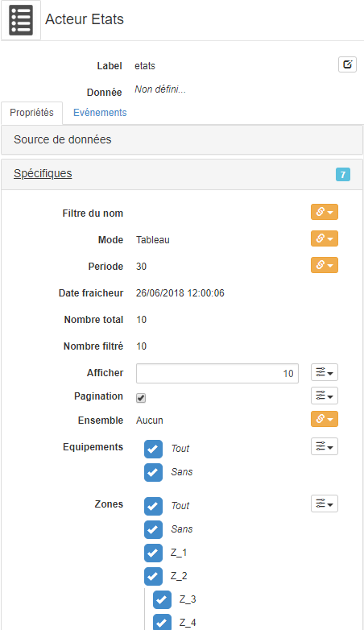
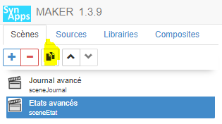
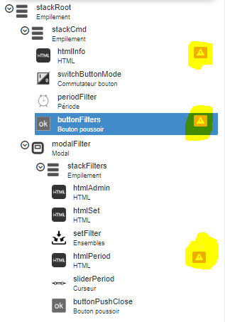
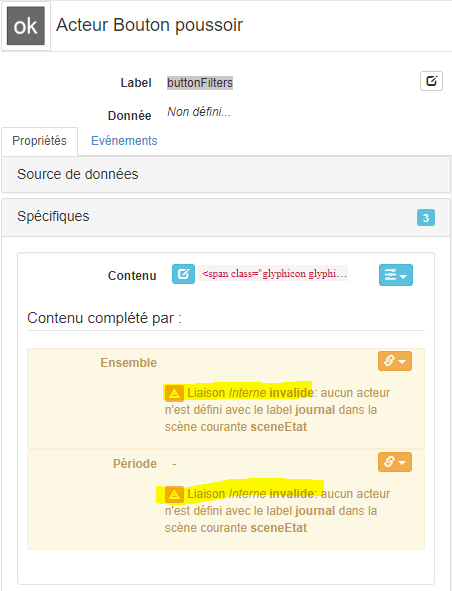
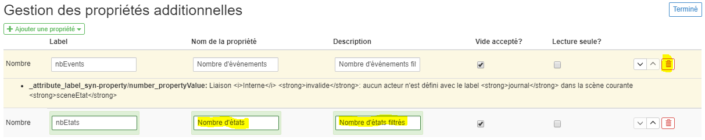
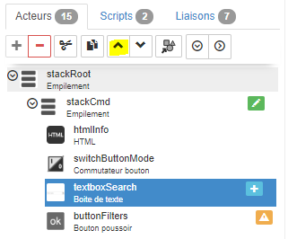
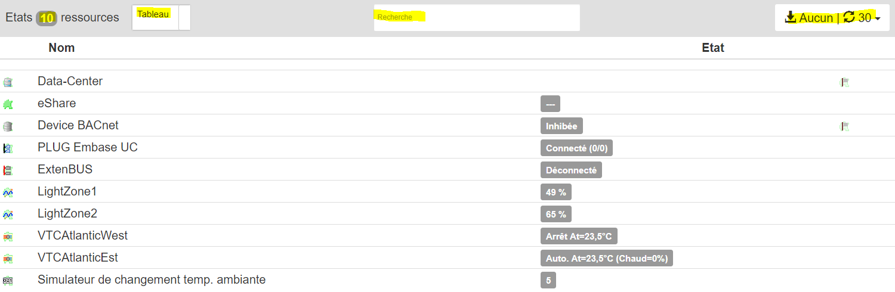

[< 7. Acteurs REDY](./index.md)



# Tutoriel 7: les acteurs métiers natifs du REDY - Part 2: **Etats**

L'acteur état fonctionne également sans la moindre configuration. Plusieurs propriétés _spécifiques_ permettent de personnaliser et filtrer son rendu. Ces propriétés sont **explicites** et comme pour le journal nous ne rentrerons pas dans le détail de chacune d'entre elles !


Nous allons intégrer l'acteur états dans une adaptation de la **scène évoluée** du journal précédente avec le même type de barre de commande permettant de configurer le **comportement** et les **filtres** des états

## Configuration de la scène

Plutot que de configurer une nouvelle scène, nous allons dupliquer la scène du journal précédente et l'adapter à l'acteur états

1. **Cloner** la scène ```sceneJournal``` et renommer le _label_ de la scène en ```sceneEtat``` et le _nom_ avec ```Etats avancés``` puis déployer

    

2. **Sélectionner** l'acteur ```journal``` et supprimer le

    _Remarque:_ une erreur de script apparait car une fonction de transformation en lecture essaye de localiser le journal

3. **Déployer** et **appuyer** sur F5 pour rafraichir la scène: des erreurs de validation apparaissent sur la scène concernant les liaisons intenes, vers le journal, désormais invalides

    

    * Par exemple sur l'acteur ```buttonFilters``` les propriétés _Sépcifiques > Ensemble_ et _Période_

      

      _Remarque:_ ces erreurs sont normales car consécutivent à la suppression du journal et vont être corrigées

4. **Sélectionner** l'acteur ```stackRoot``` et **ajouter** un acteur enfant de type _Etat_

    * renommer le _Label_ avec ```etats```
    * modifier la propriété _Spécifiques > Align. vertical_ en ```Etendre```

5. **Sélectionner** l'acteur ```htmlInfo```

    * modifier la propriété _Spécifiques > Contenu_ avec le code HTML
      ```html
      Etats <span class="badge" style="font-size:1em">{{nbEtats}}</span> ressources
      ```
    * compléter le contenu en créant la propriété additionnelle _nbEtats_ de type _nombre_

    * éditer les propriétés additionnelles dans _Additionnelles > Gestion des propriétés additionnelles_. Supprimer _nbEvents_ et définir nom et description de _nbEtats_

      

    * Lier en _interne_ la propriété _Spécifiques > Nombre d'états_ à la propriété  _Spécifiques > Nombre filtré_ de l'acteur ```etats``` en lecture uniquement

6. **Sélectionner** l'acteur ```switchButtonMode``` qui permettra désormais le passage du mode _tableau_ au mode _vignette_ de l'acteur ```etats```

    * modifier la propriété _Spécifiques > Text On_ avec le texte ```Tableau```
    * modifier la propriété _Spécifiques > Text Off_ avec le texte ```Vignette```
    * modifier la propriété _Spécifiques > Style Off_ avec la sélection ```Info```

7. **Sélectionner** l'acteur ```periodFilter``` et supprimer le car il n'est pas utile dans le contexte de l'acteur ```etats```

8. **Sélectionner** l'acteur ```stackCmd``` et **ajouter** un acteur enfant de type _Boite de texte_ qui permettra de définir une zone de recherche dans les états

    * renommer le _Label_ avec ```textboxSearch```
    * remonter la position de l'acteur entre ```switchButtonMode``` et ```buttonFilters```

      
    * modifier la propriété _Position > Align. horizontal_ en ```centré```
    * réinitialiser la propriété _Spécifiques > Valeur_ avec ```[vide]```
    * définir la propriété _Spécifiques > Texte d'aide_ avec ```Recherche```
    * définir la propriété _Spécifiques > Type d'input_ avec ```Recherche```
    * modifier la propriété _Spécifiques > Taille_ avec ```50px```

9. **Sélectionner** l'acteur ```buttonFilters``` et corriger les 2 liaisons

    * Lier en _interne_ la propriété _Spécifiques > selSet_ (ou nom personnalisé que vous avez défini) à la propriété  _Spécifiques > Ensemble_ de l'acteur ```états```

    * Editer le _Script de lecture_ de la propriété avec le javascript
    ```javascript
    const etats = context.synoStage.findByLabel('etats');
    return etats.get('setName');
    ```
    _Remarque:_ on récupère le nom de l'ensemble sélectionné comme pour le journal

    * Lier en _interne_ la propriété _Spécifiques > period_ (ou nom personnalisé que vous avez défini) à la propriété  _Spécifiques > Période_ de l'acteur ```états```

10. **Sélectionner** l'acteur ```htmlPeriod``` et corriger la liaison

    * Lier en _interne_ la propriété _Spécifiques > period_ (ou nom personnalisé que vous avez défini) à la propriété  _Spécifiques > Période_ de l'acteur ```états```

11. **Sélectionner** l'acteur ```etats``` et définir les liaisons

    * Lier en _interne_ la propriété _Spécifiques > Filtre du nom_ avec la propriété _Spécifiques > Valeur_ de ```textboxSearch```

    * Lier en _interne_ la propriété _Spécifiques > Mode_ à la propriété _Spécifiques > Valeur_ de l'acteur ```switchButtonMode``` en lecture uniquement

    * Editer le _Script de lecture_ de la propriété _Spécifiques > Mode_ avec le javascript le javascript
        ```javascript
        return context.value ? 'GRID' : 'THUMBNAILS';
        ```
    _Remarque:_ la propriété _Mode_ de l'acteur état attend une valeur de type texte avec les valeurs ```GRID``` ou ```THUMBNAILS``` pour afficher respectivement les états sous la forme d'un _tableau_ ou de _vignettes_. Actuellent, rien ne permet de savoir que ces valeurs sont attendues ! nous proposerons rapidement une mécanisme pour connaître les valeurs possibles sur les listes fermées

    * Lier en _interne_ la propriété _Spécifiques > Période_ à la propriété _Spécifiques > Valeur_ de l'acteur ```sliderPeriod``` en lecture uniquement

    * Editer le _Script de lecture_ de la propriété _Spécifiques > Période_ pour arrondir à un entier la valeur du curseur avec le javascript
        ```javascript
        return Math.round(context.value);
        ```

    * Lier en _interne_ la propriété _Spécifiques > Ensemble_ à la propriété _Spécifiques > Ensemble_ de l'acteur ```setFilter``` en lecture uniquement

Les liaisons sont configurées, la scène états  avancés est terminé

## Test et éxécution

**Déployer**, **éxécuter** et **vérifier** que tout fonctionne correctement

* Basculement entre mode de représentation tableau et vignettes
* Nombre de ressources
* Zone de recherche
* Sélection/déselection de l'ensemble
* Nombre d'ensembles
* Période de rafraichissement actuelle



## Que retenir

Nous avons mis en oeuvre l'acteur états qui fonctionne sans **aucune configuration** en adaptant la scène journal. Il est parfois plus rapide de partir d'une scène éxistante et l'adapter au besoin plutot que de partir d'une scène vide !

Comme pour le journal, vous pourrez faire évoluer la scène pour répondre précisemment à vos besoins. Par exemple: ajouter de nouveaux filtres dans la fenêtre modale:

* **Groupes**, **Zones** et **Equipements**: propriété _Spécifiques > Equipements_, _Zones_ et _Groupes_ de l'acteur états
* **Nombre maximum d'événements** affichés dans la page: propriété _Spécifiques > nombre d'événements_ du journal
* etc

## Conclusion

La **deuxième partie du tutoriel 7** portant sur l' acteur métier natif états est **terminée**. Nous avons construit 2 scènes avancées avec le **journal** et les **états**. Ils manquent encore quelques acteurs métiers natifs pour réaliser une application d'exploitation simple: les acteurs **agenda** et **grapheurs**

Vous pouvez remonter les **bugs** & **remarques** concernant ce tutoriel, SynApps RUNTIME & MAKER sur [GitHub](https://github.com/witsa/synapps/issues)

[Tutoriel suivant](part3.md)
