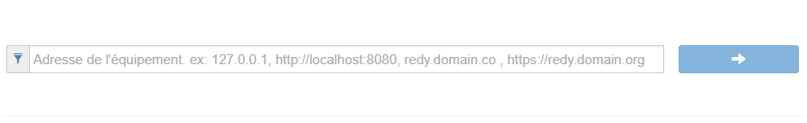

# Une première SynApp déployée *Helloworld*

## Prerequis

[Installation](install.md)

## Création de la SynApp

### Sélection de l'UTL

1. Ouvrez le Maker

2. Tapez l'adresse de l'UTL (Redy ou Redy Pro PC) puis entrée

Exemples:
* http://127.0.0.1,
* http://localhost:8080,
* redy.domain.com ,
* https://redy.domain.org

Dans le cas ou l'UTL est installée localement sur le port 80: http://127.0.0.1

3. Saisissez les identifiants de connection aux Redy *(1)*

*(1)* Identiques à ceux de l'application d'exploitation du Redy