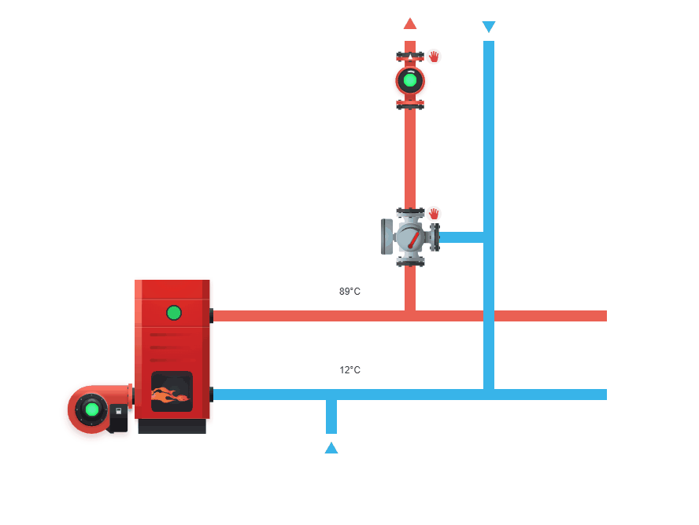
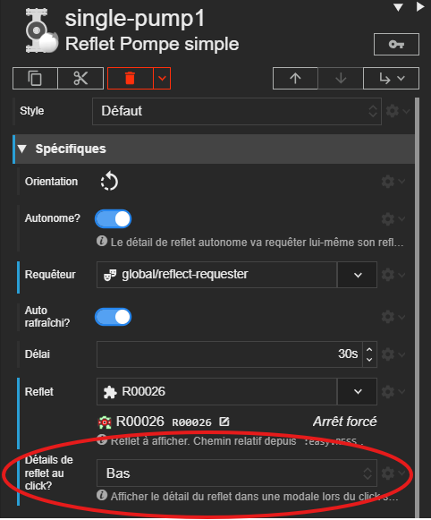
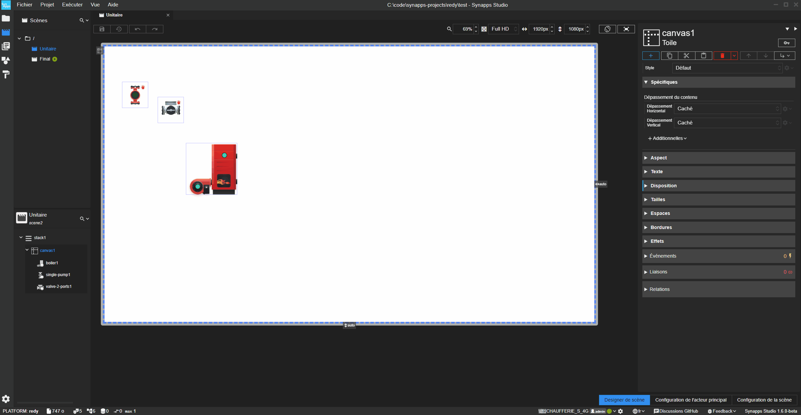
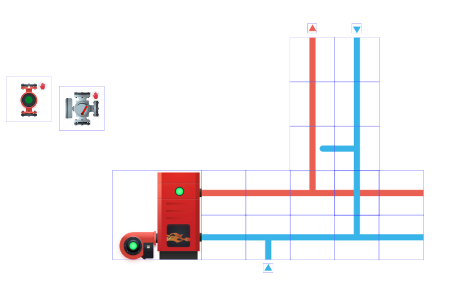
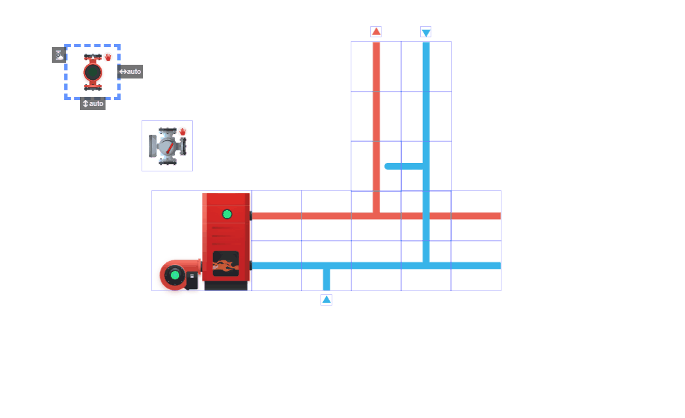
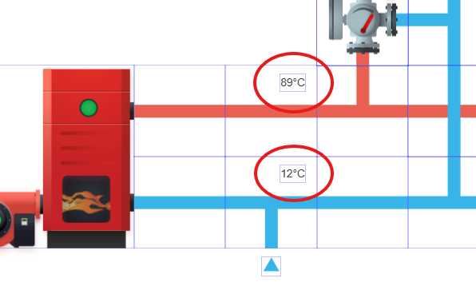

# Construire une scène de chaufferie

Studio **1.6.0**
{: .label .label-yellow }
Runtime **2.8.0**
{: .label .label-green }
REDY **16.4.0**
{: .label .label-yellow }

> 🎯 Objectif : créer une scène avec 3 acteurs reflets REDY (chaudière, pompe simple, valve 3 voies).

## Prérequis
- Accès à un REDY avec les ressources nécessaires.
- Projet Synapps Studio ouvert, avec une scène cible (ex. `Chaufferie`).

## Résultat attendu

**Une chaudière accompagnée d'un circuit utilisant des reflets REDY ainsi qu'une pompe simple possèdant un détail de reflet accessible au click.**




>Voici la scène finale obtenue à la fin de ce tutoriel ( NB : les acteurs reflets affichent "aucun état" car non liés à un reflet dans la scène ). :
>
>``` text
>SYNAPPS-STUDIO-SCENE|{"config":{"key":"boiler_room","name":"Scène de chaufferie"},"leadActor":{"type":"layout/stack","key":"stack1","children":[{"type":"layout/canvas","key":"canvas1","properties":{"verticalAlignment":"expand"},"children":[{"type":"redy/technical/boiler","key":"boiler1","properties":{"isAutonomous":false,"requesterKey":"global/reflect-requester","top":"410px","left":"350px"}},{"type":"technical/pipe","key":"pipe1","properties":{"top":"410px","left":"550px","orientation":"270","kindColor":"red"}},{"type":"technical/pipe","key":"pipe2","properties":{"top":"510px","left":"550px","orientation":"270"}},{"type":"technical/pipe","key":"pipe3","properties":{"top":"410px","left":"650px","kindColor":"red","orientation":"270"}},{"type":"technical/pipe","key":"pipe4","properties":{"top":"410px","left":"750px","kindColor":"red","orientation":"180","kind":"tee"}},{"type":"technical/pipe","key":"pipe5","properties":{"top":"510px","left":"650px","kind":"tee"}},{"type":"technical/pipe","key":"pipe6","properties":{"top":"510px","left":"750px","orientation":"270"}},{"type":"redy/data-source/resource","key":"resource1"},{"type":"technical/pipe","key":"pipe7","properties":{"top":"310px","left":"750px","kindColor":"red","orientation":"180"}},{"type":"technical/pipe","key":"pipe8","properties":{"top":"510px","left":"850px","orientation":"180","kind":"tee"}},{"type":"technical/pipe","key":"pipe12","properties":{"top":"410px","left":"850px","kindColor":"red","orientation":"270"}},{"type":"technical/pipe","key":"pipe9","properties":{"top":"210px","left":"750px","kindColor":"red"}},{"type":"technical/pipe","key":"pipe10","properties":{"top":"110px","left":"750px","kindColor":"red","orientation":"180"}},{"type":"technical/pipe","key":"pipe11","properties":{"top":"410px","left":"850px","orientation":"180"}},{"type":"technical/pipe","key":"pipe13","properties":{"top":"210px","left":"850px","orientation":"180"}},{"type":"technical/pipe","key":"pipe15","properties":{"top":"310px","left":"750px","orientation":"270","kind":"straight-end"}},{"type":"redy/technical/valve-3-ports","key":"valve-3-ports1","properties":{"isAutonomous":false,"requesterKey":"global/reflect-requester","top":"310px","left":"750px","orientation":"270"}},{"type":"technical/pipe","key":"pipe14","properties":{"top":"310px","left":"850px","orientation":"270","kind":"tee"}},{"type":"technical/pipe","key":"pipe16","properties":{"top":"110px","left":"850px","orientation":"180"}},{"type":"technical/pipe","key":"pipe17","properties":{"top":"410px","left":"950px","kindColor":"red","orientation":"270"}},{"type":"technical/pipe","key":"pipe18","properties":{"top":"510px","left":"950px","orientation":"270"}},{"type":"technical/pipe","key":"pipe19","properties":{"top":"620px","left":"690px","kind":"arrow"}},{"type":"redy/reflect-details","key":"reflect-details1","properties":{"isAutonomous":false,"requesterKey":"global/reflect-requester","top":"520px","left":"670px","withIcon":false,"withName":false}},{"type":"redy/reflect-details","key":"reflect-details2","properties":{"isAutonomous":false,"requesterKey":"global/reflect-requester","top":"420px","left":"670px","withIcon":false,"withName":false}},{"type":"technical/pipe","key":"pipe20","properties":{"top":"80px","left":"790px","kindColor":"red","kind":"arrow"}},{"type":"technical/pipe","key":"pipe21","properties":{"top":"80px","left":"890px","kind":"arrow","orientation":"180"}},{"type":"redy/technical/single-pump","key":"single-pump1","properties":{"requesterKey":"global/reflect-requester","top":"110px","left":"750px","withDetails":"bottom"}}]}]}}
>```
>

## Étape 1 — Créer/ouvrir la scène
1. Ouvrir le projet et la scène (ou la créer).
2. Créer un acteur Canva afin de pouvoir disposer les acteurs.

## Étape 2 — Ajouter les acteurs reflets REDY
Ajouter les acteurs suivants :
- **Reflet Chaudière** (REDY Reflet Chaudière)
- **Reflet Pompe simple** (REDY Reflet Pompe simple)
- **Reflet Vanne 3 voies** (REDY Reflet Vanne 3 voies)

A ce stade, les acteurs sont placés mais non configurés, ils affichent donc tous "aucun état".
Ils ne sont reliés à aucun reflet REDY pour le moment, nous allons maintenant les configurer.

## Étape 3 — Renseigner les reflets et configurer l'acteur reflect pompe simple

Par défaut, les acteurs reflets techniques REDY se basent sur le requêteur global de reflet.
Il est possible de leur assigner un acteur fournisseur de reflet différent si besoin.

{: .tip }
> Si plusieurs acteurs reflets REDY sont utilisés dans la scène, il est recommandé d'utiliser un acteur requêteur de reflet commun afin d'optimiser les performances.
>
> Voir [les conseils et optimisations relatifs aux reflets REDY](../concepts/actor-types/redy/reflect-details.md#conseils-et-optimisations).

Il faut ensuite renseigner un reflet correspondant à la ressource voulue pour chaque acteur.<br>
Un acteur reflet de chaudière devra posséder le chemin d'un reflet de chaudière, un acteur reflet de pompe simple devra posséder le chemin d'un reflet de pompe simple, etc ...

**Pour l'acteur reflet pompe simple, nous allons également activer l'affichage du détail de reflet au click, ainsi lorsque l'utilisateur clique sur l'acteur, une modale s'ouvre avec le détail de reflet à l'intérieur.**

{: .info }
>Si le reflet est commandable, la modale proposera également les commandes disponibles.



## Étape 4 — Créer la tuyauterie et agencer les acteurs

**Ajouter les acteurs Tuyaux pour construire la tuyauterie.**

{: .info }
>Le système d'ancrage de Synapps Studio permet de positionner précisément les acteurs techniques (tuyaux, chaudières, pompes, vannes, etc ...) en les alignant facilement entre eux.



{: .info }
>L'acteur Tuyau posssède plusieurs types (coudes, Tés, flèches, embouts, etc ...) et permet de définir la couleur du tuyau ( Rouge pour les tuyaux d'eau chaude par exemple).

**Voici à quoi devrait ressembler la scène une fois la tuyauterie terminée :**



{: .info }
> Les acteurs respectent l'ordre des acteurs Synapps, ainsi, si l'on souhaite qu'un tuyau soit au dessus d'un autre, il faut s'assurer que l'acteur tuyau supérieur soit placé après dans la liste des acteurs.

Les acteurs reflets techniques sont ajustés pour correspondrent à la tuyauterie, on peut maintenant les disposer sur les tuyaux que nous venons de réaliser.



## Étape 5 — Ajouter des détails de reflet

Si l'on souhaite afficher des détails de reflet supplémentaires, on peut utiliser l'acteur [*Détails de reflet*](../concepts/actor-types/redy/reflect-details.md).

Dans notre scène, nous utilisons des acteurs détails de reflet pour afficher des informations supplémentaires sur la température des tuyaux.


