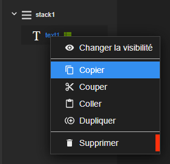
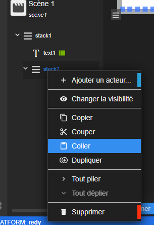
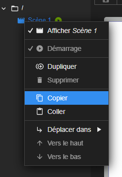
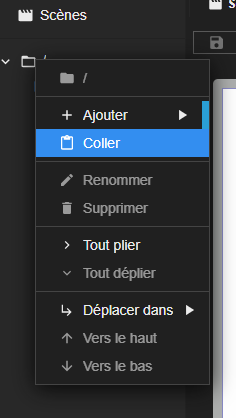

L'action de copier/coller un acteur, une scène ou un composite est une fonctionnalité phare de Synapps Studio. Elle permet de gagner du temps et de partager des éléments entre plusieurs synapps ou entre plusieurs utilisateurs.

Même si elles demeurent assez intuitives, nous allons voir ici comment réaliser ces actions.

# Copier/Coller un acteur

Pour copier un acteur, il suffit de réaliser un clic droit sur l'acteur et de sélectionner l'option *Copier*.

**La définition de l'acteur est dans le press-papier.** Vous pouvez maintenant coller l'acteur dans un autre acteur, dans une autre scène, dans un autre projet ou bien dans un mail pour le partager.

Pour coller l'acteur, il suffit de réaliser un clic droit sur un acteur de disposition et de sélectionner l'option *Coller*. Vous pouvez aussi réaliser un clic droit sur un acteur quelconque, l'acteur créer sera placer dans la même disposition que l'acteur ciblé.

# Copier/Coller une scène

Pour copier une scène, il suffit de réaliser un clic droit sur la scène et de sélectionner l'option *Copier*.

Comme dans le cas de l'acteur, **la scène est dans le press-papier**. Vous pouvez maintenant coller la scène dans un autre dossier, dans un autre projet ou bien dans un mail pour le partager.

> 📌 **REMARQUE** 
C'est d'ailleurs ainsi que sont créées les [scènes remarquables](../concepts/scene.md#scènes-remarquables) proposées dans cette documentation.

Pour coller la scène, il suffit de réaliser un clic droit sur un dossier et de sélectionner l'option *Coller*. Vous pouvez aussi réaliser un clic droit sur une scène quelconque, la scène créer sera placer dans le même dossier que la scène ciblé.

# Copier/Coller un composite

Pour copier un composite, c'est le même principe que pour une scène. Il suffit de réaliser un clic droit sur le composite et de sélectionner l'option *Copier* et de coller en réalisant un clic droit sur un dossier et de sélectionner l'option *Coller*.

> 📌 **REMARQUE** 
C'est ainsi également que sont créées les [composites remarquables](../concepts/composite.md#composites-remarquables) proposées dans cette documentation.

# Quelques remarques

> ⚠️ **ATTENTION** 
Faite attention au formatage automatique du texte si vous coller dans un autre logiciel. Par exemple **Microsoft Teams** a tendance à ajouter des caractères de formatage qui vont perturber le collage dans Studio.

> 💡 **ASTUCE** 
Pour le partage, nous recommandons d'utiliser un fichier texte brut dans lequel vous glisser ce que vous avez copié.

> 💡 **ASTUCE** 
Vous pouvez également réaliser des couper/coller qui ont pour effet de copier l'élément et de le supprimer de l'endroit d'origine. Pour cela, il suffit de réaliser un clic droit sur l'élément et de sélectionner l'option *Couper*. Cela s'avère très pratique pour déplacer un élément dans un autre endroit.

> ⚠️ **ATTENTION** 
Faite attention également au liaison vers des librairies qui sont perdues lors du collage. Si vous coller un acteur qui utilise une librairie, il faudra la définir dans le projet.
