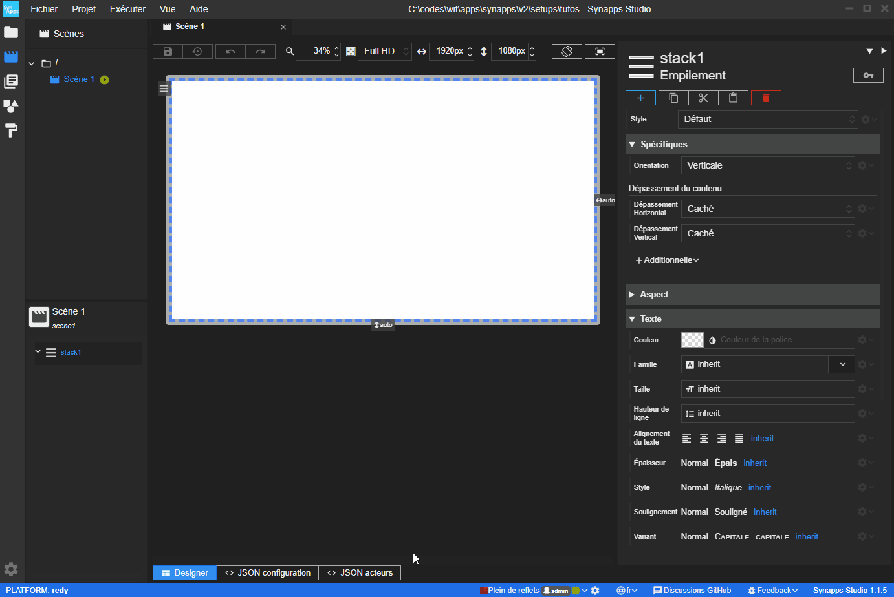
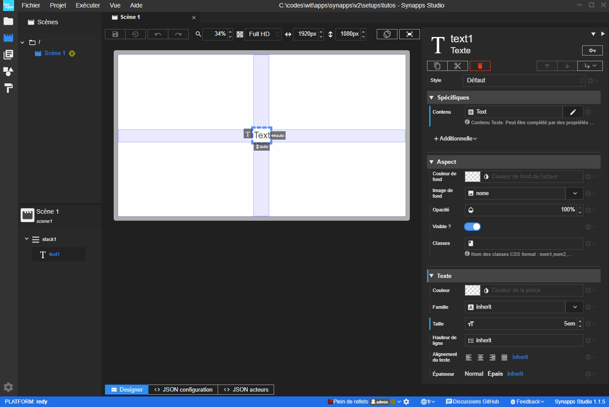
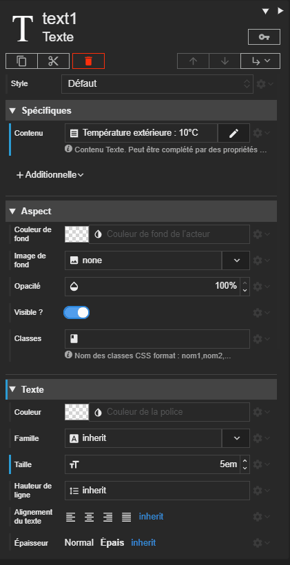
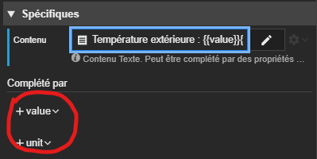
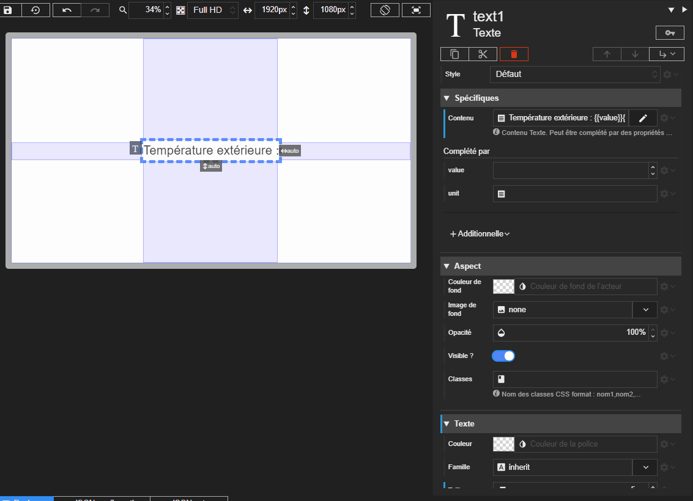

Nous allons réaliser dans ce tutoriel une scène qui affiche un *texte avec des jokers*.

Utiliser les jokers dans les acteurs complétables est manière très simple de réaliser des textes ou des contenus dynamiques.

Pour l'illustrer, nous allons réaliser un acteur texte qui possédera deux additionnelles :
- une additionnelle pour renseigner un nombre
- une autre pour renseigner une unité.

L'acteur présentera le texte suivant :
> Température extérieure : 10°C

L'idée est de permettre de changer la valeur et l'unité de la température sans avoir à modifier le texte de l'acteur.


# Etape 1 : Création de l'acteur

Pour commencer, nous allons créer un acteur texte dans une nouvelle scène.




Il est placé au milieu de la scène et la taille du texte est réglée à `5em` pour qu'il soit bien visible ici.

Nous allons entrer dans son champ *Contenu* l'exemple de texte pour se donner une idée du résultat qu'on désire obtenir :



L'acteur affiche :

> Température extérieure : 10°C

# Etape 2 : Ajout des jokers

Nous allons maintenant ajouter les jokers dans le texte de l'acteur.

> Un joker est une expression spéciale qui permet de définir une zone dans le texte qui sera remplacée par une valeur.

Il est défini par des *doubles accolades* `{{une clé}}` qui entourent une clé. Cette dernière est un texte de votre choix qui correspondra à la clé de l'additionnelle utilisée pour remplacer le joker.

> 📌 **REMARQUE**<br>
La clé du joker respecte les mêmes contraintes que celle d'une additionnelle : pas d'espace, que de l'alphanumérique.

Ici, nous créons deux jokers :
- `{{value}}` pour la température
- `{{unit}}` pour l'unité



# Etape 3 : Ajout des additionnelles

Il faut remarquer que des suggestion de création d'additionnelles sont proposées en dessous du champ de contenu de l'acteur texte, une pour chaque joker :



Nous les utilisons pour créer les deux additionnelles : Un nombre pour `value` et un texte pour `unit`.


Les deux additionnelles sont créées et pour l'instant, les valeurs sont vides.

# Etape 4 : Renseignement des additionnelles

Il ne reste plus qu'à renseigner les additionnelles avec les valeurs souhaitées.



Ici, nous entrons les valeurs en dur mais il est possible *voir recommandé* de les renseigner avec des liaisons de donnée ou par script.


# Conclusion

Nous avons vu comment réaliser un acteur texte avec des jokers ce qui donne une grande flexibilité pour réaliser des textes dynamiques.

L'acteur texte n'est pas le seul à profiter de cette fonctionnalité, nous pouvons aussi utiliser les jokers dans les acteurs HTML, les boutons, frame. Dans un composite, cette fonctionnalité prend tout son sens pour réaliser des textes dynamiques.


# Scène du tutoriel

Vous pouvez copier/coller la scène réalisée ici.


```
SYNAPPS-STUDIO-SCENE|{"config":{"key":"scene1","name":"Scène 1"},"leadActor":{"type":"layout/stack","key":"stack1","properties":{"verticalAlignment":"expand"},"children":[{"type":"display/text","key":"text1","properties":{"content":"Température extérieure : {{value}}{{unit}}","horizontalAlignment":"middle","verticalAlignment":"middle","fontSize":"5em"},"additionalDefs":{"value":{"type":"number"},"unit":{"type":"text"}},"additionals":{"value":10,"unit":"°C"}}]}}
```

