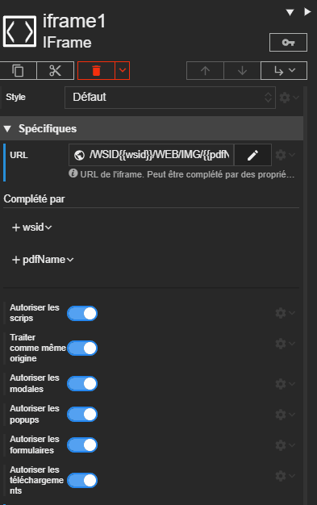
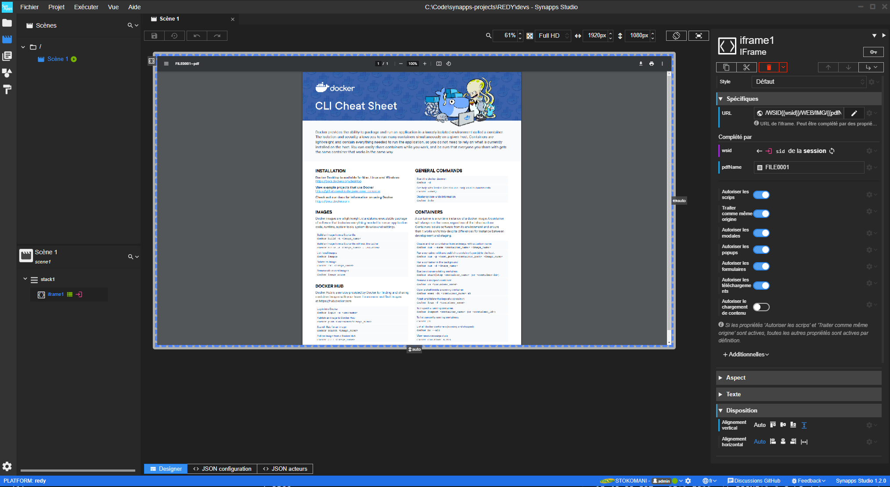

Dans ce tutoriel, nous allons apprendre à afficher un PDF depuis le REDY directement dans une iFrame au sein de la Synapp.

Nous utilisons le visualiseur de PDF inclut dans les navigateurs

Par convention, les PDF dans le REDY se situent à l'adresse : <b> /WEB/IMG/nom-de-mon-pdf </b>

> ⚠️ **ATTENTION**<br>
> Les navigateurs Android et iOS ne permettent pas l'ouverture d'un PDF via une iFrame, il faut préférer l'ouverture du PDF via un [nouvel onglet](../tutorials/open-pdf/new-tab-pdf.md)

# Afficher un PDF dans une iframe

## Étape 1 - Ajouter l'acteur iFrame

Commençons par ajouter un acteur iFrame et étendons le sur toute la longueur.


## Étape 2 - Construire l'URL

L'iFrame nécessite une URL à laquelle accéder afin d'afficher le PDF.

Nous allons avoir besoin de plusieurs informations afin de construire cette URL :

- Le WSID de la session utilisateur qui permet à l'iFrame d'être identifiée auprès du REDY
- Le nom du PDF dans le REDY

Nous allons utiliser des [jokers](../tutorials/jokers-in-text.md) afin de construire l'URL dynamiquement.

Le contenu de la propriété _url_ de l'iFrame est donc : <b> /WSID\{\{wsid\}\}/WEB/IMG/\{\{pdfName\}\} </b>


Cette url est composée d'un joker  <b>_wsid_</b> afin de récupérer l'identifiant de la session de l'utilisateur et le second <b>_pdfName_</b> qui représente le label du PDF dans le REDY.

> 📌 **REMARQUE**<br>
Le nom du PDF dans le REDY n'est <b> pas </b> le nom de fichier du PDF mais le label qui lui est attribué dans le REDY.

## Étape 3 - Renseigner les additionnelles

Nous allons donc créer deux additionnelles de type *texte* afin de renseigner des valeurs à nos jokers.




Il faut renseigner à l'additionnelle <b> _wsid_ </b> l'identifiant de session pour cela nous allons chercher sur l'objet *Session* via une liaison :


La seconde additionnelle devra être renseignée pour correspondre au PDF que l'on souhaite ouvrir dans le REDY.
Dans ce tutoriel, le fichier PDF a pour label *FILE0001~PDF*.

> 📌 **REMARQUE**<br>
Le nom du PDF dans le REDY n'est <b> pas </b> le nom de fichier du PDF mais le label qui lui est attribué dans le REDY.

## Résultat

> Affichage d'un PDF dans une iframe
>
> 

# Conclusion

Au cours de ce tutoriel, nous avons appris à utiliser des jokers et à paramétrer des additionnelles afin de récupérer des informations dans le but de compléter l'URL d'une iFrame.

# Scène du tutoriel

Vous pouvez copier/coller la scène réalisée dans ce tutoriel.


```
SYNAPPS-STUDIO-SCENE|{"config":{"key":"scene1","name":"Scène 1"},"leadActor":{"type":"layout/stack","key":"stack1","children":[{"type":"display/iframe","key":"iframe1","properties":{"verticalAlignment":"expand","url":"/WSID{{wsid}}/WEB/IMG/{{pdfName}}"},"additionalDefs":{"wsid":{"type":"text"},"pdfName":{"type":"text"}},"additionals":{"pdfName":""},"bindings":{"additionals.wsid":"session@sid"}}]}}
```

