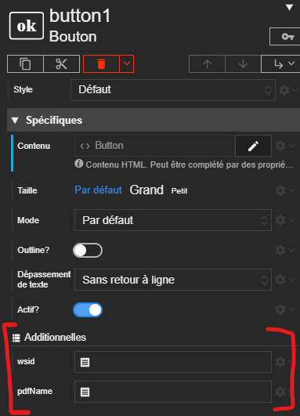
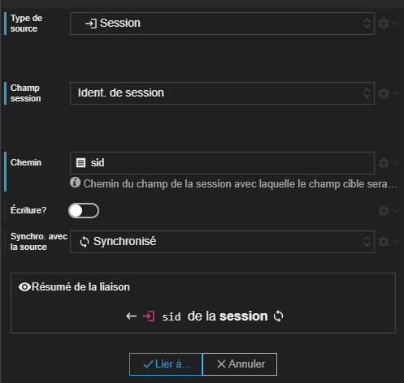

Dans ce tutoriel, nous allons apprendre à configurer un acteur bouton afin qu'il ouvre un PDF dans un nouvel onglet.

Par convention, les PDF dans le REDY se situent à l'adresse : <b> /WEB/IMG/nom-de-mon-pdf </b>

# Afficher un PDF dans un nouvel onglet

## Étape 1 - Créer le bouton

Commençons par ajouter un acteur bouton qui servira à ouvrir le PDF.


## Étape 2 - Ajouter les additionnelles

Nous allons utiliser deux additionnelles de type *texte* afin de composer l'URL du PDF pour la renseigner au script du bouton.

Il y aura donc 2 additionnelles de type *texte* :
- La première se nomme *wsid* et représente l'identifiant qui permet au REDY d'authentifier la provenance de la requête.
- La seconde se nomme *pdfName* et représente le label du PDF dans le REDY.

> 📌 **REMARQUE**<br>
Le nom du PDF dans le REDY n'est <b> pas </b> le nom de fichier du PDF mais le label qui lui est attribué dans le REDY.



## Étape 3 - Renseigner les additionnelles

Il faut renseigner à l'additionnelle <b> _wsid_ </b> l'identifiant de session pour cela nous allons chercher sur l'objet *Session* via une liaison :



Pour l'additionnelle *pdfName*, il est nécessaire de renseigner à la main le label du fichier tel qu'il est présenté au sein du REDY. Dans notre exemple, le PDF a pour label : *FILE0001~PDF*.

## Étape 4 - Ajout du script

Nous allons créer un nouveau script 'onClick' sur notre acteur bouton.


Nous allons ajouter dans le script le code suivant :

```javascript
window.open(`WSID${this.additionals.wsid}/WEB/IMG/${this.additionals.pdfName}`)
```

Ce script permet de récupérer les valeurs des additionnelles créées précédemment afin de construire le chemin et d'ouvrir le PDF dans un nouvel onglet.

## Résultat

> Lors de l'éxécution de la Synapp dans un navigateur, le click sur le bouton devrait dorénavant ouvrir un nouvel onglet avec le PDF ciblé.
>
> 

# Conclusion

Au cours de ce tutoriel, nous avons appris a renseigner à des additionnelles des informations et à récupérer ces additionnelles dans un script afin d'ouvrir un PDF dans un nouvel onglet.

# Scène du tutoriel

Vous pouvez copier/coller la scène réalisée dans ce tutoriel.


```
SYNAPPS-STUDIO-SCENE|{"config":{"key":"scene1","name":"Scène 1"},"leadActor":{"type":"layout/stack","key":"stack1","children":[{"type":"input/button","key":"button1","properties":{"content":"Button","horizontalAlignment":"middle","verticalAlignment":"middle"},"additionalDefs":{"wsid":{"type":"text"},"pdfName":{"type":"text"}},"additionals":{"pdfName":"FILE0001~PDF"},"bindings":{"additionals.wsid":"session@sid"},"events":{"onClick":["window.open(`/WSID${this.additionals.wsid}/WEB/IMG/${this.additionals.pdfName}`);","","console.log(this);"]}}]}}
```
