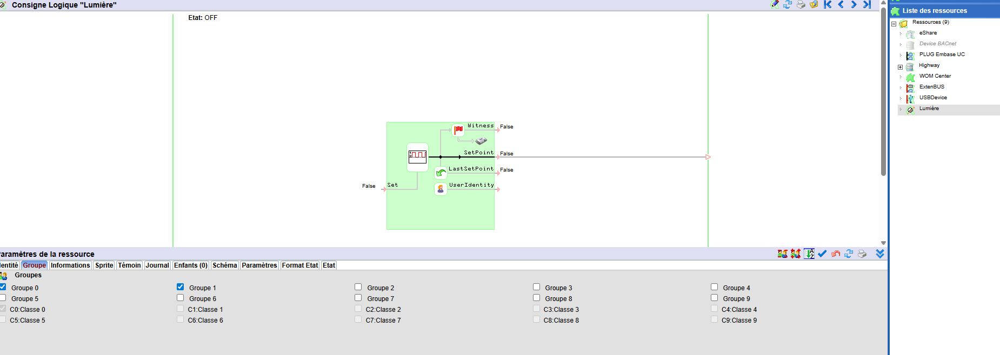
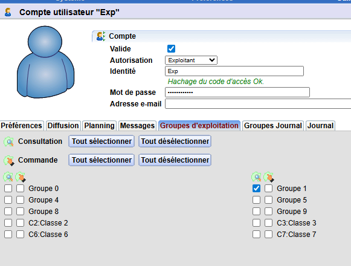
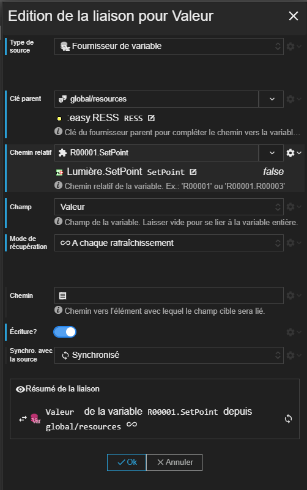
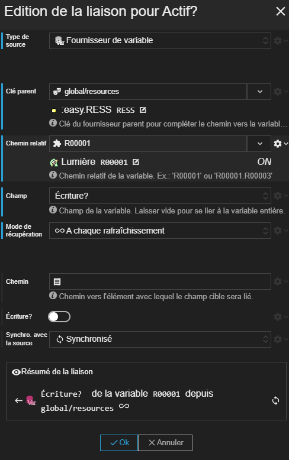

Dans ce tutoriel, nous allons voir comment utiliser les groupes d'utilisateur et de ressource du REDY pour contrôler l'accès à un bouton intérupteur.

## Etape 1 : Dans le REDY

Pour réaliser ce tutoriel, je vais utiliser une ressource Consigne que j'appelle "Lumière".



Vous voyez que nous nous avons placé la ressource dans le Groupe 1.

Aussi, nous allons utiliser un utilisateur "Exp" qui appartient au Groupe 1 qu'en lecture.




## Etape 2 : Hote avec utilisateur Exp

Nous allons maintenant créer un hôte avec l'utilisateur Exp. Pour cela, nous allons dupliquer l'hote courrant et nous renseignons les identifiants et mot de passe de l'utilisateur Exp.

Ainsi, nous pourrons basculer rapidement d'un utilisateur à l'autre dans le designer de scène et dans l'éxécution de la SynApp.

## Etape 3 : La scène

Nous allons utiliser la scène suivante :

```
SYNAPPS-STUDIO-SCENE|{"config":{"key":"scene161","name":"Tutoriel Groupe Utilisateur"},"leadActor":{"type":"layout/stack","key":"stack1","children":[{"type":"input/switch-button","key":"switch-button1","properties":{"horizontalAlignment":"middle","verticalAlignment":"middle","fontSize":"30px"}}]}}
```

Elle est composée d'un bouton intérupteur affiché au centre de la scène.

## Etape 4 : Liaison de la valeur de la consigne

Nous allons lier la propriété _Valeur_ du bouton à la valeur du champ `SetPoint` de la ressource "Lumière".



{: .important }
> N'oubliez pas d'activer l'écriture.

Après avoir validé la liaison, la propriété _Valeur_ du bouton intérupteur reçoit la valeur du champ `SetPoint` de la ressource "Lumière".

Pour l'instant, le bouton intérupteur est accessible pour tous les utilisateurs.


## Etape 5 : Utiliser les champs d'accès utilisateur

Nous allons utiliser les champs d'accès utilisateur qui se trouvent sur la ressource _Lumière_. En effet, comme expliqué [ici](../../concepts/actor-types/redy/wos-variable-source.md#champ-de-variable-redy), le champ _Ecriture?_ d'une ressource permet de savoir si l'utilisateur en cours a le droit d'écrire sur la variable.

Créons donc une liaison vers le champ _Ecriture?_ de la ressource "Lumière" sur la propriété _Actif?_ du bouton intérupteur.



## Etape 6 : Test

Il ne reste plus qu'à tester. Le bouton intérupteur n'est plus cliquable pour l'utilisateur Exp.

{: .tip }
> Utiliser le menu déroulant de changement rapide d'hote pour basculer entre des hotes qui se connectent avec des utilisateurs différents.


## La scène solution

Voici la scène que nous devons obtenir :

```
SYNAPPS-STUDIO-SCENE|{"config":{"key":"scene161","name":"Tutoriel Groupe Utilisateur"},"leadActor":{"type":"layout/stack","key":"stack1","children":[{"type":"input/switch-button","key":"switch-button1","properties":{"horizontalAlignment":"middle","verticalAlignment":"middle","fontSize":"30px"},"bindings":{"properties.value":{"canWrite":true,"relativeTo":"global/resources","relativePath":"R00001.SetPoint","fieldName":"value","dataReadMode":"always","writeOnChange":true,"source":"redy/wos-relative-variable"},"properties.enabled":{"relativeTo":"global/resources","relativePath":"R00001","fieldName":"canWrite","dataReadMode":"always","source":"redy/wos-relative-variable"}}}]}}
```
