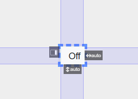
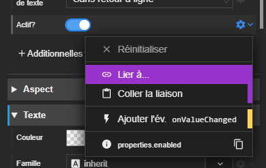
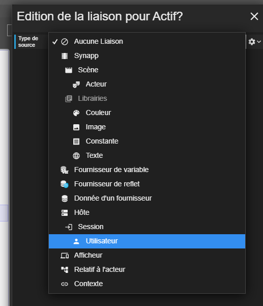
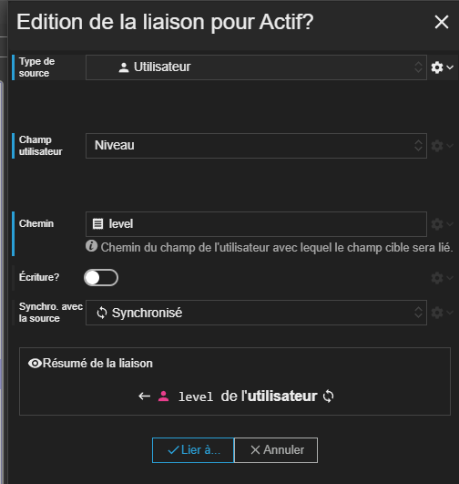
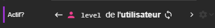
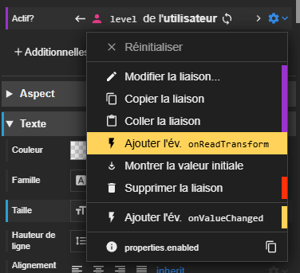

Dans ce tutoriel, nous allons voir comment utiliser le niveau de l'utilisateur pour contrôler l'accès à un bouton intérupteur.

## Etape 1 : la scène

Voici la scène que nous allons utiliser pour ce tutoriel :



```
SYNAPPS-STUDIO-SCENE|{"config":{"key":"scene160","name":"Tutoriel Niveau Utilisateur"},"leadActor":{"type":"layout/stack","key":"stack1","children":[{"type":"input/switch-button","key":"switch-button1","properties":{"horizontalAlignment":"middle","verticalAlignment":"middle","fontSize":"30px"}}]}}
```

Elle est simplement composée d'un bouton intérupteur affiché au centre de la scène.

Pour l'instant, n'importe quel utilisateur pourra contrôler ce bouton.

## Etape 2 : liaison vers le niveau utilisateur

Nous allons maitenant lier la propriété _Actif?_ du bouton à la propriété _Niveau_ de l'utilisateur.



Nous créons une nouvelle liaison et nous choisissons le type Utilisateur.



Ensuite nous choisissons le champ _Niveau_ de l'utilisateur.



Après avoir validé la liaison, la propriété _Actif?_ du bouton intérupteur reçoit la valeur du champ _Niveau_ de l'utilisateur. Mais, il doit normalement recevoir une valeur booléenne (true ou false).



### Niveau utilisateur

Le niveau utilisateur est un champ de type entier dont les valeurs sont :

| Niveau | Description    |
| ------ | -------------- |
| `1`    | Invité         |
| `2`    | Exploitant     |
| `3`    | Installateur   |
| `4`    | Administrateur |

Ainsi, pour contrôler l'accès à un bouton intérupteur, il va falloir convertir le niveau utilisateur en booléen.

## Etape 3 : conversion en booléen

Nous allons maintenant convertir le niveau utilisateur en booléen. Pour cela, nous allons ajouter un script de transformation de la liaison.

Allons dans le menu de la propriété _Actif?_ et cliquons sur le bouton _onReadTransform_.



Il sert à modifier la valeur qui sera vraiment écrite dans la propriété _Actif?_.

Cliquons sur le script ajouté en jaune sous la propriété _Actif?_.

Par défaut, nous voyons le code suivant :

```javascript
return context.value;
```

Ce script retourne la valeur de la liaison, c'est-à-dire la valeur du champ _Niveau_ de l'utilisateur.

Nous allons maintenant modifier ce script pour convertir le niveau utilisateur en booléen.

```javascript
return context.value > 2;
```

Dans ce script, nous vérifions si le niveau utilisateur est supérieur à 2. Cela signifie que si le niveau utilisateur est 3 ou 4, la valeur retournée sera `true`, sinon `false`.

Après avoir sauvegardé le script, le bouton intérupteur n'est plus accessible que pour les utilisateurs ayant un niveau 3 ou 4.


## Etape 4 : test

Il ne reste plus qu'à tester. Le mieux est de créer un hôte qui se connecte avec un nivau utilisateur Exploitant pour contrôler le bouton intérupteur.


## Scène solution

Voici la scène que nous devons obtenir :

```
SYNAPPS-STUDIO-SCENE|{"config":{"key":"scene160","name":"Tutoriel Niveau Utilisateur"},"leadActor":{"type":"layout/stack","key":"stack1","children":[{"type":"input/switch-button","key":"switch-button1","properties":{"horizontalAlignment":"middle","verticalAlignment":"middle","fontSize":"30px"},"bindings":{"properties.enabled":"user@level"},"events":{"properties/enabled/binding/onReadTransform":["return context.value > 2;"]}}]}}
```
