# Tutorial 1: première SynApp "Helloworld" - **Débutant**

[Accueil](/readme.md) / [Tutoriaux](../index.md)

L'objectif de ce tutorial est la réalisation d'une SynApp simple déployée sur un REDY

## Prerequis

[Installation](../../install.md)

## Création d'une SynApp

### Sélection de l'UTL

1. Ouvrez le MAKER

    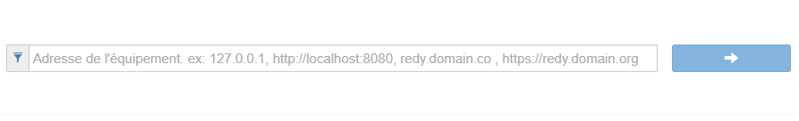

2. Entrez l'adresse de l'UTL (REDY ou REDY PC), exemples:

    * [http://127.0.0.1](http://127.0.0.1)
    * [http://localhost:8080](http://localhost:8080)
    * redy.domain.com
    * [https://redy.domain.org](https://redy.domain.org)

    Dans le cas ou l'UTL est installée localement sur le port 80: [http://127.0.0.1](http://127.0.0.1)

3. Connection à l'UTL

    Saisir les identifiants de connection du REDY. Ils sont identiques à ceux de l'application d'exploitation

### Création de la SynApp

Saisir les informations de création dans le formulaire de la SynApp:
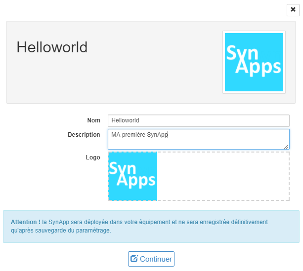

### Edition dans le MAKER

L'environnement du MAKER ainsi que tous les concepts seront décrits ultérieurement. Pour l'instant nous allons juste ajouter trois acteurs dans la *scene1*:

1. Cliquer sur **[+]** dans l'onglet acteur en bas à gauche de l'éditeur

    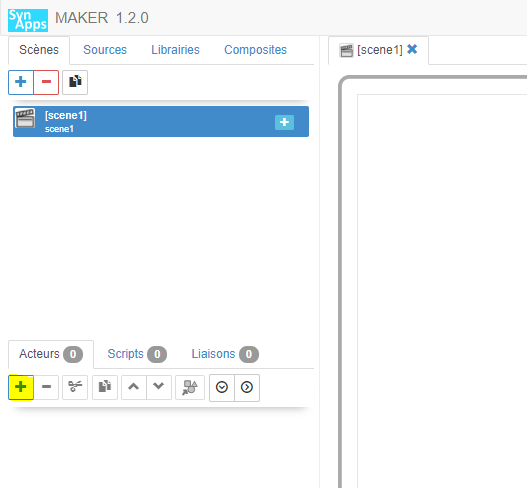

2. Dans l'explorateur d'acteur sélectionner le premier *Empilement*

    Cet acteur va permettre de disposer des acteurs enfants dans la scène courante qui vont s'empiler verticalement
    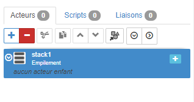

3. L'acteur *stack1* étant sélectionné, cliquer de nouveau sur **[+]** pour ajouter un premier acteur enfant de type *Affichage* > *Texte*

    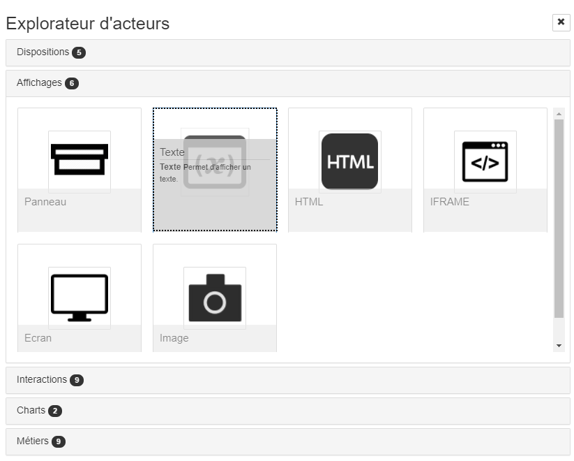

4. Modifier l'acteur texte *text2* pour augmenter la taille du texte à 100 pixels: l'acteur *text2* étant sélectionné, éditer la propriété *Aspect* > *Taille* avec *100px* dans la zone à droite de l'éditeur appélé l'inspecteur d'objets SynApps

    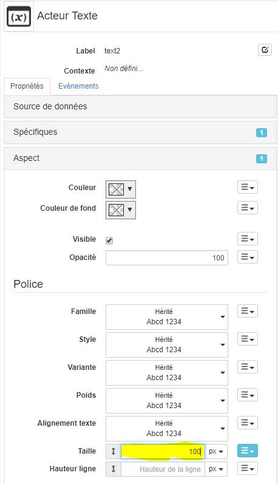

5. Dans la zone central de prévisualisation, double cliquer sur *text2* et saisissez "Hello world"

6. Sélectionner l'acteur *stack1*, cliquer de nouveau sur [+] pour ajouter un deuxième acteur enfant de type *Charts* > *Jauge*

7. Modifier l'acteur jauge *gauge3* pour qu'il prenne tout l'espace vertical: l'acteur *gauge3* étant sélectionné, éditer les propriétés *Position* > *Alignement vertical* et *Alignement horizontal* avec *Étendre*

    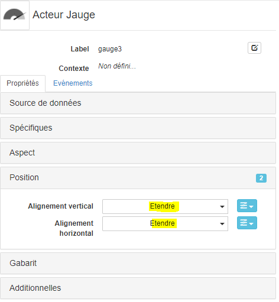

    La zone de prévisualisation finale doit ressembler à cela ! (sinon recommencer :-)
    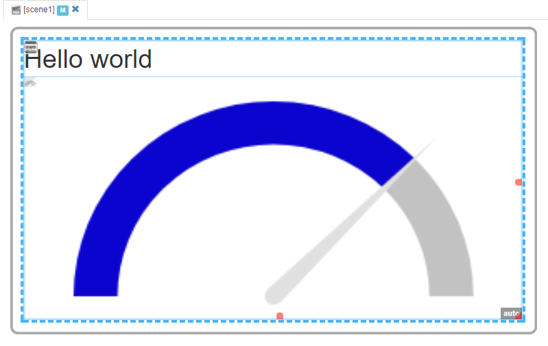

### Déploiement de la SynApp

Déployer la SynApp sur le REDY en cliquant *Déployer* dans la barre de commande en haut à droite
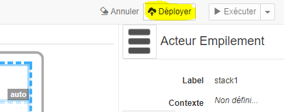

La SynApp est déployée sur le REDY dans *:easy.SynApps*
[En savoir plus sur les objets crées dans le REDY](../../redy/explore.md)

**Attention**: le paramétrage de l'UTL dévra être sauvegardé sinon, en cas de redémarrage, votre SynApp ne sera pas conservée

### Exécution de la SynApp depuis le MAKER

Exécuter la SynApp en cliquant *Exécuter* dans la barre de commande, soit:

* *Executer* principal: la SynApp est éxécuté dans le navigateur courant

    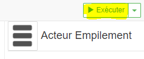

* *Executer* secondaire: la SynApp est éxécuté dans un nouveau navigateur

    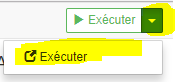

    Ce mode est a privilégier pour faire cohabiter le mode *exécution* et *edition* sur deux écrans différents par exemple. Dans ce cas, à chaque déploiement depuis le *MAKER*, le mode *exécution* est rafraîchi

### Exécution de la SynApp depuis le REDY

Naviguer dans l'exploitation du REDY, un nouvel onglet **SynApps** est désormais **accessible**
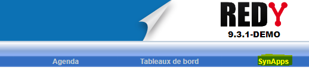

_Remarque:_ l'onglet *SynApps* est **visible** uniquement quand au moins une SynApp est **déployée** dans le REDY

## Étapes suivantes

Vous avez construit puis déployé sur un REDY une première SynApp !

* Avant de continuer, revenir dans l'edition de la SynApp et parcourir toutes les propriétés des 3 acteurs. Regarder notamment les propriétés *spécifiques*, essayer de modifier des propriétés, la couleur de fond par exemple, pour observer leurs effets dans la zone de prévisualisation

* [Tutorial suivant sur les _liaisons_](../tuto02/index.md)