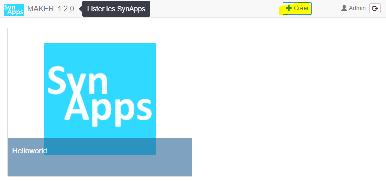
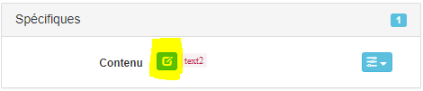
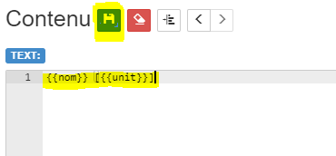
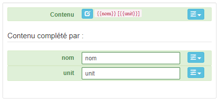
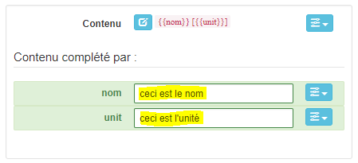
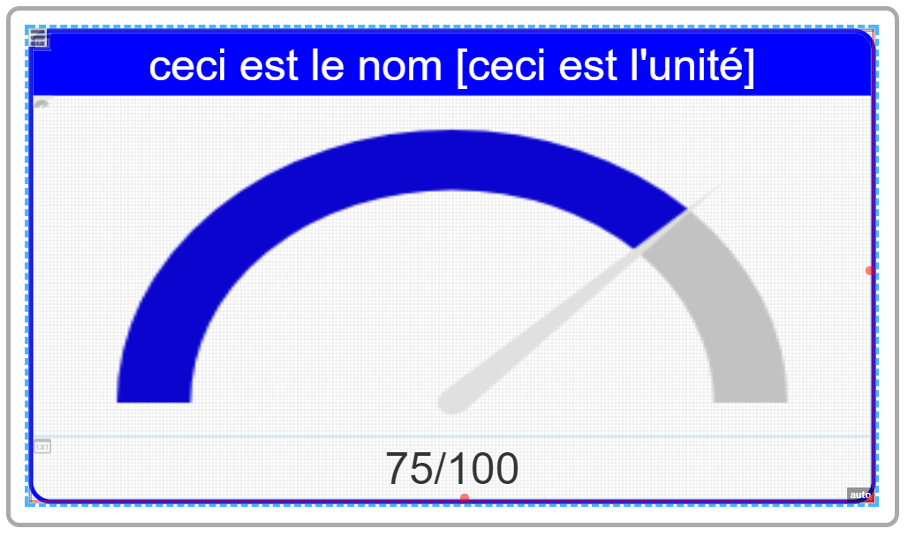

[Home](../../sitemap.md) > [Tutoriaux](../index.md)

# Tutorial 2: lier les acteurs aux ressources du Redy *(6 nov 17)*

L'objectif de ce tutorial est la réalisation d'une SynApp liée en lecture et écriture à des ressources du Redy:

* La **lecture** sera une valeur analogique, lue par la SynApp toutes les 10 secondes, liée à un acteur jauge. Le nom de la ressource sera également affiché dans un acteur texte

* l'**écriture** sera une ressource digital commandée par un bouton bi-état de type On/Off

## Prerequis

* [Tutorial 1: première SynApp "Helloworld"](../tuto01/index.md)

* Installer le paramétrage [tuto02.PK4](PK4/tuto02.PK4) avec le [gestionnaire de projets](../../redy/installPK4.md) du Redy. Il contient les 2 ressources nécessaires dans le dossier du Redy *Tutorial1*:
1. Une variable analogique *VariableAnalogiqueTuto* sinusoidale variant de 0 à 100
2. Une consigne digitale *ConsigneLogiqueTuto*

## Création de la SynApp

Créer la SynApp *tuto02* avec le Maker depuis le bouton *créer* de la *barre de commande*



## Edition dans le Maker

La SynApp sera constituée d'une seule scène avec un acteur disposition de type *empilement*

*Remarque:* le premier acteur de toute scène est appelé l'**acteur principal** et est obligatoirement type *disposition*.

1. Dans la scéne courante *scene1*, défini l'acteur principal avec un *empilement* (cliquer sur [+] pour ajouter un acteur *Dispositions* > *Empilement*)

2. Par défaut, le *label* de l'acteur est *stack1*. Cliquer sur le bouton d'édition du *label* dans l'*inspecteur* d'acteur


 et le renommer avec un nom plus explicite: *stackRoot*


*Remarque:* il est vivement conseillé de modifier systématiquement les *labels* afin de leurs donner un nom **explicite** et **définitif**. Les *labels* sont en effet utilisés dans différents sections de SynApps: *scripts*, *liaisons* et en cas de renommage, la SynApp pourrait ne plus fonctionner correctement

3. L'acteur *stackRoot* étant sélectionné, ajouter un premier acteur enfant de type *Affichage* > *Texte* et renommer le label avec *textTop*

3. Resélectionner l'acteur *stackRoot* et ajouter un deuxième acteur enfant de type *Charts* > *Jauge* et renommer le label avec *gaugeAnalogic*

4. Resélectionner l'acteur *stackRoot* et ajouter un troisième acteur enfant de type *Affichage* > *Texte* et renommer le label avec *textBottom*

5. Nous allons modifier maintenant l'alignement et la taille du texte des acteurs *textTop* et *textBottom*. Mais plutot que de modifier chacun des 2 acteurs, nous allons modifier ces propriétés au niveau de l'acteur principal car ces propriétés sont hérités par les enfants.

*Remarque:* de façon général, il est préférrable de définir les propriétés communes le **plus haut possible dans la hiérarchie** des acteurs, ceci afin d'éviter de redéfinir plusieurs fois des valeurs identiques sur chacun des acteurs.

L'acteur *stackRoot* étant sélectionné, modifier les propriétés suivantes dans l'*inspecteur d'objets*:
  * *Aspect* > *Alignement texte*: **Centre**, le texte sera centré
  * *Aspect* > *Taille*: **100px**, la taille de la police sera de 100 pixels

Vous observez que les tailles et alignements des textes des acteurs *textTop* et *textBottom* changent !

6. Modifier également la bordure de l'acteur *stackRoot* avec les propriétés suivantes:
  * *Aspect* > *Style bordure*: **Solide**
  * *Aspect* > *Epaisseur bordure*: **10px**
  * *Aspect* > *Rayon bordure*: **50px**
  * *Aspect* > *Couleur bordure*: **#0000ff**


7. Sélectionner l'acteur *textTop* et modifier les propriétés suivantes:
  * *Aspect* > *Couleur de fond*: **#0000ff**, idem *Couleur bordure* de *stackRoot*
  * *Aspect* > *Couleur*: **#ffffff**, blanc
  * *Spécifique* > *Contenu*:

Le texte affiché en haut sera composé du *nom* et de l'*unité* de la ressource avec ce format:
```
Nom [unité]
```
Il existe un moyen simple pour décrire cette composition de format en utilisant des **propriétés additionnelles**:

Cliquer sur le bouton d'édition de la propriété *Spécifique* > *Contenu*. 


Un fenêtre modale d'édition du contenu s'ouvre


Saisir:
```
{{nom}} [{{unit}}]
```
Les doubles crochets ouvrant et fermant permettent de définir une *propriété additionnelle*. Dans notre cas, deux *propriétés additionnelles* sont créées:
* **nom**: qui contiendra le nom de la ressource *variableAnalogiqueTuto*
* **unit**: qui contiendra l'unité de cette même ressource

En sauvegardant, l'inspecteur propose la création de ces deux propriétés


Créer les deux *propriétés additionnelles* en cliquant sur le [+] et en choisissant **text** comme type de propriété



Vérifier le résultat sur le *contenu* dans la zone de prévisualisation en modifiant la valeur des deux *propriétés additionnelles* **nom** et **unit**



7. Sélectionner l'acteur *textBottom* et modifier les propriétés suivantes:
  * *Spécifique* > *Contenu*: **{{value}}/{{max}}**

Procéder de la même façon que pour l'acteur *textTop* mais ici le contenu sera composé de la valeur et du max avec ce format:
```
{{value}}/{{max}}
```
Cette fois ci, choisir **nombre** comme type pour les deux *propriétés additionnelles* **value** et **max** créées

Initialiser les propriétés **valeur** et **max** avec les valeurs respectivent 75 et 100

La zone de prévisualisation finale doit ressembler à cela


