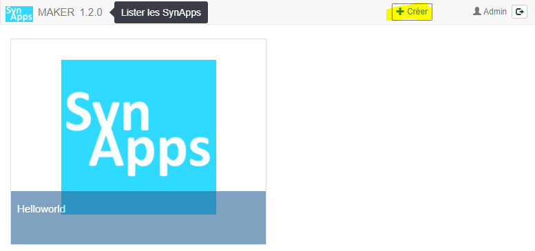

# Tutorial 2: les liaisons **1/6** *[6 nov 17]*

[Home](../../sitemap.md) > [Tutoriaux](../index.md) > [Tutorial](index.md)

## Prerequis

* [Tutorial 1: première SynApp "Helloworld"](../tuto01/index.md)

* Le paramétrage [SynApps_Tutorials.PK4](../config/SynApps_Tutorials.PK4) installé sur le REDY. Il contient deux ressources préconfigurées nécessaires dans le dossier <code>Tutorial2</code>:
    1. Une **variable analogique** <code>VariableAnalogiqueTuto</code> sinusoidale variant de 0 à 100
    2. Une **consigne digitale** <code>ConsigneLogiqueTuto</code>

## Création de la SynApp

Créer la SynApp **tuto02** avec le MAKER depuis le bouton *créer* de la *barre de commande*

Suite du [tutorial](part2.md)