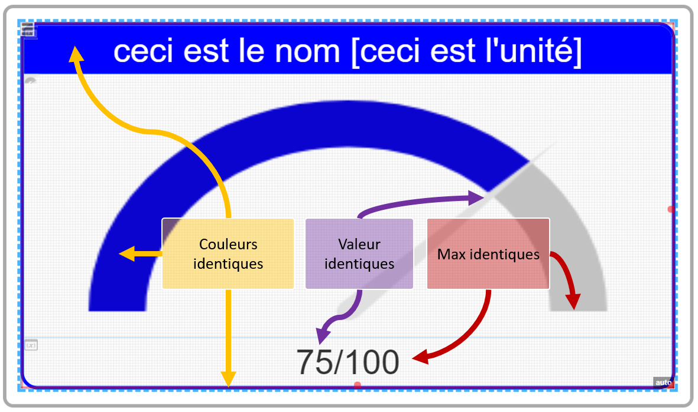
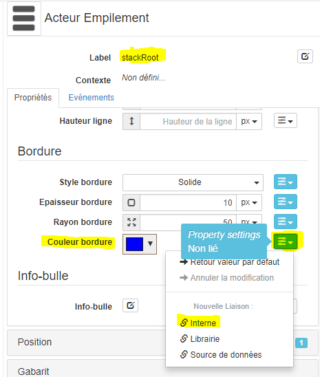
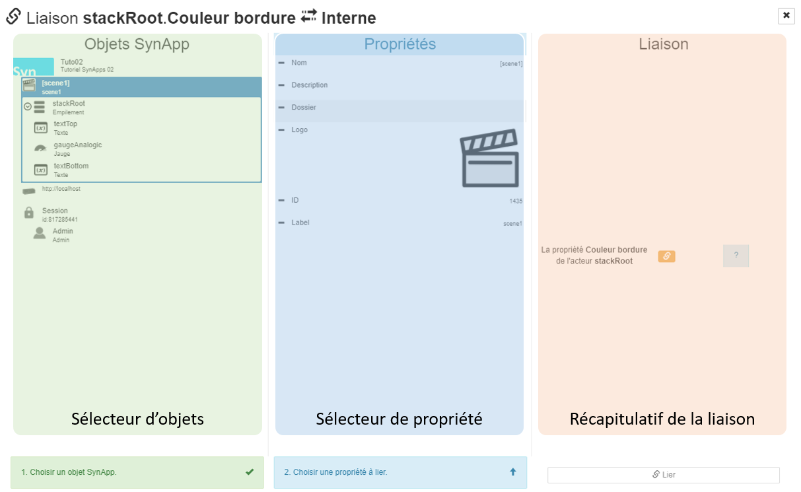
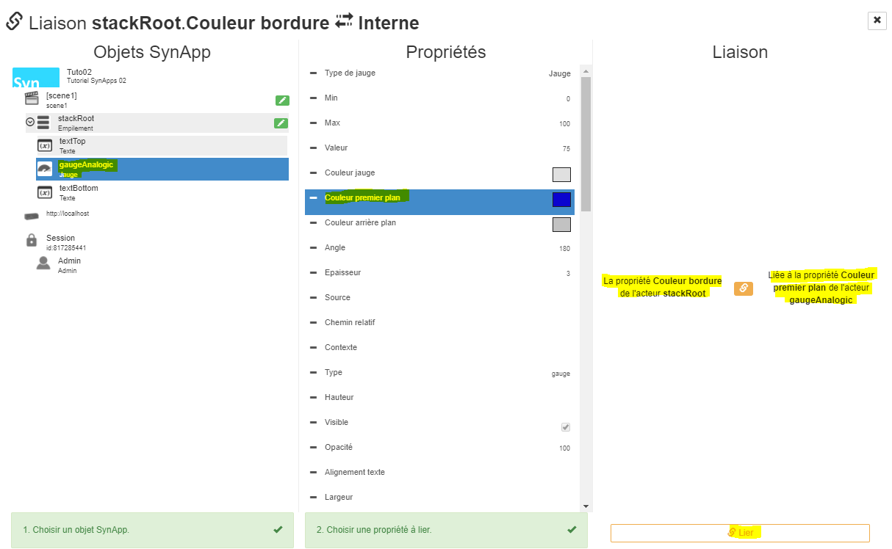
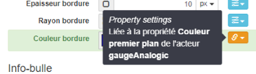
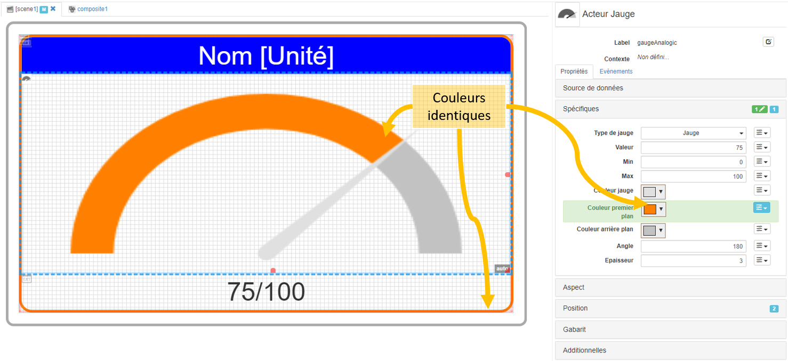

[Home](../../sitemap.md) > [Tutoriaux](../index.md) > [Tutorial](index.md)

# Tutorial 2: les liaisons *[6 nov 17] - **3/6** 

Dans la deuxième partie de ce tutorial, le squelette de présentation a été créé. Pour l'instant, toutes les propriétés des acteurs sont définies avec des valeurs fixes. La prochaine étape va consister mettre en oeuvre un concept important de SynApps: les **liaisons** pour notamment
* lier cetaines propriétés des acteurs avec des ressources du Redy: liaisons vers des **source de données**

Exemple: la valeur analogique de *variableAnalogicTuto* avec la valeur de la jauge *gaugeAnalogic*

* lier des propriétés entre acteurs: liaisons **internes**

Exemple: la couleur de fond de *textTop* avec la couleur de bordure de *stackRoot*

* lier des propriétés à des librairies globales à la Synapp: liaisons vers **librairies**

## Liaisons **internes**

Les liaisons internes permettent de lier des propriétés entre acteurs

Dans la scène *scene1*, on observe des propriétés d'acteur dont la même valeur est définie plusieurs fois. Nous voudrions notamment que:

1. la **couleur bleue** soit identique sur:
  * la couleur de la jauge *gaugeAnalogic*, 
  * la couleur de fond de *textTop* et
  * la couleur de bordure de *stackRoot*

2. la **valeur** soit identique sur:
  * la valeur de la propriété *valeur* de la jauge *gaugeAnalogic*
  * la valeur de la propriété additionnelle *value* du texte *textBottom*

3. le **max** soit identique sur:
  * la valeur de la propriété *maximum* de la jauge *gaugeAnalogic*
  * la valeur de la propriété additionnelle *max* du texte *textBottom*

En résumé:

### Création des liaisons **internes**

1. La couleur de brodure de l'acteur *stackRoot* est actuellement définie manuellement, nous allons la lier avec la couleur  de la jauge *gaugeAnalogic*.

L'acteur *stackRoot* étant sélectionné, cliquer sur le bouton d'édition de la liaison de la propriété *Couleur de fond* et sélectionner **Interne**

2. Sélectionner la propriété **source**

L'éditeur de liaison interne est composé de trois parties principales:

* **Sélecteur d'objet**: sélectionner la jauge *gaugeAnalogic*
* **Sélecteur de propriété**: sélectionner la propriété *Couleur premier plan*
* **Récapitulatif de la liaison**: vérifier la description et cliquer sur **[Lier]** en bas à droite

 Consulter [description du Maker](../../designer.md) pour en savoir plus concernant l'éditeur de liaison interne

 La propriété *Couleur bordure* de *stackRoot* est désormais liée à la propriété *Couleur premier plan* de *gaugeAnalogic*.
 
 Pour la propriété *Couleur bordure* de *stackRoot*, vous remarquez:
 * qu'elle **n'est plus modifiable manuellement car liée**
 * le bouton d'édition de la liaison est de couleur **orange** pour indiquer une liaison *interne*
 * un **tooltip résumant la liaison** apparait en déplaçant le curseur de la souris sur le bouton d'édition de la liaison
 
 

 3. Vérification de la liaison *interne*

Modifier la propriété *Couleur premier plan* de *gaugeAnalogic* dans l'onglet *Spécifiques* et vérifier que la couleur de bordure de *stackRoot* est également modifiée

 

 3. De la même manière, lier la propriété *Aspect.couleur de fond* de l'acteur *textTop* à la propriété *Spécifiques.Couleur premier plan* de l'acteur *gaugeAnalogic*

4. Lier la propriété additionnelle *Spécifiques.value* de l'acteur *textBottom* à la propriété *Spécifiques.Valeur* de l'acteur *gaugeAnalogic*

5. Lier la propriété additionnelle *Spécifiques.max* de l'acteur *textBottom* à la propriété *Spécifiques.Max* de l'acteur *gaugeAnalogic*

Toutes les liaisons **internes** sont désormais définies.

7. Pour améliorer le rendu, modifier la propriété *Aspect.Opacité* de l'acteur *textTop* à 50%

### Vérification des liaisons **internes**

Vérifier que tout fonctionne comme attendu: sélectionner l'acteur *gaugeAnalogic* et dans les propriétés *Spécifiques*, modifier:
* *Valeur*
* *Max*
* *Couleur premier plan*

La zone de prévisualisation doit restituer les changements sur l'ensemble des acteurs

**Déployer la SynApp**

Suite du [tutorial](part4.md)