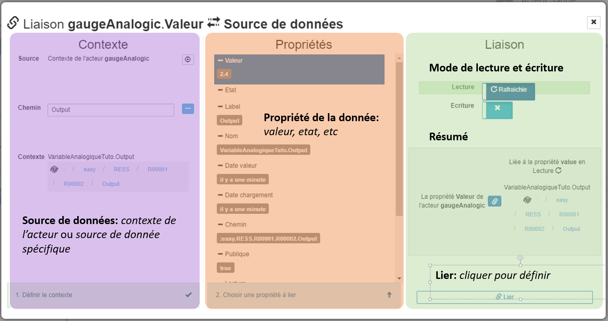
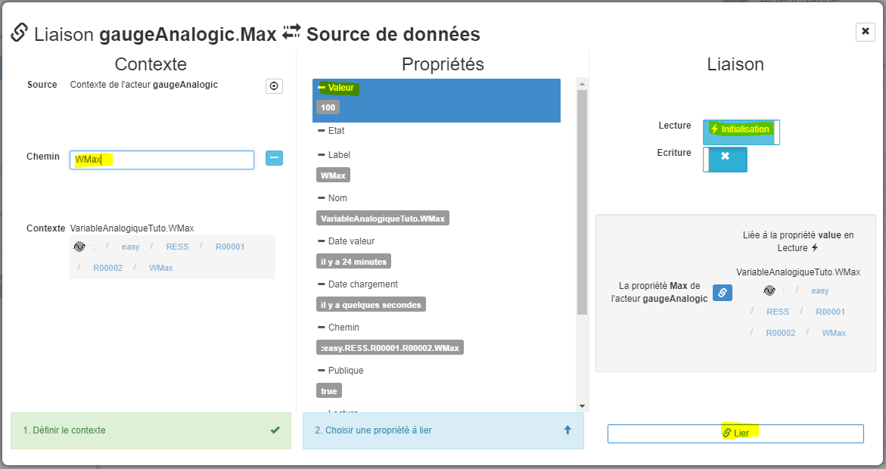
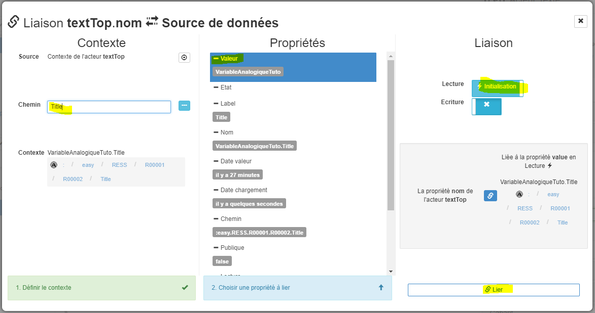

# Tutorial 2: les liaisons **4/6** *[8 nov 17]*

[Home](../../sitemap.md) > [Tutoriaux](../index.md) > [Tutorial](index.md)

## Liaisons **sources de données** en lecture

Dans la troisième partie du tutorial, des liaisons *internes* entre acteurs ont été définies. Cela a permis de rationnaliser le paramétrage des acteurs mais, pour l'instant, les acteurs ne sont toujours pas liés aux ressources du REDY

La prochaine étape va donc consister à configurer les liaisons entre les acteurs et ses ressources: les **sources de données**

_Exemple:_ la valeur de la variable analogique de *variableAnalogicTuto* liée avec la valeur de la jauge *gaugeAnalogic*

### Description source de donnée de l'acteur

De la même façon que pour les liaisons *internes*, nous pourrions définir la liaison vers la *source de donnée* directement depuis la propriété *valeur* de la jauge *gaugeAnalogic*. Cependant, l'acteur *stackRoot* et ses trois enfants, *textTop*, *gaugeAnalogic* et *textBottom* vont être liés à la même *source de donnée*. Nous allons donc définir la *source de donnée* sur l'acteur le plus haut hiérarchiquement, cad *stackRoot*

De façon général, il est conseillé de systématiquement definir la **source de donnée au niveau d'un acteur**. Dans ce cas, on parle de la **source de donnée principale** de l'acteur. Rien n'empéchera dans une propriété particulière de l'acteur d'aller chercher une autre source mais, dans la majorité des cas, une acteur et ses éventuels enfants sont liés à une seule ressource

Un *source de donnée* peut être vu comme une **passerelle de communication** entre SynApp et le REDY:
* Elle sait **requeter** et **envoyer** des données de et vers l'UTL
* Elle a **connaissance** de tous les **acteurs** qui dépendent de cette donnée et les **notifie** de tous les changements

Actuellement un seul **type** de *source de donnée* est disponible: le **WOS** mais ultérieurement le catalogue devrait s'élargir avec d'**autres types de source de données**, soit provenant du **REDY** mais aussi d'**autres services ou plateformes externes**.
Exemple: un service de fourniture de données météo, le WIT-DataCenter (+1), etc

Certains acteurs **natifs** vont chercher directement des données autres que celles provenant du *WOS*. Par exemple, l'acteur *journal* mais dans ce cas il n'est pas nécessaire de définir la *source de donnée* car les mécanismes d'accès à ces données sont directement implémentés dans SynApps au sein de l'acteur

### Définition source de donnée de l'acteur

1. L'acteur *stackRoot* étant sélectionné, ouvrir l'onglet *source de données* et cliquer sur le bouton d'édition


2. Définir une nouvelle **source de donnée**, l'éditeur de permet de:
  * **sélectionner** une *source de donnée* éxistante
  * **définir** une nouvelle *source de donnée*

3. Actuellement aucune *source de donnée* n'est définie. Cliquer sur le bouton **[+Créer]** à côté du type de source souhaité: **WOS** ... le seul disponible à ce jour (voir remarques ci-dessus)

L'explorateur des ressources du REDY s'ouvre sur le chemin par défaut:
```
:easy.RESS
```


4. Sélectionner le dossier de ressource **R00001** *Tutorial2*


5. Sélectionner la variable analogique **R00002** *VariableAnalogicTuto*

La variable analogique *VariableAnalogicTuto* a pour chemin
```
:easy.RESS.R00001.R00002
```

6. Cliquer sur **[Créer]** pour créer la *source de donnée*:
    * La source de donnée **dsR00002** est créée et également définie comme la *source de donnée* **principale** de l'acteur *stackRoot*
    * Le *label* par défaut d'une *source de donnée* est construit par concaténation des caractères **ds** + le **label** du nod

7. La propriété *Source* de l'acteur *stackRoot* est désormais définie sur **dsR00002**

    * Remarquer également la propriété **Contexte** est *variableAnalogiqueTuto* *:easy.RESS.R00001.R00002*
    * Le **contexte** est la **donnée principale** de l'acteur. Il faut bien distinguer la différence entre **source de donnée** et **contexte**:
        * **source de donnée** = moyen d'accès à une donnée
        * **contexte** = donnée retournée par une source
    
    En fait, la relation entre *contexte* et *source de donnée* n'est pas forcemment si directe mais cela sort du périmêtre de ce tuto. Pour l'instant, juste retenir que les laisons de type *source de donnée* des propriétés d'un acteur sont en fait définies par défaut par rapport au **contexte** de cet acteur

8. La source de donnée principale de l'acteur *stackRoot* est définie. Sélectionner, tour à tour, les trois acteurs enfants et constater:
* ils partagent tous le même *contexte*
* leurs source sont *Contexte parent* **stackRoot** 

    Exemple pour l'acteur jauge *gaugeAnalogic*


### Création des liaisons **sources de données**

La propriété *Valeur* de l'acteur *gaugeAnalogic* est actuellement définie manuellement, nous allons la lier avec la ressource du REDY *variableAnalogicTuto*

1. L'acteur *gaugeAnalogic* étant sélectionné, cliquer sur le bouton d'édition de la liaison de la propriété *Spécifiques.Valeur* et sélectionner **Source de données**

    La fénêtre d'édition des liaisons vers les sources de données s'ouvre


2. Configurer la liaison

L'éditeur de liaison de *source de données* est composé de trois parties principales:

* **Source de données**:

  * *Source*: laisser sur *Contexte de l'acteur* **gaugeAnalogic**. C'est ici qu'une **source de donnée spécifique** peut éventuellement être définie

  * *Chemin relatif*: **Saisir** directement **Output** dans le champs de saisie ou **sélectionner** le chemin avec l'explorateur à sa droite. *Output* est le *nod* contenant la valeur analogique

* **Contexte**: laisser la propriété *Valeur* par défaut. En sélectionnant la liste déroulante, vous pouvez visualiser les autres propriétés disponibles. Dans la cas d'un nod de type *ressource* la propriété *état* serait également sélectionnable

* **Accès**: 

  * **Lecture**: laisser sélectionné et *écriture* non sélectionné. La variable analogique *variableAnalogicTuto* est accedée en lecture 

  * **Mode**: sélectionner *Rafraichie*. La valeur sera rafraichie toutes les X secondes. L'autre valeur possible est *Initialisation* dans ce cas la valeur est récupéré une seule fois au moment de l'initialisation de l'acteur

  * **Ecriture**: laisser non sélectionné. La variable analogique *variableAnalogicTuto* ne doit pas être modifié par l'acteur
  
*Remarques:* 

* Ne sélectionner le *mode rafraichie* que sur des propriétés de nod qui changent. Par exemple, le *mode initialisation* est suffisant pour définir la liaison vers le nom d'une ressource

* La période de rafraichissement du *mode rafraichie* peut être modifiée directement au niveau de la *source de donnée*: onglet *source* en haut à gauche de SynApps


Consulter [description du MAKER](../../designer.md) pour en savoir plus concernant l'éditeur de liaison *source de donnée*

Cliquer sur **[lier]** en haut

La propriété *Valeur* de *gaugeAnalogic* est désormais liée à la propriété *Valeur* de la donnée du REDY *variableAnalogicTuto.Output*, vous remarquez:
* qu'elle **n'est plus modifiable manuellement car liée**

* le bouton d'édition de la liaison est de couleur **bleu foncé** pour indiquer une liaison *source de données*

* un **tooltip résumant la liaison** apparait en déplaçant le curseur de la souris sur le bouton d'édition de la liaison


### Vérification de la liaison **sources de données**

Modifier la période de rafraichissement de la source de donnée *dsR00002* à 3 secondes


Revenir sur la scène *scene1* et observer les mouvements de la jauge toutes les 3 secondes en fonction des changements de valeur *Output* de *variableAnalogicTuto*.

*Remarque:* la valeur dans *textBottom* change également car une liaison interne a déja été définie [précédemment](part4.md)


### Définition des autres liaisons aux **sources de données**

1. De la même manière, lier la propriété additionnelle *Spécifiques.Max* de l'acteur *gaugeAnalogic* à la propriété *Valeur* du chemin *WMax* du contexte en *mode initialisation*. *WMax* peut changer dans le REDY mais il est largemment acceptable de ne récupérer sa valeur qu'à l'initialisation


2. Lier la propriété additionnelle *Spécifiques.nom* de l'acteur *textTop* à la propriété *Valeur* du chemin *Title* du contexte en *mode initialisation*


3. Lier la propriété additionnelle *Spécifiques.unit* de l'acteur *textTop* à la propriété *Valeur* du chemin *Unit* du contexte en *mode initialisation*


Toutes les liaisons des **sources de données** sont désormais définies

### Vérification des liaisons **sources de données**

Vérifier que tout fonctionne comme attendu: connectez-vous sur le REDY et modifier le paramétrage de la ressource:
```
:easy.RESS.R00001.R00002
```
* Modifier le nom de la ressource


* Passer en mode *Forcé manuel*
* Modifier le Seuil maximum à *120*
* Modifier la Valeur à plusieurs reprises en validant: *30, 110, 50, etc*

 
La zone de prévisuallisation doit restituer les changements sur l'ensemble des acteurs

Observer le résultat dans SynApp. La zone de prévisualisation doit restituer les changements sur la resource du REDY


*Remarques:*
* les liaisons vers *WMax*, *Unit* et *Title* sont en *mode initialisation* et donc ne devraient, en théorie, pas être rafraichies mais juste chargées à l'initialisation de l'acteur. Cependant la source de donnée *dsR00002* récupère la valeur *Output* en *mode rafraichie*. A cette occasion, la ressource complète est récupérée et donc automatiquement appliquée sur toutes les liaisons la concernant quelquesoit le mode défini

* le mode **initialisation** est donc juste une indication de **non nécessité de rafraichissement** mais ne préjuge en aucun cas du moment ou les propriétés de l'acteur seront rafraichies

*Pour résumer:* le principe est toujours de **présenter les ressources du REDY les plus récentes** !

**Déployer la SynApp**

Suite du [tutorial](part5.md)