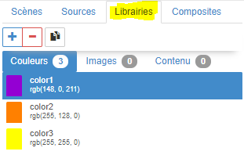
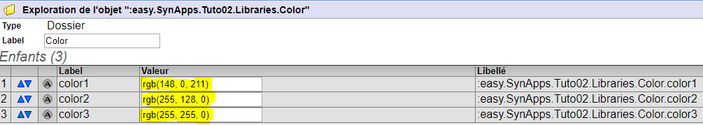
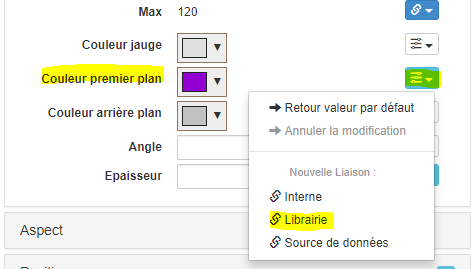
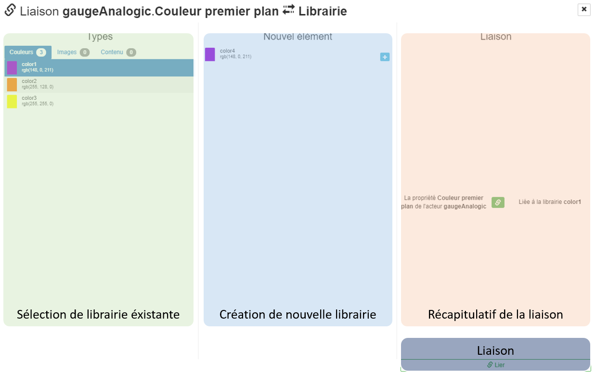
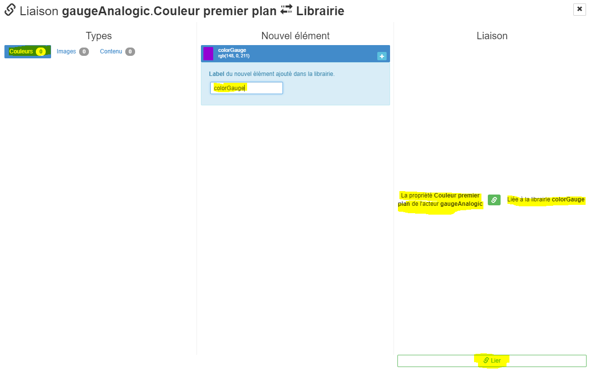
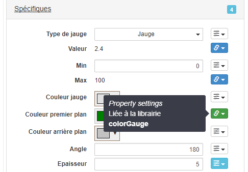
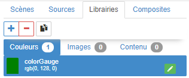
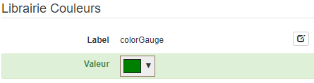
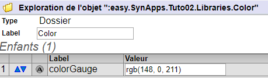
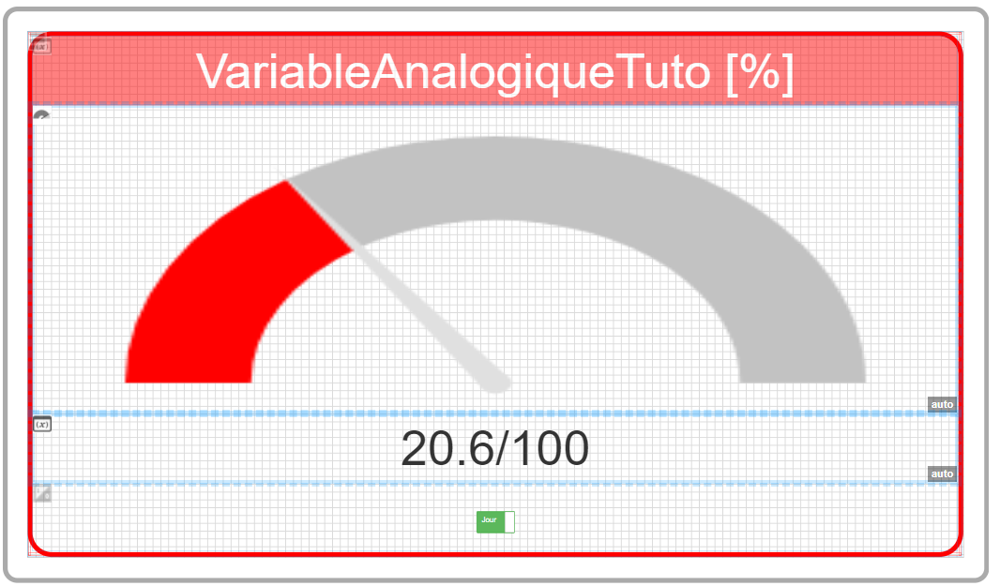

[Home](../../sitemap.md) > [Tutoriaux](../index.md) > [Tutorial](index.md)

# Tutorial 2: les liaisons **6/6** *[10 nov 17]*

## Liaisons **librairies**

Dans les parties [précédentes](part5.md) du tutoriel, les acteurs ont été:
* disposés dans une scène
* liés en **interne** à d'autres acteurs
* liés à des **sources de données** en *lecture* et *ecriture*

Pour cette dernière partie, nous adressons le concept des **librairies** qui permettent de centraliser des données simplement et ainsi favoriser leurs réutisabilité dans les propriétés d'acteurs

### Les librairies

Les librairies sont classifiées en trois **catégories**:
* **Couleurs**: librarie de *couleurs*
* **Images**: librairie d'*images*
* **Contenu**: librairie d'autre types de contenu: *texte*, *javascript*, *json*, etc


Tout élément d'une librairie est stocké dans le Redy dans un **noeud dédié** qui peut donc être simplement modifié côté UTL manuellement, avec du e@sy-script, etc


Cela implique également qu'une méthode simple pour venir éditer un élément de configuration de Synapps depuis le Redy est de sortir ce contenu de l'acteur dans une *librairie*: _texte_, _couleur_, _valeur numérique_, _etc_

[En savoir plus sur les objets crées dans le Redy](../../redy/explore.md)

*Exemple:* dans la copie d'écran ci-dessus, il suffit de modifier la valeur du label *color1* pour changer la couleur des acteurs qui sont liés à cet élément de librairie

*Remarque:* les librairies ne sont chargées qu'à l'initialisation de la SynApp

#### Cas particulier de la librairie Image

Point important concernant les **images**. Le mécanisme de chargement des images dans SynApps est plus **optimisé** lorsqu'elles sont définies dans des **librairies** car elles profitent des fonctionnalités de **cache de navigateurs**

_A retenir:_ définir **systématiquement** les images dans des librairies sauf pour les trés petites images (en taille) qui ne présentent pas d'intéret de réutisabilité

### Création des liaisons **librairies**

La couleur de premier plan de l'acteur *gaugeAnalogic* est actuellement définie manuellement. Nous allons la publier dans la *librairie couleur* et créer la liaison avec la propriété *Couleur de premier plan* de l'acteur

1. L'acteur *gaugeAnalogic* étant sélectionné, editer la liaison de la propriété *Spécifiques.Couleur de fond* et sélectionner **Librairie**

La modale d'édition des liaisons vers les librairie s'ouvre

2. Description de l'éditeur de liaison des libraries

L'éditeur de liaison de *source de données* est composé de trois parties principales:
    * **Sélecteur de librairie éxistante**: sélectionner un type et lier la propriété de l'acteur à une librairie éxistante
    
    * **Création de nouvelle librairie**: créer un nouvel élément de librairie avec la valeur actuelle de la propriété de l'acteur et lier la propriété de l'acteur

    * **Récapitulatif de la liaison**: vérifier la description et cliquer sur **[Lier]** en bas à droite

    Consulter [description du Maker](../../designer.md) pour en savoir plus concernant l'éditeur de liaison *source de donnée*

3. Dans *Types*, sélectionner *Couleurs*, sélectionner **color1** dans *Nouvel élément*. Changer le *label* pour **colorGauge** puis **[lier]** en bas à droite


4. La propriété *Couleur premier plan* de *gaugeAnalogic* est désormais liée à la librairie *colorGauge*, vous remarquez:
    * qu'elle **n'est plus modifiable manuellement car liée**
    * le bouton d'édition de la liaison est de couleur **vert** pour indiquer une liaison *librairie*
    * un **tooltip résumant la liaison** apparait en déplaçant le curseur de la souris sur le bouton d'édition de la liaison
    

### verification des liaisons **librairies**

3. Vérification la laison en modifiant la couleur de la librairie *colorGauge* avec une autre couleur



4. Revenir sur la scène *scene1* et observer que la couleur est bien appliquée sur les acteurs

5. Modifier également la couleur dans la **configuration du Redy** avec la valeur **red** en utilisant l'explorateur de nod sur
```
:easy.SynApps.Tuto02.Libraries.Color
```


6. Revenir sur la scène *scene1* de SynApps, rafraichir (F5) et observer que la couleur est bien appliquée sur les acteurs


### Conclusion

Le tutorial 2 est **terminé** ! la SynApp créée est simple mais a permis d'appréhender un des concepts importants de SynApps, les **liaisons**

Sans attendre les prochains tutoriaux, vous pouvez:
* parcourir le Maker,
* essayer d'autres acteurs

Vous pouvez remonter les **bugs** & **remarques** concernant ce tutorial, SynApps Runtime & Maker avec par ordre de préférence:
1. GitHub [gestionnaire d'issues](https://github.com/witsa/synapps/issues)
2. Discord #wup-synapps
3. Par mail à l'équipe de dev

[Tutoriel suivant](../tuto03/index.md)