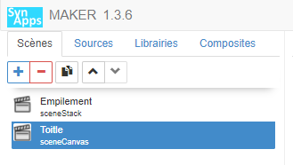

[Home](../../sitemap.md) > [Tutoriaux](../index.md) > [Tutorial](index.md)

# Tutorial 3: l'acteur de disposition **toile**

## Prerequis

Créer une **nouvelle scène** dans la SynApp créée précédemment **tuto03** . Modifier le _label_ de la scène en **sceneCanvas** et le _nom_ avec **Toile** puis déployer.

## Construction de la scène

En cours