[Accueil](../../readme.md) / [Tutoriaux](../index.md) / [Tutorial 03](index.md)

# Tutorial 3: l'acteur de disposition **Boite de vue**

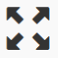

La troisième partie de ce tutorial est consacrée à l'acteur **_boite de vue_** qui permet d'**adapter** des acteurs enfants à la taille de l'écran de restitution:
* **sans déformation** et conserver le ratio _hauteur_ * _largeur_
* occuper le **maximum d'espace** disponible

Deux modes sont possibles: **visible** et **remplir** détaillés ci-après

## Prerequis

Créer une **nouvelle scène** dans la SynApp **tuto03** créée précédemment. Modifier le _label_ de la scène en ```sceneViewbox``` et le _nom_ avec ```Boite de vue``` puis déployer.
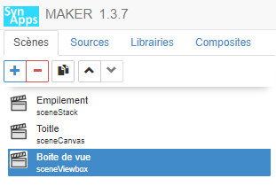

## Mise en oeuvre de la boite à vue en mode **visible**

Le mode **visible** de la _boite à vue_ permet d'adapter les acteurs enfants **sans déformation**, avec le **maximum d'espace** disponible mais en restant **visible**

1. Dans la scène courante ```sceneViewbox``` définissez l'acteur principal avec un acteur **boite de vue**

    * Définir la propriété _Gabarit > Hauteur_ avec la valeur par défaut ```[vide]```

2. **Ajouter** un acteur enfant de type **image** et définir le fond de plan avec l'image ci-dessous. 
    * Click droit sur l'image ci-dessous et _Enregistrer sous_ dans un dossier local
    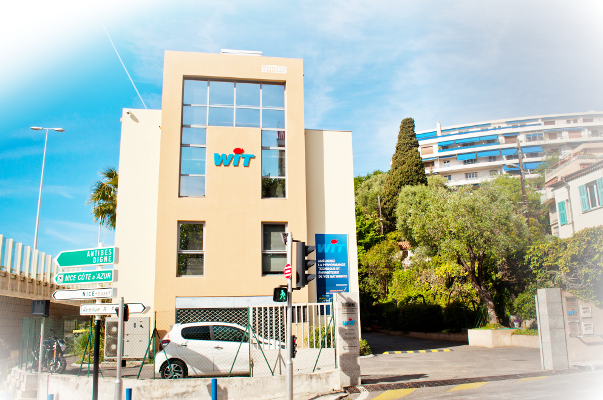

    * Ouvrir le dossier local contenant l'image
    * Glisser/déplacer l'image dans la zone **hachurée** de la propriété  _Spécifiques > Image_ 
   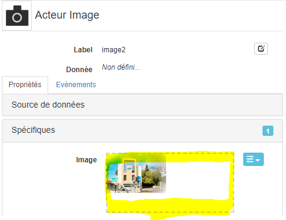
    * Modifier la propriété _Gabarit > Hauteur_ à la valeur par défaut
    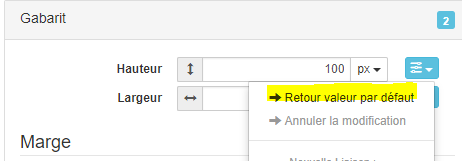
    * Modifier également la propriété _Gabarit > Largeur_ à la valeur par défaut ```[vide]```

    L'image **s'adapte automatiquement** dans la _zone de prévisualisation_

    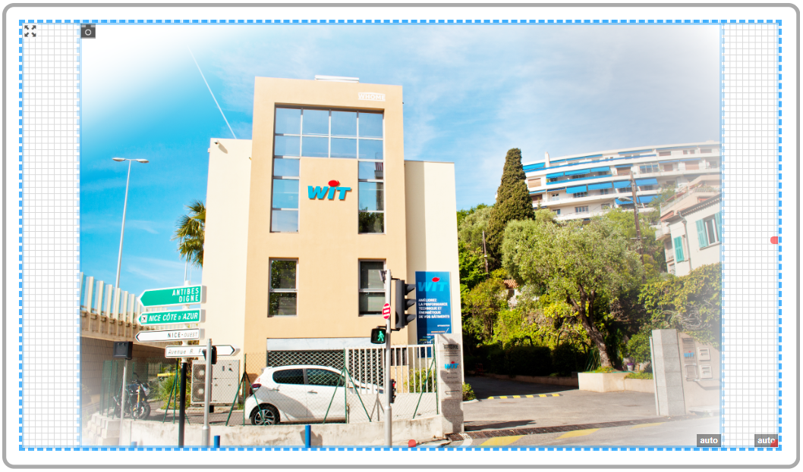

3. **Modifier** la _zone de prévisualisation_ en mode ```Portrait```

    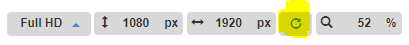

    L'image **s'adapte automatiquement** dans la _zone de prévisualisation_

    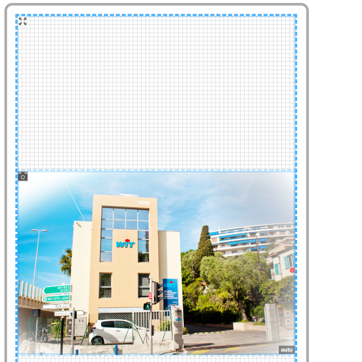

4. **Modifier** les tailles dans la _zone de prévisualisation_ en ```Hauteur``` et ```Largeur```

    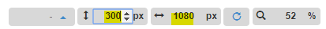

    Dans tous les cas l'image s'adapte pour être **visible sans déformation sur la totalité** de la zone

    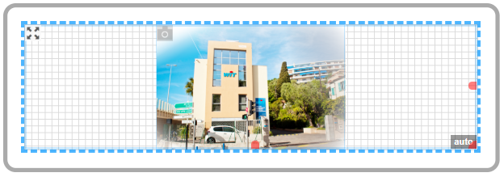

5. **Exécuter** la SynApp et modifier la taille du navigateur pour vérifier que l'image s'adapte également en mode **RUNTIME**

    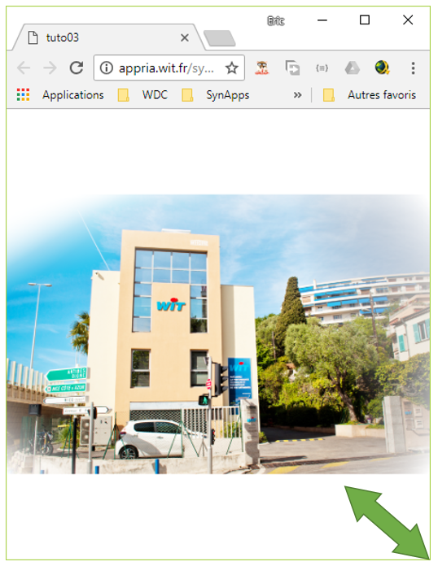

### Mise en oeuvre de la boite à vue en mode **remplir**

Le mode **remplir** de la _boite à vue_ est identique au mode _visible_ excepté que les **espaces vides sont suprrimés** et donc certaines parties des acteurs enfants peuvent être **masquées**

1. Réinitialiser la zone de prévisualisation en ```1080 x 1920```

   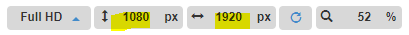

2. Sélectionner l'acteur _boite à vue_ ```viewBox1``` et changer le mode:

    * Modifier la propriété _Spécifiques > Type de vue_ avec ```Remplir```

    L'image **s'adapte automatiquement** dans la _zone de prévisualisation_ et est en partie **tronquée** en **haut** et en **bas** pour **occuper tout l'espace**

3. **Modifier** la _zone de prévisualisation_ en mode ```Portrait```

    

    L'image **s'adapte automatiquement** dans la _zone de prévisualisation_ et est en partie **tronquée** à **gauche** et à **droite** pour **occuper tout l'espace**

    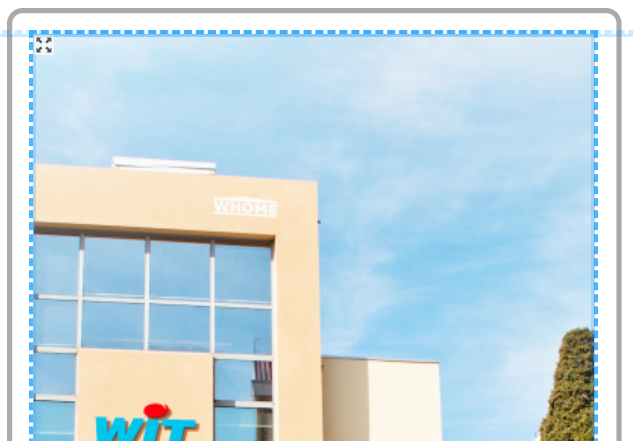

4. **Exécuter** la SynApp et modifier la taille du navigateur pour vérifier que l'image s'adapte également en mode **RUNTIME**

    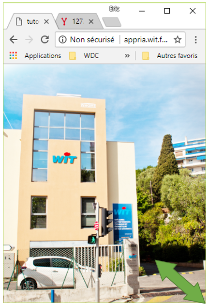

## Que retenir ?

Vous avez composé une scène de type _viewBox_ et **adapté aux mieux** une image simple pour qu'elle **occupe le maximum d'espace disponible sans déformation**. Deux modes sont possibles:
* **Visible**: la totalité des acteurs enfants sont visibles et des espaces peuvent donc être ajoutés en **haut et bas** ou à **gauche et droite**

* **Remplir**: les acteurs enfants occupent tout l'espace mais peuvent être tronqués en **haut et bas** ou/et à **gauche et droite**

L'acteur boite à vue est parfait pour adapter une image, ou tout autre acteur enfant, à la taille d'un écran.

_Remarque:_ il permet notamment d'adapter un synoptique avec des dimensions fixes en pixel !

Le tutorial suivant est consacré à l'acteur disposition de type **modal** qui permet d'**ouvrir** une **fenêtre modale** pour optenir ou fournir une information à l'utilisateur

[Tutorial acteur disposition **_modal_**](part4.md)