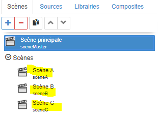

# Tutorial 4: la navigation

[Home](../../sitemap.md) > [Tutoriaux](../index.md) > [Tutorial](index.md)

Dans ce tutorial, nous allons détailler une fonction fondamentale de toute application: la **navigation** entre scènes.

Nous allons mettre en oeuvre 2 nouveaux acteurs

* **Bouton de navigation**: pour déclencher la navigation entre les scènes
* **Ecrans**: pour afficher une scène dans une zone de l'écran

## Description

L'objectif du tutorial est la construction d'une SynApp navigable avec **3 scènes**. Chaque scène naviguée pourra être accédée avec un **raccourci** ou favoris dans le navigateur. La dernière scène contiendra également une navigation.
La scène princiaple sera composée d'un **menu**, de la **scène centrale** et d'un **pied de page**

## Prerequis

Créer une nouvelle SynApp **tuto04** avec le _MAKER_. Modifier le _label_ de la première scène en **sceneMaster** et le _nom_ avec <code>scène principale**</code> puis déployer.

## Construction de la **scène principale**

1. Dans la scène courante _sceneMaster_ **définissez** l'acteur principal avec un acteur _empilement_

    * Renommer le _Label_ avec <code>stackRoot</code>
    
    * Définir la propriété _Aspect > Police > Taille_ avec <code>50px</code>

    _Remarque:_ il est important de systématiquement **renommer** le _Label_ des objets créés: acteur, scène, etc, avec des noms explicites.

    Par exemple <code>stack1</code> par <code>stackRoot</code>, <code>scene1</code> par <code>sceneMaster</code>

    Cela rend la la SynApp plus **maintenable** notamment dans ce tutorial car des acteurs vont référencés les clés d'autres acteurs

2. **Ajouter** un acteur enfant de type _empilement_ qui contiendra le menu de navigation

    * renommer le _Label_ avec <code>stackMenu</code>
    * définir la propriété _Spécifique > Orientation_ à <code>Horizontale</code>
    * définir la propriété _Aspect > Police > Alignement texte_ à <code>Centre</code>
    * définir la propriété _Gabarit > Hauteure_ à <code>10%</code>

3. **Sélectionner** l'acteur _empilement_ <code>stackRoot</code> et **Ajouter** un acteur enfant de type _écran_ (dans la catégorie _Affichage_ de l'explorateur d'acteurs) qui contiendra la scène courante

    * renommer le _Label_ avec <code>screenMiddle</code>
    * réinitialiser la propriété _Gabarit > Hauteur_ à la valeur par défaut <code>[Vide]</code>
    * définir la propriété _Position > Align. vertical_ à <code>Etendre</code>

    _Remarque:_ ne pas préter attention au **message d'avertissement** sur la propriété _Spécifiques > Scène_. Elle sera définie ultérieurement
    

4. **Sélectionner** l'acteur _empilement_ <code>stackRoot</code> et **Ajouter** un acteur enfant de type _empilement_ qui contiendra le pied de page

    * renommer le _Label_ avec <code>stackFooter</code>
    * définir la propriété _Aspect > Couleur de fond_ à un gris clair <code>#e0e0e0</code>
    * réinitialiser la propriété _Gabarit > Hauteur_ à la valeur par défaut <code>[Vide]</code>

5. **Ajouter** un acteur enfant de type _text_ qui contiendra le texte de pied de page

    * renommer le _Label_ avec <code>textFooter</code>
    * définir la propriété _Aspect > Couleur_ à un gris foncé <code>#555555</code>
    * définir la propriété _Spécifiques > Contenu_ avec le texte <code>Pied de page</code>
    * définir la propriété _Position > Align. vertical_ à <code>Centré</code>
    * définir la propriété _Position > Align. horizontal_ à <code>Centré</code>

    

    L'arbre des acteurs doit être

    

## Construction des 3 **scènes secondaires**

1. **Ajouter** une **nouvelle scène**

    * renommer le _Label_ en <code>sceneA</code>
    * définir la propriété _Nom_ avec le texte <code>Scène A</code>
    * définir la propriété _Dossier_ avec le texte <code>Scènes</code>

    

    _Remarque:_ le dossier permet de **ranger** la scène dans la liste

    

2. **Ajouter** un acteur enfant de type _empilement_

    * définir la propriété _Aspect > Couleur_ en _blanc_ à <code>#ffffff</code>
    * définir la propriété _Aspect > Couleur de fond_ en _orange_ à <code>#ff8000</code>
    * lier cette même propriété dans un nouvel élément de librairie

    

    et définir le nom de cet élément en <code>colorSceneA</code>
    

    * définir la propriété _Aspect > Police > Poids_ à <code>800</code>
    * définir la propriété _Aspect > Police > Alignement texte_ à <code>Centre</code>
    * définir la propriété _Aspect > Police > Taille_ à <code>100px</code>

3. **Ajouter** un acteur enfant de type _text_

    * définir la propriété _Spécifiques > Contenu_ avec le texte <code>Scène A</code>
    * définir la propriété _Position > Align. vertical_ à <code>Centré</code>
    

4. **Cloner** la scène <code>sceneA</code>

    * renommer le _Label_ en <code>sceneB</code>
    * définir la propriété _Nom_ avec le texte <code>Scène B</code>

5. **Sélectionner** l'acteur _empilement_ <code>stack1</code>

    * supprimer la liaison de la propriété _Aspect > Couleur de fond_
    

    * définir la propriété _Aspect > Couleur de fond_ en _violet_ à <code>#9400d3</code>
    * lier cette même propriété dans un nouvel élément de librairie avec le nom <code>colorSceneB</code>

6. **Sélectionner** l'acteur _text_ <code>text2</code>

    * définir la propriété _Spécifiques > Contenu_ avec le texte <code>Scène B</code>

7. **Définir** la scène **C comme pour la scène B** (_étapes 4 à 6_) en utilisant la couleur bleu <code>#0000ff</code>

    

## Intégration des 3 **scènes secondaires** dans la **scène principale**

1. **Sélectionner** la scène principale <code>sceneMaster</code>

2. **Sélectionner** l'acteur _ecran_ <code>screenMiddle</code>

    * définir la propriété _Spécifiques > Scène_ en sélectionnant la scène <code>sceneA</code>. La scène A est alors affichée dans l'écran principal
    

4. **Sélectionner** l'acteur _empilement_ <code>stackMenu</code> et **Ajouter** un acteur enfant de type _navigation_ (dans la catégorie _Interactions_ de l'explorateur d'acteurs) qui va naviguer sur la scene A dans l'acteur écran de la scène

    * renommer le _Label_ avec <code>buttonNavSceneA</code>
    * lier la propriété _Aspect > Couleur de fond_ à l'élément de librairie couleur <code>colorSceneA</code>
    
    * définir la propriété _Position > Align. vertical_ en <code>Etendre</code>
    * définir la propriété _Position > Align. horizontal_ en <code>Etendre</code>
    * définir la propriété _Spécifiques > Contenu_ avec le texte <code>Scene A</code>
    * sélectionner la propriété _Spécifiques > Scène_ avec <code>Scene A</code>
    * sélectionner la propriété _Spécifiques > Acteur de visualisation_ avec <code>screenMiddle</code>
    

    _Remarque:_ c'est dans ces 2 dernières sélections que la navigation opère: une action sur le bouton <code>buttonNavSceneA</code> commandera l'affichage de la scene <code>sceneA</code> dans l'acteur <code>screenMiddle</code> de la scène principale

4. **Cloner** l'acteur _navigation_ <code>buttonNavSceneA</code>

    * renommer le _Label_ avec <code>buttonNavSceneB</code>
    * supprimer la liaison de la propriété _Aspect > Couleur de fond_
    * lier cette même propriété à l'élément de librairie couleur <code>colorSceneB</code>
    * définir la propriété _Spécifiques > Contenu_ avec le texte <code>Scene B</code>
    * sélectionner la propriété _Spécifiques > Scène_ avec <code>Scene B</code>

5. **Cloner** un nouvel acteur <code>buttonNavSceneC</code> **comme pour le bouton de navigation B** (_étape 4_) en oubliant pas de lier la couleur de fond à la librairie <code>colorSceneC</code>

6. **Déployer** et **exécuter** la SynApp et cliquer sur les 3 boutons pour commander la navigation

    

    La navigation principale est désormais opérationnelle !

7. Toujours En mode exécution, **Cliquer** sur la scene B. **Copier l'url courante dans un nouvel onglet du navigateur**: la SynApp s'ouvre sur la **scene A** et pas sur la B ! Cela signifie qu'il n'est pas possible, pour l'instant, de définir un raccourci vers une scène particulière de la SynApp. 

    Dans une application, il est trés important de pouvoir définir des **accès rapide via des raccourcis** vers des scènes

## Définition de raccourci

