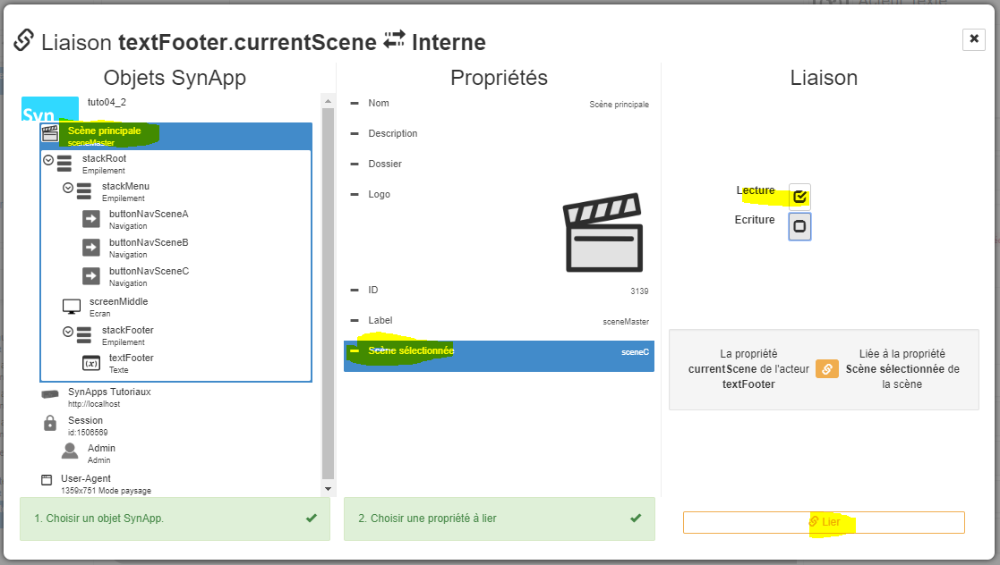
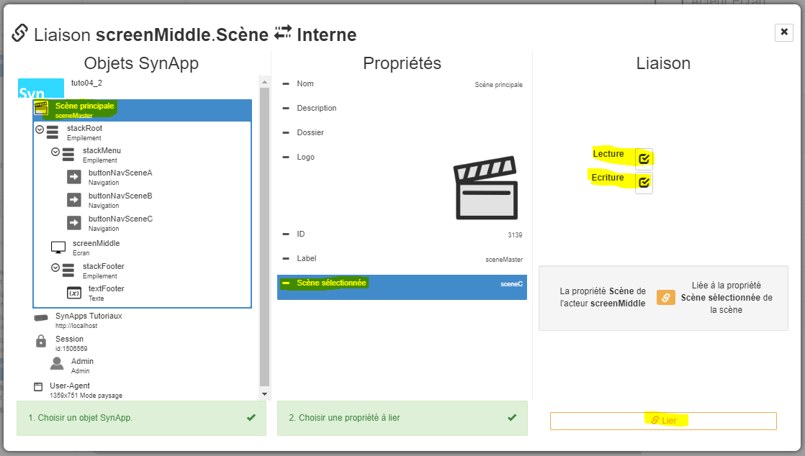

# Tutorial 4: la navigation - **<span style='color:green'>Débutant</span>**

[Home](../../sitemap.md) > [Tutoriaux](../index.md) > [Tutorial](index.md)

Dans ce tutorial, nous allons détailler une fonction fondamentale de toute application: la **navigation** entre scènes.

Nous allons mettre en oeuvre 2 nouveaux acteurs

* **Bouton de navigation**: pour déclencher la navigation entre les scènes
* **Ecrans**: pour afficher une scène dans une zone de l'écran

## Description

L'objectif du tutorial est la construction d'une SynApp navigable avec **3 scènes**. Chaque scène naviguée pourra être accédée avec un **raccourci** ou favoris dans le navigateur. La dernière scène contiendra également une navigation scondaire.
La scène principale sera composée d'un **menu**, de la **scène centrale** et d'un **pied de page**


## Prerequis

Créer une nouvelle SynApp **tuto04** avec le _MAKER_. Modifier le _label_ de la première scène en **sceneMaster** et le _nom_ avec ```scène principale**``` puis déployer.


## Construction de la **scène principale**

1. Dans la scène courante _sceneMaster_ **définissez** l'acteur principal avec un acteur _Empilement_

    * Renommer le _Label_ avec ```stackRoot```
    
    * Définir la propriété _Aspect > Police > Taille_ avec ```50px```

    _Remarque:_ il est important de systématiquement **renommer** le _Label_ des objets créés: acteur, scène, etc, avec des noms explicites.

    Par exemple ```stack1``` par ```stackRoot```, ```scene1``` par ```sceneMaster```

    Cela rend la la SynApp plus **maintenable** notamment dans ce tutorial car des acteurs vont référencés les clés d'autres acteurs

2. **Ajouter** un acteur enfant de type _Empilement_ qui contiendra le menu de navigation

    * renommer le _Label_ avec ```stackMenu```
    * définir la propriété _Spécifique > Orientation_ à ```Horizontale```
    * définir la propriété _Aspect > Police > Alignement texte_ à ```Centre```
    * définir la propriété _Gabarit > Hauteure_ à ```10%```

3. **Sélectionner** l'acteur _Empilement_ ```stackRoot``` et **ajouter** un acteur enfant de type _écran_ (dans la catégorie _Affichage_ de l'explorateur d'acteurs) qui contiendra la scène courante

    * renommer le _Label_ avec ```screenMiddle```
    * réinitialiser la propriété _Gabarit > Hauteur_ à la valeur par défaut ```[Vide]```
    * définir la propriété _Position > Align. vertical_ à ```Etendre```

    _Remarque:_ ne pas préter attention au **message d'avertissement** sur la propriété _Spécifiques > Scène_. Elle sera définie ultérieurement
    

4. **Sélectionner** l'acteur _Empilement_ ```stackRoot``` et **ajouter** un acteur enfant de type _Empilement_ qui contiendra le pied de page

    * renommer le _Label_ avec ```stackFooter```
    * définir la propriété _Aspect > Couleur de fond_ à un gris clair ```#e0e0e0```
    * réinitialiser la propriété _Gabarit > Hauteur_ à la valeur par défaut ```[Vide]```

5. **Ajouter** un acteur enfant de type _text_ qui contiendra le texte de pied de page

    * renommer le _Label_ avec ```textFooter```
    * définir la propriété _Aspect > Couleur_ à un gris foncé ```#555555```
    * définir la propriété _Spécifiques > Contenu_ avec le texte ```Pied de page```
    * définir la propriété _Position > Align. vertical_ à ```Centré```
    * définir la propriété _Position > Align. horizontal_ à ```Centré```

    

    L'arbre des acteurs doit être

    

## Construction des 3 **scènes secondaires**

1. **Ajouter** une **nouvelle scène**

    * renommer le _Label_ en ```sceneA```
    * définir la propriété _Nom_ avec le texte ```Scène A```
    * définir la propriété _Dossier_ avec le texte ```Scènes```

    

    _Remarque:_ le dossier permet de **ranger** la scène dans la liste

    

2. **Ajouter** un acteur enfant de type _Empilement_

    * définir la propriété _Aspect > Couleur_ en _blanc_ à ```#ffffff```
    * définir la propriété _Aspect > Couleur de fond_ en _orange_ à ```#ff8000```
    * lier cette même propriété dans un nouvel élément de librairie

    

    et définir le nom de cet élément en ```colorSceneA```
    

    * définir la propriété _Aspect > Police > Poids_ à ```800```
    * définir la propriété _Aspect > Police > Alignement texte_ à ```Centre```
    * définir la propriété _Aspect > Police > Taille_ à ```100px```

3. **Ajouter** un acteur enfant de type _text_

    * définir la propriété _Spécifiques > Contenu_ avec le texte ```Scène A```
    * définir la propriété _Position > Align. vertical_ à ```Centré```
    

4. **Cloner** la scène ```sceneA```

    

    * renommer le _Label_ en ```sceneB```
    * définir la propriété _Nom_ avec le texte ```Scène B```

5. **Sélectionner** l'acteur _Empilement_ ```stack1```

    * supprimer la liaison de la propriété _Aspect > Couleur de fond_
    

    * définir la propriété _Aspect > Couleur de fond_ en _violet_ à ```#9400d3```
    * lier cette même propriété dans un nouvel élément de librairie avec le nom ```colorSceneB```

6. **Sélectionner** l'acteur _text_ ```text2```

    * définir la propriété _Spécifiques > Contenu_ avec le texte ```Scène B```

7. **Définir** la scène **C comme pour la scène B** (_étapes 4 à 6_) en utilisant la couleur bleu ```#0000ff```

    

## Intégration des 3 **scènes secondaires** dans la **scène principale**

1. **Sélectionner** la scène principale ```sceneMaster```

2. **Sélectionner** l'acteur _ecran_ ```screenMiddle```

    * définir la propriété _Spécifiques > Scène_ en sélectionnant la scène ```sceneA```. La scène A est alors affichée dans l'écran principal
    

4. **Sélectionner** l'acteur _Empilement_ ```stackMenu``` et **ajouter** un acteur enfant de type _navigation_ (dans la catégorie _Interactions_ de l'explorateur d'acteurs) qui va naviguer sur la scene A dans l'acteur écran de la scène

    * renommer le _Label_ avec ```buttonNavSceneA```
    * lier la propriété _Aspect > Couleur de fond_ à l'élément de librairie couleur ```colorSceneA```
    
    * définir la propriété _Position > Align. vertical_ en ```Etendre```
    * définir la propriété _Position > Align. horizontal_ en ```Etendre```
    * définir la propriété _Spécifiques > Contenu_ avec le texte ```Scene A```
    * sélectionner la propriété _Spécifiques > Scène_ avec ```Scene A```
    * sélectionner la propriété _Spécifiques > Acteur de visualisation_ avec ```screenMiddle```
    

    _Remarque:_ c'est dans ces 2 dernières sélections que la navigation opère: une action sur le bouton ```buttonNavSceneA``` commandera l'affichage de la scene ```sceneA``` dans l'acteur ```screenMiddle``` de la scène principale

4. **Cloner** l'acteur _navigation_ ```buttonNavSceneA```

    * renommer le _Label_ avec ```buttonNavSceneB```
    * supprimer la liaison de la propriété _Aspect > Couleur de fond_
    * lier cette même propriété à l'élément de librairie couleur ```colorSceneB```
    * définir la propriété _Spécifiques > Contenu_ avec le texte ```Scene B```
    * sélectionner la propriété _Spécifiques > Scène_ avec ```Scene B```

5. **Cloner** un nouvel acteur ```buttonNavSceneC``` **comme pour le bouton de navigation B** (_étape 4_) en oubliant pas de lier la couleur de fond à la librairie ```colorSceneC```

6. **Déployer** et **exécuter** la SynApp et cliquer sur les 3 boutons pour commander la navigation

    

    La navigation principale est désormais opérationnelle !

7. Toujours En mode exécution, **Cliquer** sur la scene B. **Copier l'url courante dans un nouvel onglet du navigateur**: la SynApp s'ouvre sur la **scene A** et pas sur la B ! Cela signifie qu'il n'est pas possible, pour l'instant, de définir un raccourci vers une scène particulière de la SynApp. 

    Dans une application, il est trés important de pouvoir définir des **accès rapide via des raccourcis** vers des scènes spécifiques

## Définition des **paramêtres de la scène** principale

1. **Sélectionner** la scène principale ```sceneMaster``` pour définir qu'elle est pilotée par des paramêtres. Ici par le numéro de scène secondaire

    * cliquer sur _Gestion des propriétés paramêtres_ dans l'inspecteur de scène
    

2. **Ajouter** une propriété de type **Texte**
    

    * définir _Label_ par ```selectedScene```
    * définir _Nom de la propriété_ par ```Scène sélectionnée```
    * cliquer sur _Terminer_
    
    * Une nouvelle propriété _Scène sélectionnée_ apparait dans l'inspecteur de la scène
    
    * définir _Scène sélectionnée_ par ```sceneA```
    

3. **Sélectionner** l'acteur _text_ ```textFooter``` pour afficher la valeur de la propriété de scène ci-dessus en pied de page

    * modifier la propriété _Spécifiques > Contenu_ avec le texte 
    * créer la propriété proposée ```currentScene```
    
    * liéer en interne cette propriété
    
    * sélectionner l'objet _Scène principale_ et la propriété _Scène sélectionnée_ et **lier** en _lecture_ uniquement
    

4. **Déployer** et **exécuter** la SynApp. L'**URL** de la SynApp contient désormais la propriété de scéne créée _selectedScene_
    
    URL:
    ```text
    .../scene/sceneMaster?sceneProps=%7B%22selectedScene%22%3A%22sceneA%22%7D
    ```

    * remplacer ```sceneA``` dans le chemin ci-dessus par ```sceneB```
    ```text
    .../scene/sceneMaster?sceneProps=%7B%22selectedScene%22%3A%22sceneB%22%7D
    ```
    * le pied de page de la scène affiche bien la valeur saisie
    

    Par contre, la SynApp **ne navigue pas sur la scene B** et reste sur la scene A car, comme nous avons lié le texte du pied de page à la propriété _Scène sélectionnée_ de la scène principale, nous devons également lier la propriété _scène_ de l'acteur écran

5. **Sélectionner** l'acteur _écran_ **screenMiddle** pour lier sa scène

    * Lier la propriété _Spécifique > Scène_ en interne vers l'objet _Scène principale_ et la propriété _Scène sélectionnée_ en _lecture_ et _écriture_
    

    _Remarque:_
    **Lecture** et **écriture** car nous voulons que la modification de scène sur la scène principale soit propagée vers la scène de l'acteur écran et vice-versa !

6. **Déployer** et **exécuter** la SynApp

    * cliquer sur les 3 boutons pour commander la navigation et vérifier que l'**URL** ainsi que le **pied de page** suivent bien la scène sélectionnée
    

    * modifier directement l'URL avec un **autre clé de scene** et vérifier que la **navigation** et le **pied de page** suivent bien la scène définie
    

    * naviguer sur la **scène B** et **copier l'URL** dans un nouvel onglet du navigateur. La SynApp **s'ouvre sur la scène B**

    La navigation principale est désormais opérationnelle

## Construction de la **navigation secondaire** de la scène C

1. **Cloner** la scène ```sceneC```

    * renommer le _Label_ en ```sceneC_1```
    * définir la propriété _Nom_ avec le texte ```Scène C 1```
    * définir la propriété _Dossier_ avec le texte ```Scènes.Scène C```

    

2. **Sélectionner** l'acteur _text_ ```text2```

    * modifier la propriété _Spécifiques > Contenu_ avec le texte ```Scène C > 1```

3. **Sélectionner** l'acteur _Empilement_ ```stack1``` et **ajouter** un acteur _navigation_

    * renommer le _Label_ en ```buttonNavBack```
    * modifier la propriété _Spécifiques > Contenu_ avec le texte ```Retour```
    * définir la propriété _Spécifiques > Scène_ avec la scène ```Scène C```
    * définir la propriété _Position > Align. horizontal_ avec ```Gauche```
    * déplacer l'acteur en première position de ```stack1```
    
    

    _Remarque:_ la propriété _Spécifiques > Acteur de visualisation_ est laissée vide car nous voulons naviguer sur la zone courante.

4. **Cloner** 3 fois la scène ```sceneC_1``` en scène ```sceneC_2```, ```sceneC_3``` et ```sceneC_4``` en renommant les noms de scène et textes (_étapes 1 et 2_)
    

5. **Sélectionner** la scène ```sceneC```

6. **Sélectionner** l'acteur _Empilement_ ```stack1``` et **ajouter** un acteur _Empilement_

    * modifier la propriété _Spécifiques > Orientation_ en  ```Horizontal```
    * modifier la propriété _Position > Align. vertical_ en  ```Etendre```
    * modifier la propriété _Gabarit > Hauteur_ à la valeur par défaut ```[vide]```

7. **Ajouter** un acteur _navigation_

    * renommer le _Label_ en ```buttonNavSceneC1```
    * modifier la propriété _Spécifiques > Contenu_ avec le texte ```Scène C1```
    * définir la propriété _Position > Align. vertical_ avec ```Centré```
    * définir la propriété _Position > Align. horizontal_ avec ```Centré```
    * définir la propriété _Spécifiques > Scène_ avec la scène ```Scène C 1```
    

8. **Cloner** l'acteur ```buttonNavSceneC1```

    * renommer le _Label_ en ```buttonNavSceneC2```
    * modifier la propriété _Spécifiques > Contenu_ avec le texte ```Scène C2```
    * définir la propriété _Spécifiques > Scène_ avec la scène ```Scène C 2```

9. **Cloner** l'acteur _Empilement_ ```stack3``` contenant les 2 acteurs _navigation_ et procéder à la configuration précédente (_étape 8_) pour naviguer vers les scènes _scène C 3_ et _scène C 4_

    
    

10. **Déployer** et **exécuter** la SynApp

    * naviguer sur la scène C puis dans les scènes C1, C2, C3 et C4 en cliquant sur retour pour retourner dans la scène C

## Que retenir

Vous avez mis en oeuvre la navigation de 2 manières:

* En passant par un **acteur ecran** dans lequel s'ouvre la scène sélectionnée
* En **directe** la scène sélectionnée remplace la scène courante

Vous avez défini des **propriétés de scènes** qui permettent de **piloter les scènes** et **définir des raccourcis** vers des scènes spécifiques. Ces propriétés sont **liables** par tous les acteurs constitutifs de cette scène

Enfin, vous avez rangé les scènes dans des **dossiers** pour les retrouver plus facilement !

## Conclusion

Le **tutorial 4** sur les acteurs _navigation_ est **terminé**. La maitrise de la navigation est extrémement importante pour construire des applications ambitieuses !

Vous pouvez remonter les **bugs** & **remarques** concernant ce tutorial, SynApps RUNTIME & MAKER sur [GitHub](https://github.com/witsa/synapps/issues)

[Tutoriel suivant sur les acteurs composites](../tuto05/index.md)