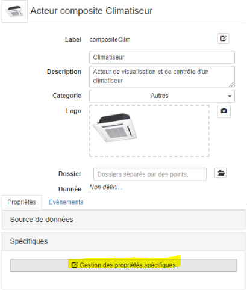

# Tutorial 5: les acteurs **composites**

[Home](../../sitemap.md) > [Tutoriaux](../index.md) > [Tutorial](index.md)

Dans ce tutorial, nous allons mettre un oeuvre l'acteur **composite** qui permet de construire de **nouveaux acteurs** à partir d'acteurs éxistants. Ces derniers peuvent être soit des acteurs:

* **Natifs**: disponibles dans toute SynApp
* **Composites**: construits avec le MAKER, ils correspondent à un usage avancé et nécessitent une bonne compréhension du fonctionnement de SynApps

Quelque soit la nature de l'acteur, son **usage est identique**, la distinction permet donc uniquement de les différencier dans leurs mécanismes de fabrication

Le composite est un élément **fondamental** de toute SynApp, car il favorise:

* **Réutisabilité**: au sein d'une même SynApp et vers d'autres SynApp et utilisateurs via des mécanismes d'import/export

* **Maintenabilité**: la modification d'un acteur composite est propagée automatiquement à l'ensemble des scènes qui l'utilise

* **Modularité**: construction de scènes complexes par compositions d'acteurs simples et imbriqués

Ils peuvent être classés dans deux grandes catégories:

* **Standard**: ils ont une fonction de représentation indépendante d'une source de donnée. Par exemple: une jauge

* **Métiers**: ils ont besoin d'une source de données pour fonctionner ou ils utilisent en interne une ressource du REDY. Par exemple: l'acteur journal


_Classement des acteurs par nature et catégorie_

## Description

L'objectif du tutorial est la construction d'un acteur composite standard permettant de visualiser/gérer une climatiseur

## Prerequis

* Le paramétrage [SynApps_Tutorials.PK4](../config/SynApps_Tutorials.PK4) installé sur le REDY. Il contient trois ressources préconfigurées nécessaires dans le dossier <code>Tutorial5</code>:
    1. Deux ressource **Régulation ventilo-convecteur 2T** <code>VTCAtlanticEst</code> et <code>VTCAtlanticWest</code>
    2. Une ressource  **Compteur/Décompteur** <code>Simulateur de changement temp. ambiante</code>

* Créer une nouvelle SynApp **tuto05** avec le _MAKER_. Modifier le _label_ de la première scène en <code>sceneClims</code> et le _nom_ avec <code>scène climatiseurs</code> puis déployer.

## Construction de la **scène climatiseurs**

1. Dans la scène courante <code>sceneClims</code> définissez l'acteur principal avec un acteur **toile**

2. **Ajouter** un acteur enfant de type **image** et définir le fond de plan avec l'image ci-dessous. 
    * Click droit sur l'image ci-dessous et _Enregistrer sous_ dans un dossier local
    

    * Ouvrir le dossier local contenant l'image
    * Glisser/déplacer l'image dans la zone **hachurée** de la propriété  _Spécifiques > Image_ 
    * Modifier la propriété _Gabarit > Hauteur_ à la valeur par défaut
    * Modifier également la propriété _Gabarit > Largeur_ à la valeur par défaut

## Construction de l'ossature du **composite**

1. **Sélectionner** l'onglet composites et **créer** un nouvel acteur composite

    

    * modifier le _label_ du composite en <code>compositeClim</code> et le _nom_ avec <code>Climatiseur</code>
    * modifier la _description_ du composite en <code>Acteur de visualisation et de contrôle d'un climatiseur</code>
    
    * Récupérer l'image ci-dessous

        

    * Glisser/déplacer l'image dans la zone **hachurée** de la propriété  _Logo_

        

        _Remarques:_ le logo permet d'identifier visuellement le composite dans l'_explorateur d'acteurs_. Il est également possible de faire une copie d'écran du composite avec l'icone **appareil photo** ci-dessus: à tester mais le résultat sera toujours mieux avec une image adaptée

    * définir la propriété _Aspect > Police > Taille_ à <code>50px</code>

    _Important:_ les propriétés définies **directement** sur le composite sont des **valeurs par défaut** qui seront **initialisées** lors de l'ajout du composite dans la scène.
    Elles sont alors modifiables ce qui permet la personnalisation du composite.
    Ici, nous définissons la police par défaut à <code>50px</code> directement sur le composite. Cette taille sera modifiable lors de l'ajout du composite dans la scène.
    Cet aspect est extrémement important: un composite peut être considéré comme une **boite noir** avec des **propriétés publiques personnalisables**. Editer le composite revient à ouvrir la boite et définir son comportement. Nous reviendrons sur cet aspect ultérieurement dans le tutorial

2. **Définissez** l'acteur principal avec un acteur _empilement_

    * Renommer le _Label_ avec <code>stackClim</code>
    * définir la propriété _Aspect > Couleur_ à un bleu clair <code>#45aadb</code>

3. **Ajouter** un acteur enfant de type _html_ qui contiendra la température mesurée courante

    * renommer le _Label_ avec <code>htmlTempCurrent</code>
    * définir la propriété _Spécifiques > Contenu_ avec le texte
    ```html
    <span style="white-space: nowrap;"><i class="icon-temperature-thermometer"></i>{{tempCurrent}}°C</span>
    ```
    _Remarques:_
    * l'acteur _html_ est identique à l'acteur _text_ mais est adapté au contenu HTML
    * _icon-temperature-thermometer_ permet d'utiliser une libraire d'icones embarquée dans SynApps

    * créer la propriété proposée <code>tempCurrent</code> de type **texte**
    
    * modifier les informations de la propriété additionnelle <code>tempCurrent</code> dans l'onglet _Additionnelles > Gestion des propriétés additionnelles_
    
    * modifier _Nom de la propriété_ avec <code>Température courante</code> et _Description_ avec <code>Température mesurée par le climatiseur</code>
    
    * définir la propriété _Spécifiques > Température courante_ avec la valeur <code>21</code>
    
    * définir la propriété _Aspect > Police > Alignement texte_ à <code>Centre</code>

4. **Sélectionner** l'acteur <code>stackClim</code> et **ajouter** un acteur enfant de type _boite à vue_ qui adaptera le visuel du climatiseur à la taille de l'écran

    * renommer le _Label_ avec <code>viewBoxClim</code>
    * définir la propriété _Position > Align. vertical_ à <code>Etendre</code>
    * définir la propriété _Position > Align. horizontal_ à <code>Etendre</code>
    * réinitialiser la propriété _Gabarit > Hauteur_ à <code>[vide]</code>

5. **Ajouter** un acteur enfant de type _toile_ qui contiendra les différents acteurs du visuel

    * renommer le _Label_ avec <code>canvasClim</code>
    * définir la propriété _Gabarit > Hauteur_ à <code>150px</code>
    * définir la propriété _Gabarit > Largeur_ à <code>175px</code>

    _Remarque:_ l'acteur enfant d'une _toile_ doit toujours avoir une dimension fixe. Ici nous définissons la toile avec les dimensions de l'image ci-après.

6. **Ajouter** un acteur enfant de type _image_ qui contiendra l'image du climatiseur

    * renommer le _Label_ avec <code>imageClim</code>
    * Récupérer l'image ci-dessous

        

    * Glisser/déplacer l'image dans la zone **hachurée** de la propriété  _Spécifiques > Image_
    * Réinitialiser la propriété _Gabarit > Hauteur_ à la valeur par défaut
    * Réinitialiser également la propriété _Gabarit > Largeur_ à la valeur par défaut

7. **Sélectionner** l'acteur _toile_ <code>canvasClim</code> et **ajouter** un acteur enfant de type _commutateur image_ qui affichera le mode hiver/été

    * renommer le _Label_ avec <code>switchImageMode</code>
    * récupérer les 2 images  
    * réinitialiser la propriété _Gabarit > Hauteur_ à la valeur par défaut <code>[vide]</code>
    * réinitialiser également la propriété _Gabarit > Largeur_ à la valeur par défaut <code>[vide]</code>
    * modifier la propriété _Spécifiques > Texte On_ avec le texte <code>Chaud</code>
    * modifier la propriété _Spécifiques > Texte Off_ avec le texte <code>Froid</code>
    * désactiver la propriété _Spécifiques > Actif_
    * glisser la première image dans la zone hachurée de la propriété _Spécifiques > Image On_
    * glisser la deuxième image dans la zone hachurée de la propriété _Spécifiques > Image off_
    
    * modifier la propriété _Position > Position gauche_ avec la taille <code>5px</code>
    * modifier la propriété _Position > Position bas_ avec la taille <code>5px</code>

8. **Sélectionner** l'acteur _toile_ <code>canvasClim</code> et **ajouter** un second acteur enfant de type _commutateur image_ qui affichera le mode de fonctionnement on/off

    * renommer le _Label_ avec <code>switchImageOnOff</code>
    * récupérer les 2 images  
    * réinitialiser la propriété _Gabarit > Hauteur_ à la valeur par défaut <code>[vide]</code>
    * réinitialiser également la propriété _Gabarit > Largeur_ à la valeur par défaut <code>[vide]</code>
    * modifier la propriété _Spécifiques > Texte On_ avec le texte <code>On</code>
    * modifier la propriété _Spécifiques > Texte Off_ avec le texte <code>Off</code>
    * désactiver la propriété _Spécifiques > Actif_
    * glisser la première image dans la zone hachurée de la propriété _Spécifiques > Image On_
    * glisser la deuxième image dans la zone hachurée de la propriété _Spécifiques > Image off_
    
    * modifier la propriété _Position > Position droite_ avec la taille <code>5px</code>
    * modifier la propriété _Position > Position haut_ avec la taille <code>5px</code>

9. **Sélectionner** l'acteur _toile_ <code>canvasClim</code> et **ajouter** un acteur enfant de type _image_ qui indiquera si le climatiseur est en train de fonctionner

    * renommer le _Label_ avec <code>imageProgress</code>
    * récupérer l'image 
    * glisser l'image dans la zone hachurée de la propriété _Spécifiques > Image_
    * réinitialiser la propriété _Gabarit > Hauteur_ à la valeur par défaut <code>[vide]</code>
    * réinitialiser également la propriété _Gabarit > Largeur_ à la valeur par défaut <code>[vide]</code>
    * modifier la propriété _Position > Position gauche_ avec la taille <code>70px</code>
    * modifier la propriété _Position > Position bas_ avec la taille <code>10px</code>

10. **Sélectionner** l'acteur _empilement_ <code>stackClim</code> et **ajouter** un acteur enfant de type _html_ qui contiendra la température de consigne

    * renommer le _Label_ avec <code>htmlTempCmd</code>
    * définir la propriété _Spécifiques > Contenu_ avec le texte
    ```html
    <span style="white-space: nowrap;"><i class="icon-target"></i>{{tempCmd}}°C</span>
    ```
    _Remarques:_
    * l'acteur _html_ est identique à l'acteur _text_ mais est adapté au contenu HTML
    * _icon-temperature-thermometer_ permet d'utiliser une libraire d'icones embarquée dans SynApps

    * créer la propriété proposée <code>tempCmd</code> de type **texte**
    * modifier les informations de la propriété additionnelle <code>tempCmd</code> dans l'onglet _Additionnelles > Gestion des propriétés additionnelles_
    * modifier _Nom de la propriété_ avec <code>Température consigne</code> et _Description_ avec <code>Température de consigne</code>
    * définir la propriété _Spécifiques > Température consigne avec la valeur <code>22 °C</code>
    
    * définir la propriété _Aspect > Police > Alignement texte_ à <code>Centre</code>

11. **Vérifier** la configuration
    * la zone de prévisualisation
    

    * structure des acteurs du composites
    

## Ajout du **composite** dans la **scène**

Seul l'ossature du visuel est finalisée, les propriétés personnalisées et le comportement du composite reste à configurer. Au préalable, nous allons ajouter plusieurs **instances** du composite dans la scène

1. **Sélectionner** la scène _climatiseurs_
    

2. **Sélectionner** l'acteur _toile_ <code>canvas1</code> et **ajouter** un acteur enfant de type _Climatiseur_ (dans la catégrorie _Autres_ de l'explorateur d'acteurs)

    * renommer le _Label_ avec <code>compositeClimEast</code>
    * modifier la propriété _Gabarit > Hauteur_ avec la taille <code>300px</code>
    * modifier la propriété _Gabarit > Largeur_ avec la taille <code>300px</code>
    * modifier la propriété _Position > Position gauche_ avec la taille <code>200px</code>
    * modifier la propriété _Position > Position haut_ avec la taille <code>240px</code>
    * vérifier que la propriété _Aspect > Police > Taille_ a bien la valeur de <code>50px</code> que nous avons configuré au niveau du composite
    * modifier cette propriété avec la valeur <code>30px</code> et constater que la taille du texte de l'acteur diminue
    * réinitialiser la propriété et constater que la taille est de nouveau <code>50px</code>
    
    * modifier la propriété _Aspect > Couleur de fond_ avec la couleur jaune clair <code>#ffe583</code>

3. **Dupliquer** l'acteur _Climatiseur_ <code>compositeClimEast</code>

    * renommer le _Label_ avec <code>compositeClimWest</code>
    * modifier la propriété _Position > Position gauche_ avec la taille <code>600px</code>
    * modifier la propriété _Aspect > Couleur de fond_ avec la couleur gris clair <code>#e0e0e0</code>
    
    * constater que nous avons personnalisé les 2 instances d'un même composite

## Définition des **propriétés spécifiques** du composite

Nous allons définir les propriétés personnalisées du composite pour pouvoir configurer notamment le mode de fonctionnement été/hiver, marche/arrêt, les températures ambiante et de consigne

1. **Sélectionner** le composite _Climatiseur_

2. **cliquer** sur **Gestion des propriétés** spécifiques dans l'onglet _Spécifiques_ de l'inspecteur du composite
    

3. **ajouter** une propriété de type _Booléen_ qui permettra de définir si le climatiseur est en marche ou arrêt

    * définir le _Label_ avec le texte _onoff_
    * définir le _Nom de la propriété_ avec le texte _Marche/Arrêt_
    * définir la _Description_ avec le texte _Climatiseur en Marche/Arrêt_

4. **ajouter** une propriété de type _Nombre_ qui permettra de définir la température de consigne

    * définir le _Label_ avec le texte _tempCmd_
    * définir le _Nom de la propriété_ avec le texte _Température consigne_
    * définir la _Description_ avec le texte _Température commandée_

5. **ajouter** une propriété de type _Nombre_ qui permettra de définir la température ambiante

    * définir le _Label_ avec le texte _tempCurrent_
    * définir le _Nom de la propriété_ avec le texte _Température ambiante_
    * définir la _Description_ avec le texte _Température mesurée par le climatiseur_

6. **ajouter** une propriété de type _Liste de choix_ qui permettra de définir le mode de fonctionnement été ou hiver

    * définir le _Label_ avec le texte _modeClim_
    * définir le _Nom de la propriété_ avec le texte _Mode_
    * définir la _Description_ avec le texte _Mode de fonctionnement_
    * Dans la liste de choix définir les 2 éléments été et hiver avec les labels respectifs <code>SUMMER</code> et <code>WINTER</code>
    

7. **Vérifier** la définition des 4 propriétés spécifiques et **fermer** le _Gestionnaire de propriétés spécifiques_ en cliquant sur _Terminé_
    

8. **Définir** les valeurs par défaut des 4 propriétés spécifiques créées

    * définir la propriété _Spécifiques > Marche/Arrêt_ en <code>sélectionné</code>
    * définir la propriété _Spécifiques > Température consigne_ avec la valeur <code>20</code>
    * définir la propriété _Spécifiques > Température ambiante_ avec la valeur <code>23</code>
    * définir la propriété _Spécifiques > Mode ambiante_ avec la sélection <code>Eté</code>

## Liaisons des **propriétés spécifiques** du composite aux acteurs internes

Quatre propriétés spécifiques du composite ont été créées et doivent maintenant être **liées aux acteurs internes** du composite et ainsi définir le comportement du composite en fonction des valeurs définies dans ces propriétés

1. **Selectionner** l'acteur <code>switchImageOnOff</code>

    * lier la propriété _Spécifiques > Valeur_ en _interne_ à la propriété _Spécifiques > Marche/Arrêt_ du composite
    
    

2. **Selectionner** l'acteur <code>htmlTempCurrent</code>

    * lier la propriété _Spécifiques > Température courante_ en _interne_ à la propriété _Spécifiques > Température courante_ du composite (même opération que la propriété précédente)

3. **Selectionner** l'acteur <code>htmlTempCmd</code>

    * lier la propriété _Spécifiques > Température consigne_ en _interne_ à la propriété _Spécifiques > Température consigne_ du composite

4. **Selectionner** l'acteur <code>switchImageMode</code>

    * lier la propriété _Spécifiques > Valeur_ en _interne_ à la propriété _Spécifiques > Mode_ du composite

    **_Important:_** jusqu'a présent les **données liéés** étaient de **même nature**
    * _Marche/Arrêt_ du composite et _valeur_ de _switchImageOnOff_ de type **booléen**
    * _Température courante_ du composite et _Température courante_ de _htmlTempCurrent_ de type **nombre**
    * dans le cas de _switchImageMode_ la propriété _Valeur_ est de type **booléen** et la propriété _Mode_ du composite est de type **texte**: <code>SUMMER</code> ou <code>WINTER</code>. Il faut donc procéder à une **conversion** ou **transformation** de la valeur **texte** en **booléen**

    * Définir une fonction de transformation en lecture pour transformer le _Mode_ **texte** en _Valeur_ **booléen**
    
    * Définir la fonction
    ```javascript
    return context.value==="SUMMER"
    ```
    

    Les scripts seront détaillés dans le [Tutorial 6: événements et javascript](../tuto06/index.md) mais simplement savoir que dans une fonction de transformation _context.value_ contient la **valeur de la source de la liaison**: ici, la valeur de la proriété _Mode_ du composite.

    <code>_return context.value==="SUMMER"</code> retourne la valeur booléénne <code>true</code> si le mode est <code>SUMMER</code>, sinon <code>false</code> (pour <code>WINTER</code>)

5. **Sélectionner** le composite (sans acteurs sélectionnés) et **tester** son fonctionnement

    * Modifier la propriété _Spécifiques > Marche/Arrêt_ et vérifier que l'image correspondante dans la _zone de prévisualisation_ bascule bien du _rouge_ au clignotant _vert/gris_
    * Modifier la propriété _Spécifiques > Température consigne_ et vérifier que la consigne dans la _zone de prévisualisation_ change
    * Modifier la propriété _Spécifiques > Température ambiante_ et vérifier qu'elle change dans la _zone de prévisualisation_
    * Modifier la propriété _Spécifiques > Mode_ et vérifier que l'image correspondante dans la _zone de prévisualisation_ bascule bien de _été_ à _hiver_
    
    

## Configuration des propriétés spécifiques du composite dans la scène

La définition du composite est finalisée, nous allons maintenant lier les valeurs des propriétés spécifiques de ses instances dans la scène vers une ressource du REDY de type _Régulation ventilo-convecteur 2T_

1. **Sélectionner** la scène _climatiseurs_

2. **Sélectionner** l'acteur <code>compositeClimEast</code>

    * définir la propriété _Spécifiques > Température consigne_ avec la valeur <code>21</code>
    * définir la propriété _Spécifiques > Température ambiante_ avec la valeur <code>19</code>
    * définir la propriété _Spécifiques > Mode ambiante_ avec la sélection <code>Eté</code>
    

3. **Sélectionner** l'acteur <code>compositeClimWest</code>

    * définir la propriété _Spécifiques > Marche/Arrêt_ <code>non sélectionné</code>
    * définir la propriété _Spécifiques > Température consigne_ avec la valeur <code>25</code>
    * définir la propriété _Spécifiques > Température ambiante_ avec la valeur <code>19</code>
    * définir la propriété _Spécifiques > Mode_ avec la sélection <code>Hiver</code>

4. **Verifier** que les 2 instances du composite, <code>compositeClimEast</code>, <code>compositeClimWest</code> représentent les valeurs définies
    

Le composite fonctionne et les valeurs définies pour les 2 instances du composite dans la scène peuvent sans difficultés être liées à une ressource de type _Régulation ventilo-convecteur 2T_ via une source de donnée, consulter le [tutorial 2 sur les liaisons](../tuto06/index.md).

Cela pose cependant **plusieurs problèmes**:

* A chaque fois que l'acteur _Climatiseur_ sera ajouté dans une scène, il faudra
    1. definir sa source de donnée principale de type _Régulation ventilo-convecteur 2T_ et
    2. lier les 4 propriétés _Spécifiques_ _Marche/Arrêt_, _Température consigne_, _Température ambiante_ ainsi que _Mode_ ...
* Cela ne favorise ni la réutisabilité, ni la maintenabilité
* L'utilisateur qui utilise le composite dans la scène n'est pas forcemment l'auteur du composite: il ne sait peut-être pas, ni comment, ni quels chemins relatifs de la ressources doivent être liées aux propriétés

C'est le principe de la **boite noir**, l'utilisateur veut juste ajouter un composite sur la scène, définir sa ressource et tout doit fonctionner ! Et c'est possible avec les composites que nous appelons alors **Metiers**

## Composite Metier lié à une ressource du REDY

Plutôt que de modifier le composite éxistant, nous allons créer un nouveau composite

1. **Sélectionner** l'onglet composites et **créer** un nouvel acteur composite

    

    * modifier le _label_ du composite en <code>compositeClim2</code> et le _nom_ avec <code>Climatiseur métier</code>
    * modifier la _description_ du composite en <code>Acteur de visualisation et de contrôle d'un climatiseur avec ressource Régulation ventilo-convecteur 2T</code>
    * modifier la _catégorie_ du composite avec la sélection <code>Métier</code>. Cela permet de retrouver le composite dans cette catégorie dans l'_explorateur d'acteurs_
    * Récupérer l'image ci-dessous

        
    * Glisser/déplacer l'image dans la zone **hachurée** de la propriété  _Logo_
    

    * définir la propriété _Source de données > Source_
    

    **Important:** nous définissons une source de donnée sur le composite afin d'avoir une **ressource de travail** pour configurer les liaisons. Cette ressource pourra et devra  être modifié au moment de l'ajout d'une instance de ce composite dans la scène

    * créer la source de donnée WOS 
    * parcourir le chemin vers la ressource <code> VTCAtlanticEst</code> dans le dossier <code> Tutorial5</code>
    ```text
    : / easy / RESS / R00005 / R0003
    ```
    * modifier le nom de la source de donnée par <code>dsVTCAtlanticEst</code> puis cliquer sur **Créer**
        

    * modifier la _Classe de la donnée_ pour indiquer la classe de ressource que sait consommer le composite. Cela facilitera la configuration du composite lors de l'ajout dans une scène en indiquant à l'utilisateur le type de ressource à définir. Sélectionner **Classe de la donnée** pour contraindre le composite à une ressource de type _ventilo-convecteur 2T_

        
        

2. **Définir** l'acteur principal avec un acteur _empilement_

3. **Ajouter** un acteur enfant de type _Climatiseur_

    * renommer le _Label_ avec <code>compositeClimDrived</code>
    * réinitialiser la propriété _Gabarit > Hauteur_ avec la valeur par défaut <code>[Vide]</code>
    * définir la propriété _Position > Align. vertical_ a <code>Etendre</code>
    * définir la propriété _Position > Align. horizontal_ a <code>Etendre</code>
    * lier la propriété _Spécifiques > Marche/Arrêt_ en Source de données
    
    * saisir <code>VC_Stop</code> dans le _Chemin_ ou utiliser l'_explorateur de chemin relatif_
    * sélectionner la propriété _Valeur_ et la liaison en lecture _Rafraichie_ et **Lier**
    
    * lier la propriété _Spécifiques > Température consigne_ en Source de données

    _Remarque:_ la valeur du chemin de la ressource <code>VC_Stop</code> retourne <code>true</code> lorsque le climatiseur est arreté et <code>false</code> lorsqu'il est en marche. Hors la propriété _Spécifiques > Marche/Arrêt_ doit avoir la valeur <code>true</code> pour indiquer que le climatiseur est en marche: il faut donc **inverser** la valeur provenant de la source de données avec un **fonction de transformation**

    * editer le script de transformation lecture
    
    * écrire la fonction suivante
        ```javascript
        return !context.value
        ```
        Pour rappel _context.value_ retourne la valeur de la source = valeur du noeud <code>VC_Stop</code>

        Le caratere _!_ signifie <code>not</code> et va donc inverser la valeur de la ressource, ce qui est le comportement souhaité

    * lier la propriété _Spécifiques > Température consigne_ en Source de données avec le chemin <code>VC_At</code>, la propriété _valeur_ et la liaison en lecture _Rafraichie_

    _Remarque:_ la consigne est accessible en écriture mais ne sera pas commandé par l'acteur _compositeClim2_. C'est un choix que nous avons fait quant au périmêtre métier du composite. Nous commenderons la consigne depuis la scène, la liaison n'est donc pas autorisée en écriture.

    * lier la propriété _Spécifiques > Température ambiante_ en Source de données avec le chemin <code>VC_Sp</code>, la propriété _valeur_ et la liaison en lecture _Rafraichie_
    VC_Sp

    * lier la propriété _Spécifiques > Mode_ en Source de données avec le chemin <code>VC_Cold</code>, la propriété _valeur_ et la liaison en lecture _Rafraichie_

    _Remarque:_ la valeur du chemin de la ressource <code>VC_Cold</code> retourne <code>true</code> lorsque le climatiseur est en mode _hiver_ et <code>false</code> en mode _été_. Hors la propriété _Spécifiques > Mode_ doit avoir la valeur <code>WINTER</code> ou <code>SUMMER</code>: il faut donc **modifier** la valeur provenant de la source de données avec un **fonction de transformation**

    * editer le script de transformation lecture de _Mode_ avec la fonction suivante
        ```javascript
        return context.value ? "WINTER" : "SUMMER";
        ```
        Pour rappel _context.value_ retourne la valeur de la source = valeur du noeud <code>VC_Cold</code>

        Le caratere _?_ est une instruction conditionnelle qui retournera <code>WINTER</code> lorsque _context.value_ est <code>true</code> sion <code>SUMMER</code>

La définition du composite métier est finalisée ! Les valeurs _Spécifiques_ _Marche/Arrêt_, _Température consigne_, _Température ambiante_ et _Mode_ ainsi que la représentation dans la _zone de prévisualisation_ doivent désormains refleter les données de la ressource _VTCAtlanticEst_

Modifier les valeurs directement dans le paramétrage de la Ressource du REDY puis attendre (max 30 secondes ou forcer le rechargement avec F5) le rafraissement de la source de donnée pour vérifier que le composite reflète bien les modifications


## Modification de la scène par remplacement du composite métier

Nous avons configuré la scène avec 2 intances de composite _compositeClim_. Hors nous avons désormais un composite métier _compositeClim2_ qui sait exploiter des ressources _Régulation ventilo-convecteur 2T_. Nous allons donc supprimer ces 2 instances, les remplacer par notre composite métier puis associer les 2 ressources

1. **Sélectionner** la scène _climatiseurs_

2. **Sélectionner** l'acteur <code>compositeClimEast</code> et le supprimer 

3. **Sélectionner** l'acteur <code>compositeClimWest</code> et le supprimer également

4. **Sélectionner** l'acteur _toile_ <code>canvas1</code> et **ajouter** un acteur enfant de type _Climatiseur métier_ (dans la catégrorie _Métiers_ de l'explorateur d'acteurs)

    * renommer le _Label_ avec <code>compositeClimEast</code>
    * modifier la propriété _Gabarit > Hauteur_ avec la taille <code>300px</code>
    * modifier la propriété _Gabarit > Largeur_ avec la taille <code>300px</code>
    * modifier la propriété _Position > Position gauche_ avec la taille <code>200px</code>
    * modifier la propriété _Position > Position haut_ avec la taille <code>240px</code>

5. **Dupliquer** l'acteur _Climatiseur_ <code>compositeClimEast</code>

    * renommer le _Label_ avec <code>compositeClimWest</code>
    * modifier la propriété _Position > Position gauche_ avec la taille <code>600px</code>
    * modifier la propriété _Source de données > Source_
    
    * créer une nouvelle source de donnée _WOS_
    
    * parcourir le chemin vers la ressource <code> VTCAtlanticWest</code> dans le dossier <code> Tutorial5</code>
    ```text
    : / easy / RESS / R00005 / R0004
    ```
    * modifier le nom de la source de donnée par <code>dsVTCAtlanticWest</code> puis cliquer sur **Créer**
        
    * vérifier que l'acteur représente bien les valeurs de la ressource du REDY <code>VTCAtlanticWest</code>

6. **Sélectionner** l'acteur _toile_ <code>canvas1</code> et **ajouter** un acteur enfant de type _Curseur_

    * renommer le _Label_ avec <code>sliderEast</code>
    * définir la propriété _Gabarit > Largeur_ avec la taille <code>400px</code>
    * définir la propriété _Position > Position gauche_ avec la valeur <code>120px</code>
    * définir la propriété _Position > Position haut_ avec la valeur <code>630px</code>
    * définir la propriété _Source de données > Source_ avec la source de donnée <code>dsVTCAtlanticEst</code>
    * définir la propriété _Spécifiques > Min_ avec la valeur <code>15</code>
    * définir la propriété _Spécifiques > Max_ avec la valeur <code>35</code>
    * définir la propriété _Spécifiques > Bar_ avec la sélection <code>Avant curseur</code>
    * définir la propriété _Spécifiques > Couleur bar_ avec la couleur <code>#ff8000</code>
    * définir la propriété _Spécifiques > Interval_ avec la valeur <code>0.5</code>
    * lier la propriété  _Spécifiques > Valeur_ en source de donnée avec le chemin <code>VC_At</code>, la propriété _valeur_ et la liaison en lecture _Rafraichie_ et **écriture**
    

7. **Dupliquer** l'acteur <code>sliderEast</code>

    * renommer le _Label_ avec <code>sliderWest</code>
    * définir la propriété _Gabarit > Largeur_ avec la taille <code>400px</code>
    * définir la propriété _Position > Position gauche_ avec la valeur <code>600px</code>
    * définir la propriété _Source de données > Source_ avec la source de donnée <code>dsVTCAtlanticWest</code>

8. **Déployer**, **éxécuter** et **vérifier** que:

    * vous pouvez commander les consignes de température des 2 ressources
    * les températures de consigne sur les 2 instances du composite _Climatiseur métier_ changent en conséquence

## **Partage** du composite

Nous avons réalisé 2 acteurs composites qui repondent au besoin de la SynApp. Hors, il est fort probable que nous souhaitions **réutiliser** le composite dans d'autre SynApps et le **partager** avec d'autres utilisateurs

Ultérieurement, SynApps MAKER disposera d'un mécanisme  permettant d'**importer** et **exporter** tout ou partie des objets d'une SynApp et d'un composite notamment
En attendant, il est tout de même possible d'exporter, et d'importer un composite en tant que fichier de paramétrage partiel .WK4 depuis la Configuration du REDY

Nous allons créer une nouvelle SynApp et importer le composite <code>compositeClim</code> créé dans la SynApp <code>tuto05</code>

1. Lister les SynApps et créer une nouvelle SynApps que vous appelerez <code>Test Import</code>
    ]

2. **Naviguer** dans l'interface de **Configuration** du REDY et l'onglet **Explorateur**

3. **Sélectionner** le chemin du compoite
    ```text
    :easy.SynApps.tuto05.Composites.compositeClim
    ```
    

4. **Cliquer** sur le bouton **Exporter**

5. **Sélectionner** le chemin du dossiers des compoite dans la nouvelle SynApp <code>Test Import</code>
    ```text
    :easy.SynApps.Test_Import.Composites
    ```

6. **Cliquer** sur le bouton _Choisir un fichier_, **sélectionner** le fichier _.WK4_ exporté précédemment, et **Ajouter**
    

7. **Vérifier** que le composite est bien importé
    

8. **Retourner** dans SynApps MAKER et nettoyer le cache pour forcer le rechargement du paramétrage de la SynApp depuis le REDY

    _Remarque:_ souvenez vous, SynApps **cache les configurations** des SynApps pour des questions d'**optimisation** du temps de chargement. Il se base notamment sur un **numéro de build** pour savoir si la SynApp a été mise à jour et dans ce cas **forcer le rechargement** de la SynApp depuis le REDY

    Ici, nous avons importé un paramétrage depuis le REDY, le numéro de build de la SynApp <code>Test Import</code> est donc resté inchangé, c'est pourquoi, nous nettoyons le cache des SynApps dans le navigateur

9. **Rafraichir** la SynApp avec F5

10. **Sélectionner** l'onglet composites et vérifier la présence du composite <code>Climatiseur</code> dans la SynApp <code>Test Import</code>

Vous pouvez alors créer une scène et utiliser le composite !

## Que retenir

Vous avez mis en oeuvre un des concepts fondamentaux de SynApps: les **acteurs composites**

Ils permettent de construire de nouveaux acteurs à partir d'acteurs **natifs** ou d'autres **composites** et ainsi avoir une construction plus modulaire qui favorise **maintenabilité** et **réutisabilité** !

Ils permettent également d'avoir des profils utilisateurs de **SynApps MAKER** de niveaux différents:

* **avancés**: capable de **construire** des acteurs composites plus ou moins évolués
* **standards**: capable de d'**utiliser** ces acteurs composites sans avoir besoin de comprendre comment ils fonctionnent. Principe de la **boite noir** !

Nous avons vu comment **personnaliser les propriétés** par défaut de l'acteur composite, par exemple la couleur de fond.
Nous avons également défini de **nouvelles propriétés**  qui permettent de personnaliser l'instance d'acteur composite, par exemple, _Mode_ et _Températures_

Nous avons vu également comment construire des acteurs **métiers** qui savent exploiter une source de donnée particulière, par exemple une ressource du REDY. En tant qu'utilisateur du composite, il a suffit de définir la source de données de l'acteur composite _Climatiseur métier_ pour que ce dernier soit pleinement **opérationnel** !

Enfin, en attendant un mécanisme d'import/export natif depuis SynApps MAKER, nous avons **importé** un composite via le **paramétrage partiel** du REDY

## Conclusion

Le **tutorial 5** sur les acteurs _composites_ est **terminé**. La maitrise de la création est extrémement importante pour construire des applications ambitieuses, maintenables et réutilisables !

Il est important de bien définir le **périmêtre fonctionnel** de chaque composite et exposer notamment de façon intelligible ses **propriétés personnalisées**. La **description** est également importante pour donner des indications à celui qui va utiliser le composite

L'acteur composite est une fonctionnalité majeure de SynApps et permet de construire un éco-système d'acteurs métiers réutilisables et ainsi priviligier **qualité** et **productivité** !

Vous pouvez remonter les **bugs** & **remarques** concernant ce tutorial, SynApps Runtime & Maker sur [GitHub](https://github.com/witsa/synapps/issues)

[Tutoriel suivant sur les événements et fonctions](../tuto06/index.md)