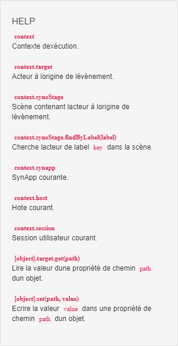

# Tutorial 6: les événements et fonctions javascripts

[Home](../../sitemap.md) > [Tutoriaux](../index.md) > [Tutorial](index.md)

SynApps est conçu pour construire des applicatinos avec le minimum de connaissances en développement et
il est tout a fait possible de ne pas à avoir à saisir une seule ligne de javascript pour arriver à un rendu adapté

Dans les précédents tutoriaux, nous avons commencé à définir des **fonctions de transformations** en lecture sur des liaisons pour adapter un type de valeur source à un type attendu par l'acteur. Exemple: une valeur booléenne <code>true</code> ou <code>false</code> vers une chaine de caractère. Nous reviendrons dans ce tutorial sur les fonctions de transformation en lecture et en écriture de liaison

Dans l'inspecteur d'acteur, nous avons largemment manipulé les **Propriétés** mais, vous l'avez peut-être aperçu, un autre onglet permet de définir des **Evénements**.


Ces événements sont générés dans 2 circonstances liées soit:

1. au **cycle de vie** de l'acteur. Exemple: _Initialisation_, _Rendu_, _Destruction_
2. une **intéraction** de l'utilisateur: _Click_, _Entrée souris_

Tout comme les propriétés, les événements peuvent être classés dans 2 catégories:

1. **Commun** à tous les acteurs

    Exemple: _Entrée souris_ est généré quand une l'utilisateur entre en survol souris sur un acteur

2. **Spécifiques** à un acteur

    Exemple: _Sélection d'une ressource_ est généré quand une ressource est sélectionnée par l'utilisateur dans un acteur _Etat_

Par défaut la définition de ces événements est vide, cad qu'aucune action n'est effectuée. Mais il est possible de définir une **action spécifique** avec un éditeur de javascript qui donne accès à l'ensembles des **objets de SynApps**: acteurs, scène, etc, pour les **lire** mais aussi pour les **modifier** !

Nous verrons qu'il est également possible de **débugger** au pas à pas ces fonctions pour résoudre un comportement inattendu par exemple

La maitrise de la définition des événements est un élément important de toute SynApps afin d'effectuer des actions avancées non, ou pas encore, configurables dans l'éditeur SynApps MAKER !

## Prerequis

* Créer une nouvelle SynApp **tuto06** avec le _MAKER_. Modifier le _label_ de la première scène en <code>sceneEvents</code> et le _nom_ avec <code>scène événements</code> puis déployer

## Construction de l'ossature de la **scène événements**

Nous allons construire une scène qui contiendra plusieurs acteur qui vont générer des événements. Ces derniers seront loggés dans une console de sortie

_Remarque:_ la définition des labels des acteurs est d'autant plus importante avec les événements car ils sont largemment utilisés dans les scripts pour notamment identifier des acteurs

1. **Définir** l'acteur principal avec un acteur _empilement_

    * renommer le _Label_ avec <code>stackRoot</code>
    * modifier la propriété _Spécifiques > Orientation_ en <code>Horizontal</code>

2. **Ajouter** un acteur enfant de type **_empilement_** qui contiendra les acteurs qui vont générer des événements

    * renommer le _Label_ avec <code>stackEvents</code>
    * réinitialiser la propriété _Gabarit > Largeur_ avec la taille <code>[vide]</code>
    * définir la propriété _Position > Align. vertical_ en <code>Etendre</code>
    * définir la propriété _Aspect > Police > Taille_ avec la taille <code>50px</code>

3. **Ajouter** un acteur enfant de type **_texte_** qui sera le premier acteur à générer des événements

    * renommer le _Label_ avec <code>textActorA</code>
    * modifier la propriété _Spécifiques > Contenu_ avec le texte <code>Acteur A</code>
    * modifier la propriété _Aspect > Couleur de fond_ avec la couleur <code>#009fe3</code>
    * modifier la propriété _Aspect > Couleur_ avec la couleur <code>#ffffff</code>
    * modifier les 2 propriétés _Position > Align. vertical_, _Position > Align. horizontal_ en <code>Centré</code>
    * modifier les 4 propriétés _Gabarit > Marge int. gauche_, _Marge int. droit_, _Marge int. haut_, _Marge int. bas_ avec la taille <code>50px</code>

4. **Sélectionner** l'acteur <code>stackRoot</code> et **ajouter** un acteur enfant de type _Zone de texte_ (dans la catégorie **Intéractions** de l'_explorateur d'acteurs_) qui jouera le rôle de console de sortie des événements

    * renommer le _Label_ avec <code>textareaOutput</code>
    * réinitialiser la propriété _Spécifiques > Valeur_ avec le texte <code>[Vide]</code>
    * définir la propriété _Spécifiques > Texte d'aide_ avec le texte <code>Console des événements</code>
    * définir la propriété _Aspect > Couleur de fond_ avec la couleur <code>#d6d6d6</code>
    * définir la propriété _Aspect > Police > Style_ avec la sélection <code>Italic</code>
    * définir la propriété _Aspect > Police > Taille_ avec la taille <code>30px</code>
    * modifier les 4 propriétés _Gabarit > Marge int. gauche_, _Marge int. droit_, _Marge int. haut_, _Marge int. bas_ avec la taille <code>50px</code>

5. **Vérifier** la _liste des acteurs_ ainsi que la _zone de prévisualisation_

    
    

## Implémentation et log d'un événement dans la console

Nous allons définir un premier événement _click_ sur l'acteur A et le logger dans la console

1. **Sélectionner** l'acteur <code>textActorA</code>

    * cliquer dans l'onglet _Evénements_ de l'_inspecteur d'acteur_
    * cliquer sur _commun_ pour ouvrir la liste des événemnts
    
    * éditer l'événement _Ev. "Click souris"_
    
    * copier la fonction javascript suivante dans la _zone d'édition_
    ```javascript
    var evtName = "Click souris";
    var textareaOutput = context.synoStage.findByLabel('textareaOutput');
    var currentOutput = textareaOutput.get('value');
    var newOutput = context.target.get('content') + ' > '+ evtName + "\n" + currentOutput;
    textareaOutput.set("value", newOutput);
    ```
    

    * sauvegarder la fonction et fermer l'éditeur d'événement
    

2. **Déployer**, **éxécuter** et **cliquer** sur _Acteur A_, la console log l'événement

    

3. **Revenir** sur le MAKER et ouvrir l'événement _Ev. "Click souris"_ défini précédemment

    * une **zone d'aide** est affichée droite de la fenêtre et donne les **mots-clefs** permettant de récuperer et modifier les objets de la SynApp, acteurs, scènes, etc dans le contexte courant

        

    * ligne 2

        ```javascript
        var textareaOutput = context.synoStage.findByLabel('textareaOutput');
        ```
        L'instruction _contexte.synotage_ retourne la scène courante <code>sceneEvents</code> de l'acteur à l'origine de l'événement

        La fonction _findByLabel(...)_ retourne l'acteur avec le label <code>textareaOutput</code> dans la scène

        la variable _textareaOutput_ contient donc l'acteur du même nom

    * ligne 3

        ```javascript
        var output = textareaOutput.get('value');
        ```
        La fonction _get(...)_ retourne la valeur de la propriété <code>value</code> de l'acteur <code>textareaOutput</code>

        _Remarque:_ la propriété <code>value</code> correspond à la propriété _Spécifiques > Valeur_ dans l'_inspecteur d'acteur_. En effet, toutes les propriétés ont un nom **intelligible** pour l'utilisateur du MAKER et un nom **interne** (en anglais) utilisé dans les scripts. Pour connaître le nom interne d'une propriété, il suffit de survoler le bouton de liaison de la propriété comme ci-dessous

        

    * ligne 4

        ```javascript
        var newOutput = context.target.get('content') + ' > '+ evtName + "\n" + currentOutput;
        ```

        L'instruction _context.target_ retourne l'acteur à l'origine de l'événement <code>textActorA</code>

        La fonction _get('content')_ retourne la valeur de la propriété <code>Contenu</code> de l'acteur <code>textActorA</code>, soit <code>Actor A</code>

        

        _"\n"_ effectue un retour à la ligne

    * ligne 5

        ```javascript
        textareaOutput.set("value", newOutput);
        ```

        La fonction _set(...)_ modifie la valeur de la propriété <code>value</code> de l'acteur <code>textareaOutput</code> qui prend la valeur de _newOutput_, soit <code>Actor A > Click souris\n...</code>

## Généralisation du log sur autres événements et acteurs

Nous souhaitons mettre en place le même mécanisme que précédemment mais généralisé à tous les acteurs. Nous pourrions dupliquer le code ci-dessus en modifiant le nom de l'événement dans la ligne 1

```javascript
var evtName = "XXXX"; // Remplacer XXXX par le nom de l'événement
```

Mais cela n'est pas vraiment maintenable: la moindre modification devrait être reproduite sur toutes les implémentations des événements

L'objectif est donc de déclarer une fonction _log(...)_ dans l'acteur <code>textareaOutput</code> et appeler cette fonction depuis tous les événements de l'acteur <code>textActorA</code>. Cette fonction prendra 2 paramêtres:

* _actor_: l'acteur à l'origine de l'événement
* _evtName_: le nom de l'événement

_A savoir:_ Les **fonctions doivent être déclarées** dans l'événement _initialisation_ qui est le **premier** événement à s'éxécuter dans le cycle de vie de l'acteur

1. **Sélectionner** l'acteur <code>textareaOutput</code> pour déclarer la fonction _log(...)_

    * Editer l'événement _Commun > Ev. "initialisation"_

        

    * copier la fonction javascript suivante dans la _zone d'édition_
    ```javascript
    context.target.log = function (actor, evtName) {
        var textareaOutput = context.target;
        var currentOutput = textareaOutput.get('value');
        var newOutput = actor.get('label') + ' > '+ evtName + "\n" + currentOutput;
        textareaOutput.set("value", newOutput);
    }
    ```

    * ligne 1

        ```javascript
        context.target.log = function (actor, evtName) {
            ...
        }
        ```

        L'instruction _context.target.log = function ..._ permet de définir une fonction _log(...)_ qui est définie sur l'acteur courant, _context.target_, <code>textareaOutput</code>

        La fonction a été adaptée par rapport à la définition précédente et prend en paramêtre _actor_ et _evtName_ respectivement l'acteur à l'origine de l'événement et le nom de l'événement

2. **Sélectionner** l'acteur <code>textActorA</code> pour modifier l'événement _Clic souris_ et appeler la fonction _log()_

    * Editer l'événement _Commun > Ev. "Click souris"_ et remplacer avec le javascript suivant

        ```javascript
        var textareaOutput = context.synoStage.findByLabel('textareaOutput');
        textareaOutput.log(context.target, "Click souris");
        ```

    * ligne 2

        ```javascript
        textareaOutput.log(context.target, "Click souris");
        ```
        La fonction _log(...)_ ,que nous avons implémenté précédemment, est appelée avec l'acteur à l'origine de l'événement _context.target_ et le nom de l'événement

3. **Déployer**, **éxécuter** et **cliquer** sur _Acteur A_, pour vérifier que la console log toujours l'événement

4. **Sélectionner** l'acteur <code>textActorA</code> pour implémenter les autres événements

    * copier le javascript suivant

        ```javascript
        var textareaOutput = context.synoStage.findByLabel('textareaOutput');
        textareaOutput.log(context.target, "XXX");
        ```

    * éditer l'événement _Commun > Ev. "Rendu"_ et coller le javascript copier ci-dessus en remplaçant la chaine de caractère <code>XXX</code> par <code>Rendu</code>

    * reproduire l'opération ci-dessus pour les événements _Ev. "Entrée souris"_, _Ev. "Sortie souris"_, _Ev. "Clic enfoncé"_, _Ev. "Clic relaché"_

5. **Cloner** l'acteur <code>textActorA</code>

    * renommer le _Label_ avec <code>textActorB</code>
    * modifier la propriété _Spécifiques > Contenu_ avec le texte <code>Actor B</code>
    * modifier la propriété _Aspect > Couleur de fond_ avec la couleur <code>#9400d3</code>

6. **Cloner** l'acteur <code>textActorB</code>

    * renommer le _Label_ avec <code>textActorC</code>
    * modifier la propriété _Spécifiques > Contenu_ avec le texte <code>Actor C</code>
    * modifier la propriété _Aspect > Couleur de fond_ avec la couleur <code>#ff8000</code>

7. **Déployer**, **éxécuter** et **intéragir** avec les acteurs _Acteur A, B et C_, pour vérifier que la console log tous les événements implémentés: _Rendu_, _Entrée souris_, _Sortie souris_,  _Clic enfoncé_, _Clic relaché_ et _Clic souris_

    

    _Remarques:_

    * l'événement _Rendu_ apparait en premier car il est éxécuté au moment du rendu des 3 acteurs sur la scène. Cet événement est **appelé à chaque fois que le visuel de l'acteur change**: ici, en l'occurence, il ne change pas et est donc appelé une seule fois par acteur

    VOIR AVEC MANU

    * l'événement _Clic enfoncé_ est généré au moment même ou l'utilisateur clique sur la souris, idem pour _Clic relaché_ au moment du relachement. Ces 2 événements sont toujours suivi de l'événement _Clic souris__. La pluspart du temps, seul ce dernier doit être implémenté

## Ajout d'un bouton de nettoyage de la console

La console de log est vite remplie des événements générés. Nous allons ajouter un bouton de nettoyage qui videra le contenu de la console

1. **Revenir** sur le MAKER et **sélectionner** l'acteur <code>stackRoot</code>

2. **Ajouter** un acteur _Bouton poussoir_

    * renommer le _Label_ avec <code>buttonPushClear</code>
    * modifier la propriété _Spécifiques > Contenu_ avec le HTML
    ```html
    <span class="glyphicon glyphicon-erase" aria-hidden="true"></span>
    ```
    _Remarque:_ ce code restitue une image de type gomme provenant de la librairie bootstrap

    * modifier la propriété _Spécifiques > Couleur model_ avec la sélection <code>Danger</code>
    * modifier la propriété _Aspect > Police > Taille_ avec la taille <code>50px</code>
    * modifier la propriété _Position > Align. vertical_ avec la position <code>Haut</code>
    * éditer l'événement _Commun > Ev. "Clic souris"_ avec le javascript
    ```javascript
    var textareaOutput = context.synoStage.findByLabel('textareaOutput');
    textareaOutput.set('value', '');
    }
    ```

    * ligne 2: _textareaOutput.set('value', '')_ remplace le contenu de la console de log par une chaine vide

3. **Déployer**, **éxécuter** et **vérifier** que le bouton de nettoyage est opérationnel

    

## Debugging sous Chrome

Il est parfois trés utile de pouvoir débugger une fonction javascript pour résoudre un dysfonctionnement ou une erreur.
SynApp une application qui s'éxécute dans le navigateur et nous pouvons donc utiliser ses fonctionnalités avancés pour débugger le code éxécuté dans SynApp !
La plupart des navigateurs modernes possèdent des fonctions de débugging. Nous utiliserons ici **Chrome** pour les besoins de ce tutorial

1. **Exécuter** la SynApp et appuyer sur **F12** pour ouvrir la console _Developer Tools_

    _Remarque:_ dans la mesure du possible, il est préferrable d'utiliser 2 écrans: le premier pour la SynApp, le second pour la console _Developer Tools_. Configurer le _Dock side_ pour choisir le mode d'affichage

    

2. **Sélectionner** l'onglet _Sources > Network_ de la console
    

3. Pour info, le dossier _appria.wit.fr_ contient le runtime du SynApps qui ne peut pas être exploité

4. **Ouvrir** le second dossier _synapps-scripts_. Celui-ci nous intéresse car il contient tous les événements implémenté dans la SynApp ! Ils sont classés par nom relativement explicites: _onClick_, _onInit_, _onMouseDown_, _onMouseEnter_, _onMouseLeave_, _onMouseUp_, _onRender_

    

5. **Ouvrir**  le dossier des événements _onInit_ qui contien la fonction javascript implémenté par l'événement _Ev. "Initialisation"_ de l'acteur <code>textareaOutput</code>

    

    _Remarque:_ une SynApp peut avoir beaucoup de scripts définis dans plusieurs acteurs et scènes. Un formalisme est donc défini afin d'**identifier rapidement le script recherché**:

    Dans <code>actor-textarea-textareaOutput-sceneEvents.js</code>

    * <code>actor</code> signifie que le script est associé à un objet de type acteur
    * <code>textarea</code> correspond au type _zone de texte_ de l'acteur (en anglais)
    * <code>textareaOutput</code> correspond au label de l'objet
    * <code>sceneEvents</code> correspond à la scène de l'objet

6. **Ouvrir** le dossier des événements _onClick_ qui contien les 4 fonctions javascript implémenté par l'événement _Ev. "Clic souris"_ dans la scène

    

    Le **formalisme de nommage** des évènements permet d'**identifier aisemment** les 4 fonctions et les acteurs auquelles elles se rapportent

7. **Sélectionner** la fonction javascript <code>actor-buttonPush-buttonPushClear-sceneEvents.js</code>. Son contenu s'affiche dans la zone centrale

    

8. **Ajouter** un point d'arret sur la ligne 4 en cliquant sur celle-ci

    

9. **Cliquer** sur le bouton de nettoyage de la SynApp pour éxécuter l'événement _Ev "Clic souris"_. Le code javascript est alors éxécuté jusqu'au point d'arrêt et le navigateur indique _Paused in debugger_

    
    

10. **Ouvrir** la console si pas encore ouverte

    

11. **copier** le javascript suivant dans la console + entrée

    ```javascript
    textareaOutput.get('value')
    ```
    Le contenu de la propriété _Valeur_ est alors affichée dans la console !

    

    * La totalité des propriétés de l'acteur peuvent être évaluées de la même manière. Pour connaitre la couleur de fond, copier dans la console:

        ```javascript
        textareaOutput.get('backgroundColor')
        ```

    * Vous pouvez également modifier les valeurs des propriétés. Pour modifier la couleur de fond de l'acteur en jaune, copier dans la console

        ```javascript
        textareaOutput.set('backgroundColor', 'yellow')
        ```
        puis appuyer sur **F8** pour sortir du point d'arrêt