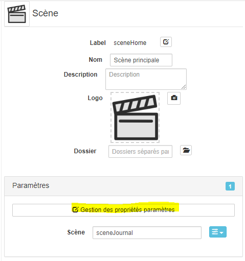
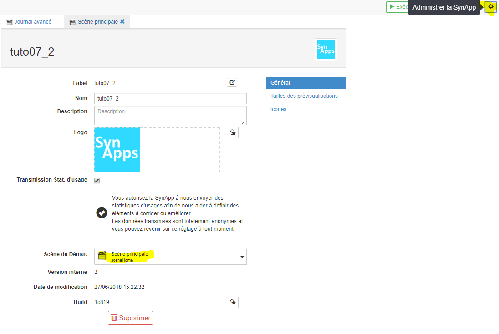
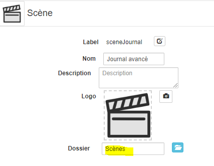
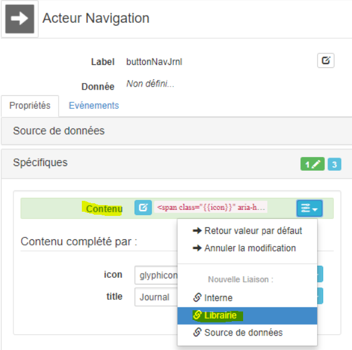
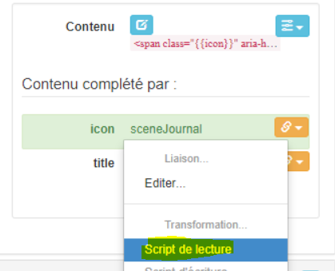
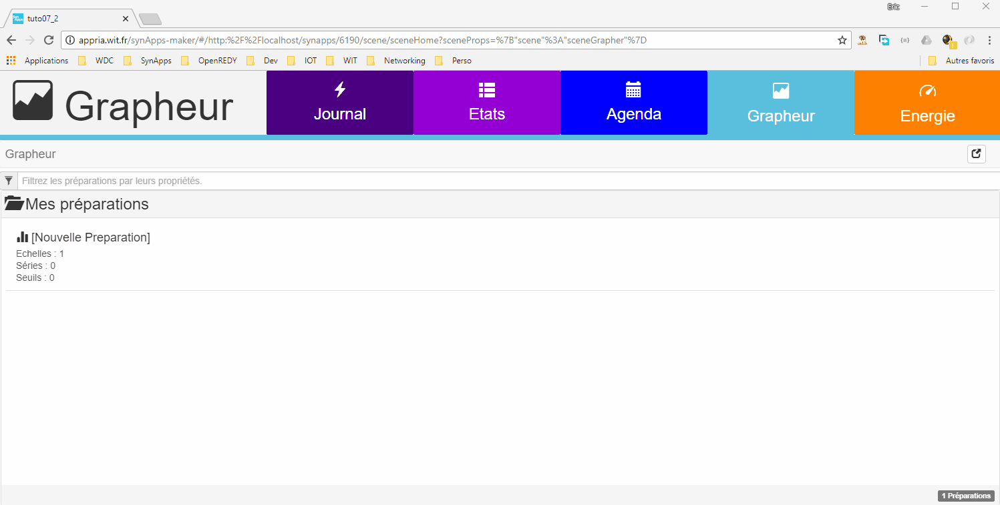

[Accueil](../../readme.md) / [Tutoriaux](../index.md) / [Tutorial 07](index.md)

# Tutorial 7: les acteurs métiers natifs du REDY - Part 4: **Navigation**

Les 5 scènes de l'application d'exploitation sont finalisées. Nous allons les intégrer dans une nouvelle scène principale avec la navigation

## Construction de l'ossature de la scène

1. **Créer** une nouvelle scène et **renommer** le _label_ de la scène en ```sceneHome``` et le _nom_ avec ```Scène principale``` puis déployer

    * ajouter une propriété de scène de type _texte_ dans _Paramêtres > Gestion des propriétés paramètres_

      

    * définir _label_ avec ```scene``` et _Nom de la propriété_ avec ```Scène```

      

    * définir la propriété de scène _Scène_ avec le texte ```sceneJournal```

    _Remarque:_ pour rappel, les paramêtres de scène permettent de **piloter les scènes** et **définir des raccourcis** vers des scènes spécifiques. Voir [tutorial 4 sur la navigation](../../tuto04/index.md)

2. **Modifier** la scène principale de la SynApp avec la scène ```Scène principale```

    

3. **Sélectionner** la scène ```sceneJournal``` pour la ranger dans un dossier

    * modifier la propriété _Dossier_ avec le dossier ```Scènes```

       

4. **Modifier** également le dossier des 4 autres scènes ```sceneEtat```, ```sceneGrapher```, ```sceneAgenda``` et ```sceneDashboard```

5. **Sélectionner** la scène ```sceneHome``` et **définir** l'acteur principal avec un acteur _Empilement_ qui contiendra uniquement le grapheur

    * renommer le _Label_ avec ```stackRoot```

6. **Ajouter** un acteur enfant de type _Empilement_ qui contiendra la zone de titre avec la navigation

    * renommer le _Label_ avec ```stackHeader```
    * modifier la propriété _Spécifiques > Orientation_ en ```Horizontal```
    * modifier la propriété _Aspect > Couleur de fond_ avec la couleur ```#f3f3f3```
    * réinitialiser la propriété _Gabarit > Hauteur_ avec la valeur par défaut ```[vide]```

7. **Ajouter** un acteur enfant de type _HTML_ qui contiendra la zone de titre avec la navigation

    * renommer le _Label_ avec ```htmlTitle```
    * Modifier la propriété _Spécifiques > Contenu_ avec le texte suivant
        ```HTML
        <span class="{{icon}}" aria-hidden="true"></span> {{title}}
        ```
    * compléter le contenu en créant les propriétés additionnelle _icon_ et _title_ de type _texte_
    * modifier la propriété _Spécifiques > icon_ avec le texte ```icon-appointment-agenda```
    * modifier la propriété _Spécifiques > title_ avec le texte ```title```
    * modifier la propriété _Aspect > Police > Taille_ avec le texte ```5em```
    * modifier la propriété _Position > Align. vertical_ en ```Centré```
    * modifier la propriété _Position > Align. horizontal_ en ```Gauche```
    * modifier la propriété _Gabarit > Marge > Marge ext. gauche_ en ```20px```

8. **Sélectionner** l'acteur ```stackRoot``` et **ajouter** un acteur enfant de type _Empilement_ qui définira une barre de séparation en la zone en-tête et la scène courante

    * renommer le _Label_ avec ```stackLine```
    * modifier la propriété _Aspect > Couleur de fond_ avec ```#4b0082```
    * modifier la propriété _Gabarit > Hauteur_ avec ```8px```

9. **Sélectionner** l'acteur ```stackRoot``` et **ajouter** un acteur enfant de type _Ecran_ qui contiendra la scène courante

    * renommer le _Label_ avec ```screenMain```
    * modifier la propriété _Position > Align. vertical_ en ```Etendre```
    * réinitialiser la propriété _Gabarit > Hauteur_ avec ```[vide]```
    * lier la propriété _Spécifiques > Scène_ avec la propriété _Scène_ de la ```Scène principale``` en _lecture_ et _écriture_

       

       _Remarque:_ signification de **lecture** et **écriture** sur les liaisons
       * **lecture**: lorsque la _Scène_ de la _Scène princiaple_ change alors celle de l'acteur ```screenMain``` change également
       * **écriture**: lorsque la _Scène_ de l'acteur ```screenMain``` écran change alors la _Scène_ de la _Scène princiaple_ change également
       * La liaison est **bidirectionnelle**

10. **Sélectionner** l'acteur ```stackHeader``` et **ajouter** un acteur enfant de type _Empilement_ qui contiendra les 5 boutons de navigation entre les scènes

    * renommer le _Label_ avec ```stackNav```
    * réinitialiser la propriété _Gabarit > Hauteur_ avec ```[vide]```
    * modifier la propriété _Spécifiques > Orientation_ en ```Horizontal```
    * modifier la propriété _Aspect > Police > Alignement texte_ en ```Centre```
    * modifier la propriété _Aspect > Police > Taille_ en ```2em```
    * modifier la propriété _Position > Align. horizontal_ en ```Droite```

11. **Sélectionner** l'acteur ```stackNav``` et **ajouter** un acteur enfant de type _Navigation_ qui permettra de naviguer sur le journal

    * renommer le _Label_ avec ```buttonNavJrnl```
    * modifier la propriété _Spécifiques > Contenu_ avec
        ```HTML
        <span class="{{icon}}" aria-hidden="true"></span><br/>
        {{title}}
        ```
    * compléter le contenu en créant les propriétés additionnelle _icon_ et _title_ de type _texte_
    * modifier la propriété _Spécifiques > icon_ avec le texte ```icon-appointment-agenda```

    _Remarque:_ ```icon-appointment-agenda``` est défini dans une librairie d'icones intégrée à SynApps provenant de [WebHostingHub](https://www.webhostinghub.com/glyphs/){:target="_blank"}

    * modifier la propriété _Spécifiques > title_ avec le texte ```Journal```
    * lier en _librairie_ le contenu en créant un nouvel élément de librairie ```contentButtonNav```

        

        _Remarque:_ nous ajoutons ce contenu en librairie car les 5 boutons aurons le même contenu. La **maintenabilité** de la SynApp sera ainsi simplifiée en cas de modification

    * modifier la propriété _Spécifiques > Scène_ avec la scène ```Journal avancé```
    * modifier la propriété _Spécifiques > Acteur de visualisation_ avec l'acteur de visualisation ```screenMain```
    * modifier la propriété _Aspect > Couleur de fond_ avec la couleur ```#4b0082```
    * modifier la propriété _Gabarit > Largeur_ avec la taille ```220px```
    * Le bouton de navigation doit resembler à ceci
        

12. **Dupliquer** l'acteur navigation pour configurer la navigation sur les états

    * renommer le _Label_ avec ```buttonNavState```
    * modifier la propriété _Spécifiques > icon_ avec ```icon-abacus```
    * modifier la propriété _Spécifiques > title_ avec ```Etats```
    * modifier la propriété _Spécifiques > Scène_ avec la scène ```Etats avancé```
    * modifier la propriété _Aspect > Couleur de fond_ avec la couleur ```#9400d3```

13. **Dupliquer** l'acteur navigation pour configurer la navigation sur l'agenda

    * renommer le _Label_ avec ```buttonNavAgenda```
    * modifier la propriété _Spécifiques > icon_ avec ```icon-calendarthree```
    * modifier la propriété _Spécifiques > title_ avec ```Agenda```
    * modifier la propriété _Spécifiques > Scène_ avec la scène ```Agenda```
    * modifier la propriété _Aspect > Couleur de fond_ avec la couleur ```#0000ff```

14. **Dupliquer** l'acteur navigation pour configurer la navigation sur le grapheur

    * renommer le _Label_ avec ```buttonNavGraph```
    * modifier la propriété _Spécifiques > icon_ avec ```icon-stocks```
    * modifier la propriété _Spécifiques > title_ avec ```Grapheur```
    * modifier la propriété _Spécifiques > Scène_ avec la scène ```Grapheur```
    * modifier la propriété _Aspect > Couleur de fond_ avec la couleur ```#5bc0de```

15. **Dupliquer** l'acteur navigation pour configurer la navigation sur le tableau de bord énergies

    * renommer le _Label_ avec ```buttonNavGraph```
    * modifier la propriété _Spécifiques > icon_ avec ```icon-speed```
    * modifier la propriété _Spécifiques > title_ avec ```Energie```
    * modifier la propriété _Spécifiques > Scène_ avec la scène ```Tableau de bord énergies```
    * modifier la propriété _Aspect > Couleur de fond_ avec la couleur ```#ff8000```

16. **Déployer**, **éxécuter** et **vérifier** que la navigation fonctionne correctement.

    2 problèmes subsistent:
    * Le **titre** et **icône** en haut à gauche ne changent pas
    * La **couleur de la barre horizontal** de séparation (entre l'en-tête et la scène secondaire) reste également inchangée. Elle est sensée être de la même couleur que le bouton de navigation de la scène sélectionnée

## Finalisation de la SynApp

Nous allons définir les comportements des titres, icônes et barre horizontal avec des **liaisons** à la scène sélectionnée et des **fonctions de transformations**

1. **Sélectionner** l'acteur ```htmlTitle``` pour définir l'**icone** en fonction du bouton de navigation de la scène secondaire sélectionnée

    * lier en _interne_ la propriété _Spécifiques > icon_ à la propriété _Scène_ de la scène ```Scène principale``` en _lecture_ uniquement

        

    * editer le script de transformation lecture

        

    * copier le script suivant qui va retourner l'icone défini dans le bouton de navigation de la scène sélectionnée

        ```javascript
        var currentSceneKey = context.synoStage.get('scene');
        var stackNav = context.synoStage.findByLabel('stackNav');
        var buttonNavCurrent = stackNav.get('actors').findBy('displaySceneKey', currentSceneKey);
        return buttonNavCurrent.get('icon');
        ```

        * _Ligne: 1_ recherche la scène secondaire sélectionnée
        ```javascript
        var currentSceneKey = context.synoStage.get('scene');
        ```

        * _Ligne 2:_ recherche l'acteur ```stackNav``` dans la scène principale
        ```javascript
        var stackNav = context.synoStage.findByLabel('stackNav');
        ```

        * _Ligne 3:_ retourne les acteurs enfants de ```stackNav```, cad: les 5 acteurs navigation
        ```javascript
         var buttonNavCurrent = stackNav.get('actors')...
        ```

        * _Ligne 3 suite:_ recherche l'acteur navigation qui navigue sur la scène secondaire sélectionnée
        ```javascript
        ...findBy('displaySceneKey', currentSceneKey);
        ```
        * _Ligne 4:_ retourne la propriété _icon_ de l'acteur de navigation
        ```javascript
           return buttonNavCurrent.get('icon');
        ```

        _Pour résumer:_

        * le script identifie l'acteur de navigation correspondant à la scène courante puis
        * retourne sa propriété _icon_

2. **Sélectionner** l'acteur ```htmlTitle``` pour définir le **titre** en fonction du bouton de navigation de la scène secondaire sélectionnée

    * lier en _interne_ la propriété _Spécifiques > title_ à la propriété _Scène_ de la scène ```Scène principale``` en _lecture_ uniquement (comme pour l'icone)

    * définir le script de transformation en lecture

    * copier le script suivant qui va retourner le titre défini dans le bouton de navigation de la scène sélectionnée (même mécanisme que pour l'icône)

        ```javascript
        var currentSceneKey = context.synoStage.get('scene');
        var stackNav = context.synoStage.findByLabel('stackNav');
        var buttonNavCurrent = stackNav.get('actors').findBy('displaySceneKey', currentSceneKey);
        return buttonNavCurrent.get('title');
        ```
    _Remarque:_ le script est **identique** à celui de l'icône à l'**exception** de la dernière ligne qui retourne la propriété _title_ définie dans le bouton de navigation

3. **Sélectionner** l'acteur ```stackLine``` pour définir la **couleur de fond** en fonction du bouton de navigation de la scène secondaire sélectionnée

    * lier en _interne_ la propriété _Aspect > Couleur de fond_ à la propriété _Scène_ de la scène ```Scène principale``` en _lecture_ uniquement (comme pour l'icone)

    * définir le script de transformation en lecture

    * copier le script suivant qui va retourner la couleur de fond défini dans le bouton de navigation de la scène sélectionnée (même mécanisme que pour l'icône)

        ```javascript
        var currentSceneKey = context.synoStage.get('scene');
        var stackNav = context.synoStage.findByLabel('stackNav');
        var buttonNavCurrent = stackNav.get('actors').findBy('displaySceneKey', currentSceneKey);
        return buttonNavCurrent.get('backgroundColor');
        ```
    _Remarque:_ le script est **identique** à celui de l'icône à l'**exception** de la dernière ligne qui retourne la propriété _backgroundColor_ définie dans le bouton de navigation

4. **Déployer**, **éxécuter** et **vérifier** que la navigation fonctionne désormais correctement:
    * Le **titre** et **icône** en haut à gauche changent
    * La **couleur de la barre horizontal** de séparation (entre l'en-tête et la scène secondaire) est désormais de la même couleur que le bouton de navigation de la scène sélectionnée

    

## Que retenir

Nous avons réalisé une **application d'exploitation simple** contenant des acteurs métiers natifs augmentés avec des filtres pour améliorer l'expérience utilisateur

Nous avons également intégré le **tableau de bord multi-énergies** du REDY avec un acteur IFrame intégrant l'URL d'exploitation du tableau de bord dans le REDY composé avec notamment la session utilisateur

Enfin, nous avons mis en place une **navigation avancée** avec des scripts de transformation permettant d'améliorer le visuel de la scène sélectionnée

Nous avons utilisé des **librairies d'icones** qui sont embarquées dans SynApps et qui peuvent être affichées simplement dans des acteurs avec contenu HTML avec le code ci-dessous

```HTML
<span class="[icon]"></span>
```

Vous pouvez visualiser les icones disponibles:

1. [Boostrap](https://getbootstrap.com/docs/3.3/components/){:target="_blank"}
2. [WebHostingHub](https://www.webhostinghub.com/glyphs/){:target="_blank"}

## Conclusion

Le principal intérêt des acteurs métiers natifs sont leur **simplicité** d'usage: peu ou pas de configuration pour fonctionner !

Vous pouvez également créer vos propres acteurs métiers réutilisables avec les composites et ainsi améliorer votre **productivité**, voir [tutoriel sur les composites](../tuto05/index.md)

Vous pouvez remonter les **bugs** & **remarques** concernant ce tutorial, SynApps RUNTIME & MAKER sur [GitHub](https://github.com/witsa/synapps/issues)

[Tutoriel suivant sur les tailles](../tuto08/index.md)