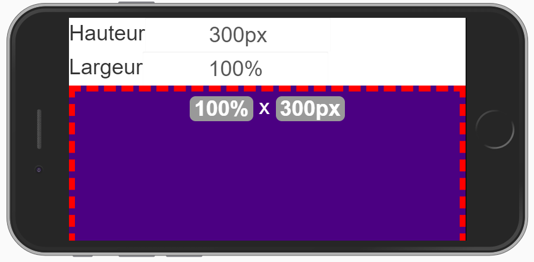

# Tutorial 8: les tailles - **<span style='color:green'>Débutant</span>**

[Home](../../sitemap.md) > [Tutoriaux](../index.md)

Un des éléments fondateur de SynApps est sa capacité à construire des applications adaptatives: on parle également de **responsive design** ou **site web adaptatif**

[Wikipédia](https://fr.wikipedia.org/wiki/Site_web_adaptatif){:target="_blank"}

Il est important de bien comprendre comment définir les tailles des acteurs pour construire des SynApps qui s'adaptent au mieux aux différentes dimensions d'écrans

_Remarque:_ cela ne veut pas dire qu'une application réalisée pour un mode desktop sera parfaitement adaptée à un smartphone. Il est même recommendé de réaliser des applications différentes pour les devices de type desktop/tablette et smartphone

En respectant les indications de ce tutoriel, votre application s'adaptera parfaitement aux différentes tailles d'écrans pour ces deux types de restitution

## Prérequis

* Créer une nouvelle SynApp **tuto08**

## Construction de la scène de test

Nous allons construire une scène simple afin de mettre en évidence le comportement des différents types de taille sur le rendu d'un acteur

1. **Modifier** le _label_ de la première scène en ```sceneSizes``` et le _nom_ avec ```Test des tailles``` puis déployer

2. **Définir** l'acteur principal avec un acteur _Empilement_

    * renommer le _Label_ avec ```stackRoot```
    * modifier la propriété _Aspect > Police > Taille_ en ```3em```
    * définir la propriété _Aspect > Police > Alignement texte_ en ```Centre```

3. **Ajouter** un acteur enfant de type _Empilement_ qui permettra de saisir la taille de la hauteur

    * renommer le _Label_ avec ```stackInputHeight```
    * modifier la propriété _Spécifiques > Orientation_ en ```Horizontale```
    * réinitialiser la propriété _Gabarit > Hauteur_ avec la valeur par défaut ```[vide]```

4. **Ajouter** un acteur enfant de type _Texte_ qui contiendra le libellé hauteur

    * renommer le _Label_ avec ```textHeight```
    * modifier la propriété _Spécifiques > Contenu_ en ```Hauteur```

5. **Sélectionner** l'acteur ```stackInputHeight``` et **ajouter** un acteur enfant de type _Boite de texte_ qui permettra de saisir la taille

    * renommer le _Label_ avec ```textboxHeight```
    * modifier la propriété _Spécifiques > Valeur_ en ```200px```
    * modifier la propriété _Spécifiques > Texte d'aide_ en ```Hauteur du texte```
    * modifier la propriété _Spécifiques > Taille_ en ```15```
    * modifier la propriété _Aspect > Police > Taille_ en ```1em```

6. **Sélectionner** puis **dupliquer** l'acteur ```stackInputHeight```

    * renommer le _Label_ avec ```stackInputWidth```

7. **Sélectionner** l'acteur enfant de type _Texte_ sous (=enfant de) l'acteur ```stackInputHeight```

    * renommer le _Label_ avec ```textWidth```
    * modifier la propriété _Spécifiques > Contenu_ en ```Largeur```

8. **Sélectionner** l'acteur enfant de type _Boite de texte_ sous l'acteur ```stackInputHeight```

    * renommer le _Label_ avec ```textboxWidth```
    * modifier la propriété _Spécifiques > Valeur_ en ```100%```
    * modifier la propriété _Spécifiques > Texte d'aide_ en ```Largeur du texte```

9. **Sélectionner** l'acteur ```stackRoot``` et **ajouter** un acteur enfant de type _Empilement_

    * renommer le _Label_ avec ```stackInner```
    * modifier la propriété _Aspect > Couleur de fond_ en ```#e0e0e0```
    * modifier la propriété _Position > Align. vertical_ en ```Etendre```

10. **Sélectionner** l'acteur ```stackInner``` et **ajouter** un acteur enfant de type _Texte_ auquel seront appliquées les tailles définies par l'utilisateur

    * renommer le _Label_ avec ```textSize```
    * modifier la propriété _Spécifiques > Contenu_ avec le code HTML

    ```HTML
    <span class="badge" style="font-size:1em;">{{width}}</span> x <span class="badge" style="font-size:1em;">{{height}}</span>
    ```
    * compléter le contenu en créant les propriétés additionnelle _width_ et _height_ de type _texte_
    * lier la propriété _Spécifiques > width_ créée à la propriété _Largeur_ du même acteur
    * lier la propriété _Spécifiques > height_ créée à la propriété _Hauteur_ du même acteur
    * modifier la propriété _Position > Align. vertical_ en ```Centré```
    * modifier la propriété _Position > Align. horizontal_ en ```Centré```
    * lier la propriété _Gabarit > Hauteur_ à la propriété _Valeur_ de l'acteur ```textboxHeight```
    * lier la propriété _Gabarit > Largeur_ à la propriété _Valeur_ de l'acteur ```textboxWidth```
    * modifier la propriété _Aspect > Couleur_ en ```#ffffff```
    * modifier la propriété _Aspect > Couleur de fond_ en ```#4b0082```
    * définir la propriété _Aspect > Bordure > Style bordure_ en ```Pointillé```
    * définir la propriété _Aspect > Bordure > Epaisseur bordure_ en ```10px```
    * définir la propriété _Aspect > Bordure > Couleur bordure_ en ```#ff0000```

11. **Vérifier** la zone de prévisualisation

    

12. **Déployer** et **éxécuter**

La SynApp est terminée ! nous allons tester l'effet des différentes tailles sur l'acteur _texte_ du centre

## Simulation device de type smartphone

Nous allons simuler le rendu sur un petit écran pour mieux comprendre l'influence des tailles sur le rendu de l'acteur central

1. En mode éxécution, **appuyer** sur F12 pour ouvrir les _DevTools_ (outils développeurs) de Chrome

2. **Cliquer** sur l'icone permettant de choisir un type de _device_ de rendu

    

3. **Sélectionner** le _device_ que vous souhaitez dans la fenêtre principale du navigateur. Par exemple _iPhone 6/7/8_

    

    _Remarque:_ si vous souhaitez faire apparaitre le contour du téléphone, cliquer sur les 3 points verticaux en haut à droite puis sélectionnez **Show device frame**

## Test des tailles

L'environnement de test est opérationnel et la SynApp est en mode **éxécution** !

### Tailles en **pixel**

1. **Tourner** la SynApp en mode _portrait_

    

2. **Définir** la hauteur à ```300px``` et laisser la largeur à ```100%```

    

3. **Tourner** la SynApp en mode _paysage_ et **constater** que le bord rouge du bas de la zone disparait

    

La zone centrale est tronquée, la SynApp n'est pas adaptative !

Bien que la taille en pixel soit la plus simple à appréhender, nous recommandons d'éviter ce type de taille pour construire des applications **responsives** excepté dans quelques cas:

* Scène de type synoptique avec fond de plan dans une disposition _toile_, pour rappel [tutorial 3 sur l'acteur de disposition **toile**](../tuto03/part2.md). Tous les acteurs de la scène doivent être défnis en valeur absolu en pixels. L'adaptabilité du synoptique pourra alors être apporté par l'acteur boite à vue, pour rappel [tutorial 3 sur l'acteur de disposition **boite à vue**](../tuto03/part3.md)

* Acteur enfant dont la taille doit absolument rester fixe. Par exemple: un logo qui doit avoir un aspect fixe

* SynApp réalisée pour un écran d'accueil à la résolution précise

De façon générale, lorsque vous définissez une taille en pixels, cela doit être pour une raison justifiée !

### Tailles pourcentage **%**

Permet de définir des tailles en pourcent par rapport à l'acteur parent

1. **Définir** la hauteur à ```50%``` et laisser la largeur à ```100%```

2. **Passer** du mode _paysage_ au mode _portrait_ et **constater** que la hauteur de la zone est de 50% relativement à la hauteur de la **zone grise**

    

    _Remarque:_ lorsque vous définissez des tailles en %, elles sont relatives par rapport à l'acteur parent immédiat. Ici, il s'agit de l'acteur ```stackInner``` en gris

### Tailles viewport height **vh** et viewport width **vw**

Permet de définir des tailles en pourcent par rapport à la taille de la fenêtre

1. **Définir** la hauteur à ```50vh``` et laisser la largeur à ```100%```

2. **Passer** du mode _paysage_ au mode _portrait_ et **constater** que la hauteur de la zone est de 50% relativement à la hauteur de la **fenêtre**

    

    _Remarque:_ lorsque vous définissez des tailles avec **vh**, elles sont relatives par rapport à la **taille de la fenêtre** à la différence du %

3. **Définir** la largeur à ```80vw``` et laisser la Hauteur à ```30vw```

4. **constater** que la largeur de la zone est de 80% relativement à la largeur de la **fenêtre**

    

    _Remarque:_ **vh** correspond à la hauteur de la fenêtre et **vw** correspond à la largeur de la fenêtre

**vh** et **vw** sont trés utiles pour définir des tailles en % par rapport aux tailles de fenêtres sur des écrans _desktop_ non orientables

### Tailles **vmin** et **vmax**

Permet de définir des tailles en pourcentage par rapport à, respectivement, la plus petite et la plus grande taille de la fenêtre. L'interêt étant de conserver la même taille quelque soit l'orientation, portrait ou paysage, sur un écran orientable

1. **Définir** la hauteur à ```50vmin``` et la largeur à ```100%```

2. **Passer** du mode _paysage_ au mode _portrait_ et **constater** que la hauteur de la zone est de 50% relativement à la plus petite des tailles: la **largeur** de la **fenêtre**

    

    _Remarque:_ **vh** correspond à la hauteur de la fenêtre et **vw** correspond à la largeur de la fenêtre

3. **Définir** la hauteur à ```30vmax``` et laisser la largeur à ```100%```

4. **constater** que la hauteur de la zone est de 30% relativement à la plus grande des tailles: la **hauteur** de la **fenêtre**

    

**vmin** et **vmax** sont trés utiles pour définir des tailles en % par rapport aux tailles de fenêtres sur des écrans _smartphone_ et _tablette_ orientables. La taille est conservée quelquesoit l'orientation

### Tailles **em**

Permet de définir une taille en fonction de celle de la police. **em** est adapté pour les acteurs qui contiennent du texte afin d'adapter au mieux la dimension à la taille de la police

1. **Définir** la hauteur à ```3em``` et laisser la largeur à ```100%```

2. **constater** que la hauteur de la zone est 3x plus grande que la taille de la police. Le nombre, qui peut être décimal, devant **em** est donc un coefficient multiplicateur par rapport à la taille de la police

    

3. **Passer** en mode portrait et **constater** que la hauteur est conservée

    _Remarque:_ tout comme **vmin** et **vmax**, **em** permet de **conserver** la taille entre l'orientation portrait et paysage mais est adapté pour représenter parfaitement les contenus texte

## Que retenir

Nous avons passé en revu les différents types de tailles:

* **px**: L'unité de longueur ```px``` est absolue. Elle dépend de la résolution du périphérique d'affichage

* **%**: L'unité de longueur ```%``` est relative à la taille de l'acteur parent

* **em**: L'unité de longueur ```code``` est relative à la taille de la police de l'acteur

* **vh**: L'unité de longueur ```vh``` est relative à la hauteur de la fenêtre. ```1vh``` est égale à ```1%``` de la hauteur de la fenètre

* **vw**: L'unité de longueur ```vw``` est relative à la largeur de la fenêtre. ```1vw``` est égale à ```1%``` de la largeur de la fenètre

* **vmin**: L'unité de longueur ```vmin``` est relative à la plus petite des dimensions de la fenêtre. ```1vmin``` est égale à ```1%``` de la plus petite des dimensions de la fenêtre

* **vmax**: L'unité de longueur ```vmax``` est relative à la plus grande des dimensions de la fenêtre. ```1vmax``` est égale à ```1%``` de la plus grande des dimensions de la fenêtre

Selon le **type de device** de restitution, certain types sont plus adaptés que d'autre:

1. **vh** et **vw** pour le desktop
2. **vmin** et **vmax** pour les smartphones et tablettes
3. **px** est a éviter sauf dans certains cas trés limités

Dans ce tutorial, les tailles ont été mis en oeuvre dans les propriétés _Gabarit > Hauteur_ et _Gabarit > Largeur_ mais le principe reste le même pour les autres propriétés des acteurs avec des tailles:

* _Gabarit > Marge > Extérieurs_
* _Gabarit > Marge > Intérieurs_
* _Aspect > Police > Taille_
* _Aspect > Police > Hauteur ligne_
* _Aspect > Bordure > Epaisseur bordure_
* _Aspect > Bordure > Rayon bordure_

Enfin nous avons utilisé les **Dev Tools** de Chrome pour simuler un device de type smartphone

## Conclusion

La **tutorial 8** portant sur les tailles est **terminée**

Vous ne devez pas hésiter à **tester** votre SynApp avec les outils de développement des navigateurs qui permmettent de vérifier rapidement le rendu dans différentes tailles et orientations d'écrans: n'hésitez pas à **changer le device** de restitution _iPad_, _Nexus_, etc

Vous pouvez même utiliser le device **Responsive** qui permet de modifier manuellement la largeur et la hauteur !


La bonne utilisation des tailles est un facteur clé pour construire des applications adaptatives, une des promesses majeures de SynApps !

[](http://google.com.au/)
[Source Blog Stéphanie Walter](https://blog.stephaniewalter.fr/en/freebies-giveaways/)

Vous pouvez remonter les **bugs** & **remarques** concernant ce tutorial, SynApps RUNTIME & MAKER sur [GitHub](https://github.com/witsa/synapps/issues)

Revenir sur la [liste des tutoriaux](../index.md)